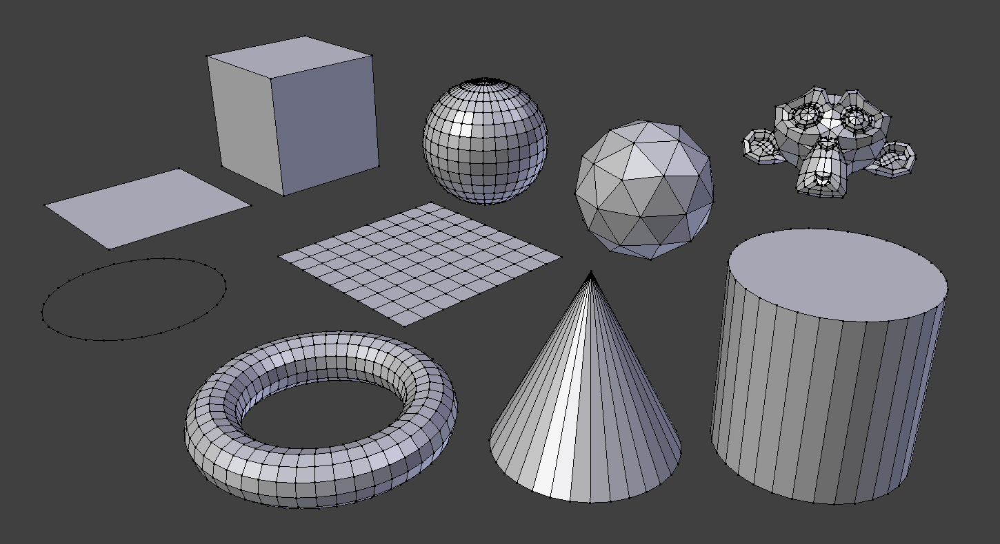

[Blender Tutorials](README.md)

---

# 🌀 OBJECT PLAY II: Build Your Abstract Sculpture or Creature in Blender

**Goal:** Translate the sketch you created in **Object Play I** into a 3D sculpture or creature using Blender primitives and the tools covered today.

---

## ✏️ Review Your Sketch

Before you begin modelling, look closely at the sketch you created in **Object Play I**.

Identify:

- The main primitive shapes in your design
- Which shape you will build first
- How the shapes connect, overlap, or repeat
- Which parts need to be moved, rotated, or scaled
- Whether your sculpture or creature will stand, float, balance, or lean

A **primitive** is a basic 3D form used as a starting point for modelling. Blender primitives include cubes, spheres, cylinders, cones, planes, and toruses.

{: .tutorial-image }

Keep your sketch beside you while you work. You may change your design as you experiment in Blender, but try to preserve its main mood, story, or purpose.

---

## 🧱 Start Building in Blender

Use only the tools from today’s lessons:

* 🧱 [QuickStart Blender Guide](01_QuickStart_Blender_Guide.md){:target="_blank"}  
* 🧱 [Blender Modifiers Reference Sheet](02_Blender_Modifiers.md){:target="_blank"}  

You can:

- Add, delete, and combine basic geometric primitives
- Move, rotate, and scale objects
- Apply modifiers: **Subdivision Surface**, **Mirror**, **Boolean**, **Solidify**, and **Array**

Begin with the largest or most important shape, then add the smaller parts.

❗ **Save your work often!**