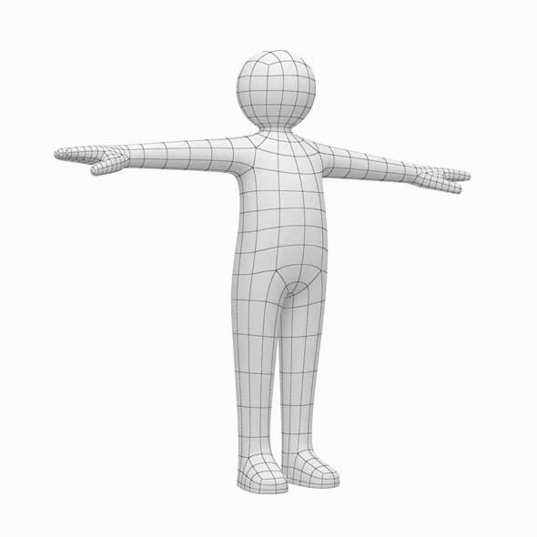
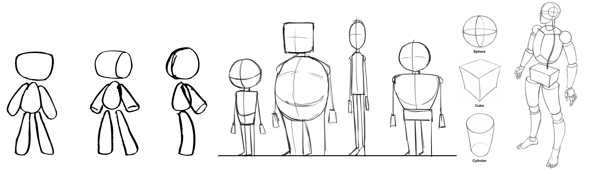

[Blender Tutorials](README.md)

-------------------------------------------------------------------------------

# ✏️ Character Design Activity

**Activity:** Sketch a character using basic geometric shapes. Explore its silhouette, proportions, personality, and overall design.

---

## 🎯 Goal

Design a creature or character that expresses a clear personality, emotion, or identity.

You will build this character in Blender today, so keep the design clear, manageable, and **not too detailed**.

Your drawing will also help you plan the character’s body parts before modelling them in 3D.

---

## 🔍 Step 1: Brainstorm Your Character (3–5 min)

On a piece of paper, briefly answer these questions:

- What is your character’s name?
- What kind of being is it: an animal, robot, alien, creature, blob, or something else?
- What is one important emotion or personality trait it has?
- Where does it come from: a desert, dream world, underwater city, another planet, or somewhere else?
- What makes it different from other characters?

---

## 🎨 Step 2: Sketch Your Character in a T-Pose (15–20 min)

Draw your character from the front in a **T-pose**.

A **T-pose** is a neutral position used when preparing characters for 3D modelling and animation. The character stands upright with both arms extended horizontally, creating the shape of the letter **T**.

{: .tutorial-image }

Your character should have:

- Both arms extended straight out to the sides
- Both legs separated, with visible space between them
- The head facing forward
- The full body visible from head to feet
- **No body parts overlapping**

{: .tutorial-image }

**Keep the body easy to understand by building it from basic geometric shapes**, such as:

- Circles or spheres for the head and joints
- Rectangles or cubes for the torso
- Cylinders for the arms and legs
- Cones for horns, ears, spikes, or other features

### ❗ Try to avoid:

- Complicated clothing
- Complex or overlapping shapes
- Features that would be difficult to model quickly

---

## ✏️ Step 3: Add Design Notes

- The geometric shapes you plan to use for each body part
- The type of movement you imagine for the character
- A catchphrase, voice, sound, or way of communicating
- The colours or textures you might use

---

## 📝 Reflection

After you finish modelling, consider:

**What makes your character recognizable and unique?**

**Which parts of your drawing may need to change when you build the character in 3D?**

---

## 🗣️ Character Pitch Activity

You will have approximately **two minutes** to introduce your character to the class.

Your drawing will be projected while you present.

Briefly explain:

- Your character’s name
- What kind of being it is
- Where it comes from
- The design feature that makes it unique

You do not need to explain every detail. Focus on the most important parts of your idea.

---