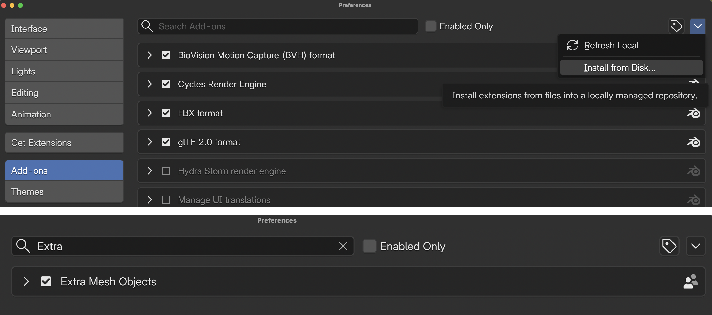

[Blender Tutorials](README.md)

---

# 👾 Character Modelling — Session 1

---

## 🎯 Objective

Translate your character sketch into a 3D model in Blender using one of the modelling approaches introduced in class.

* 🧱 [QuickStart Blender Guide](01_QuickStart_Blender_Guide.md){:target="_blank"}   
* 🧱 [Blender Modifiers Reference Sheet](02_Blender_Modifiers.md){:target="_blank"}   
* 🧱 [Blender Reference—More Tools](05_Blender_Reference_More_Tools.md){:target="_blank"}   

Focus on:

- Building your character in a clear **T-pose**
- Maintaining the proportions and silhouette of your sketch
- Using symmetry to create the left and right sides of the body
- Starting with simple forms before adding details

Follow the steps in order and save your work regularly.

---

## First, Review Your Sketch

Look at your character drawing and its breakdown into geometric shapes.

Ask yourself:

- What is the main shape of the torso?
- Which shapes will become the head, arms, hands, legs, and feet?
- Is the character mostly symmetrical?
- Is the character more geometric or more organic?

Choose one of the following approaches:

- If your character is made from clear shapes such as cubes, spheres, cones, and cylinders, use **Path 🅰️**.
- If your character has a connected body with curved limbs, use **Path 🅱️**.

---

## 💡 Pro Tips

- Use **Path A** for robots, abstract beings, and characters made from separate geometric parts.
- Use **Path B** for humanoid, animal-like, or organic characters with connected limbs.
- Begin with the largest body parts before adding smaller features.
- Keep your model low-poly and simple.
- Keep the character in a T-pose.
- **Ask for help when choosing a modelling method or applying a modifier.** 

---

## 💾 File Saving

1. Go to **File → Save As**.
2. Name your file:

   `YourName_Tuesday.blend`

3. Save the file to your assigned class folder.

---

  <strong>🅰️ Path A: Geometric Modelling with Basic Shapes and Modifiers</strong>
   
  
    Best for robots, abstract beings, and characters built from separate geometric shapes.
  

## Step 1: Identify the Main Shapes

Review your sketch and decide which primitive will represent each body part.

For example:

- Sphere = Head
- Cube or sphere = Torso
- Cylinders = Arms and Legs
- Smaller spheres = Joints
- Cubes or flattened spheres = Hands and Feet
- Cones = Horns, Ears, Spikes, or other features

Begin with the torso because it will help you position the rest of the body.

---

## Tutorial

  <iframe
    src="https://www.youtube.com/embed/zRsLUXSTN_U?si=mbwgRH-vGkSSFE1G"
    title="Geometric character modelling tutorial"
    style="width: 100%; height: 100%; border: 0;"
    allow="accelerometer; autoplay; clipboard-write; encrypted-media; gyroscope; picture-in-picture; web-share"
    referrerpolicy="strict-origin-when-cross-origin"
    allowfullscreen>
  </iframe>

---

## Step 2: Build the Main Body

1. Open Blender.
2. Delete the default cube if you do not need it.
3. Add your first primitive:

   `Shift + A → Mesh → Choose a shape`

4. Move and scale the shape to create the torso.
5. Add another primitive for the head.
6. Add shapes for the arms and position them horizontally.
7. Add shapes for the legs and leave space between them.
8. Add hands, feet, or other major features.
9. Check the character from the front and side views.

---

## Step 3: Maintain the T-Pose

As you build, check that:

- Both arms form a straight horizontal line
- The arms do not touch the torso
- The hands point away from the body
- The legs are separated
- The feet point forward
- The head is centred above the torso
- The left and right sides are balanced
- No body parts overlap

Do not bend the elbows, knees, or torso during this session.

---

## Step 4: Use These Tools

| Tool | Shortcut | Use |
|---|---|---|
| Add Object | `Shift + A` | Add cubes, spheres, cylinders, and other primitives |
| Select Object | Left Click | Select the object you want to edit |
| Move | `G` | Change an object’s position |
| Rotate | `R` | Change an object’s orientation |
| Scale | `S` | Change an object’s size or proportions |
| Duplicate | `Shift + D` | Create a copy of an object |
| Delete | `X` | Remove an object |
| Join Objects | `Ctrl + J` | Combine selected meshes into one object |
| Shade Smooth | Right-click → Shade Smooth | Soften the appearance of a surface |
| Toggle Snapping | `Shift + Tab` | Help align objects |

---

## Step 5: Use Modifiers

| Modifier | How to Access | Use |
|---|---|---|
| Mirror | Modifiers Tab | Create a symmetrical copy of one side |
| Subdivision Surface | Modifiers Tab | Smooth and round a shape |
| Array | Modifiers Tab | Repeat an object |
| Boolean | Modifiers Tab | Combine, intersect, or subtract shapes |
| Solidify | Modifiers Tab | Give thickness to a flat object |
| Wireframe | Modifiers Tab | Turn a surface into a wire-like structure |

The **Mirror Modifier** is especially helpful for maintaining a symmetrical T-pose.

---

  <strong>🅱️ Path B: Organic Modelling with the Skin Modifier</strong>
   
  
    Best for humanoid, animal-like, or organic characters with connected limbs and curved forms.
  

## Step 1: Plan the Character Structure

Use your sketch to identify the central structure of the character: Head, Neck, Torso, Shoulders, Arms, Hands, Hips, Legs, and Feet.  

Begin with the centre of the body, then extend outward toward the arms and legs.

### Add-On needed

1. Download this ZIP file:
2. On Blender, go to **Edit** → **Preferences**
3. Go to the **Add-ons** Tab
4. Click on the top-right down arrow, select **Install from Disk**
5. Select the ZIP file and click **Install from Disk**
6. In the search bar, look for **Extra Mesh Objects** and make sure it is enabled.
7. Follow the tutorial bellow.

If you have problems installing this add-on, please call the instructor.  

{: .tutorial-image }

---

## Tutorial

  <iframe
    src="https://www.youtube.com/embed/DAAwy_l4jw4?si=FmuLJg7aTmCXu6qk&amp;start=99"
    title="Organic character modelling with the Skin Modifier"
    style="width: 100%; height: 100%; border: 0;"
    allow="accelerometer; autoplay; clipboard-write; encrypted-media; gyroscope; picture-in-picture; web-share"
    referrerpolicy="strict-origin-when-cross-origin"
    allowfullscreen>
  </iframe>

---

## Step 2: Build the Character in a T-Pose

1. Begin with a single vertex.
2. Extrude upward to create the torso, neck, and head.
3. Extrude sideways from the shoulders to create one arm.
4. Keep the arm horizontal.
5. Use the **Mirror Modifier** to create the arm on the opposite side.
6. Extrude downward from the hips to create the legs.
7. Keep visible space between the legs.
8. Check the model from the front and side views.
9. Adjust the thickness of each body section.
10. Add the Skin and Subdivision Surface modifiers.

The character must remain upright and facing forward.

---

## Tools You Will Use

| Tool | Purpose |
|---|---|
| **Single Vertex** | Creates the starting point for the character structure |
| **Extrude — `E`** | Extends connected vertices to create the torso and limbs |
| **Move — `G`** | Positions vertices and adjusts proportions |
| **Skin Modifier** | Builds a three-dimensional surface around the connected vertices |
| **Skin Resize — `Ctrl + A` in Edit Mode** | Adjusts the thickness of selected parts |
| **Mirror Modifier** | Creates a symmetrical opposite side |
| **Subdivision Surface** | Smooths the character’s form |
| **Shade Smooth** | Softens the appearance of the surface |

---

## T-Pose Checklist for Path B

Before continuing, make sure:

- The centre line of the body is straight
- The shoulders are level
- Both arms are horizontal
- Both arms are approximately the same length
- The legs extend downward with space between them
- The head is centred
- The body is symmetrical
- The character faces forward
- The elbows and knees are not bent

---

## 📝 Reflection

Consider the following questions:

- How did your drawing change when you translated it into a 3D model?
- Which modelling approach did you use, and why?
- Which design feature communicates your character’s personality most clearly?
- What was challenging about maintaining the T-pose?
- What would you refine or add during the next modelling session?

---

## What is next?

If you finish, continue with 🌆 [Environment Modelling: Building your environment using custom-made objects](07_Environment_Modeling_Session1.md)

---