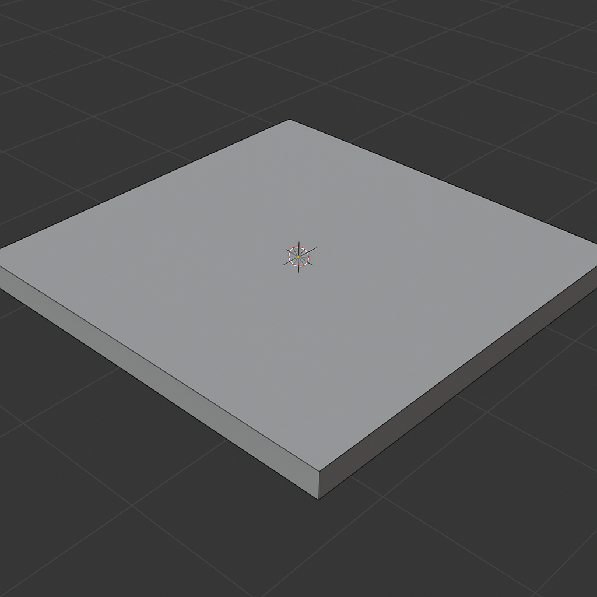
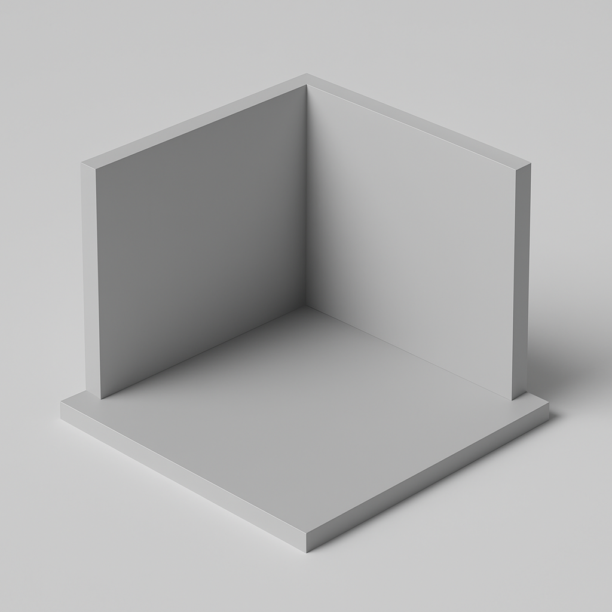
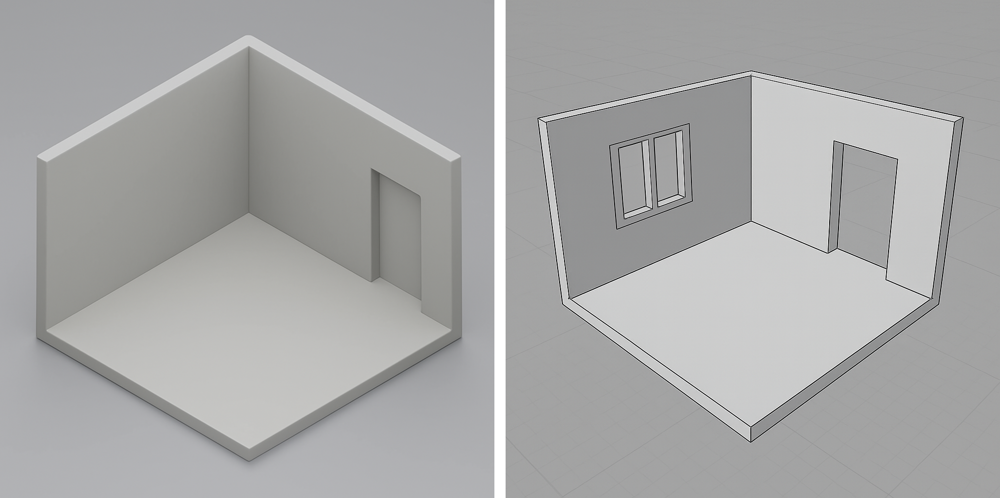

[Blender Tutorials](README.md)

---

# 🌆 Environment Modeling: Building your environment using custom-made objects

---

## Plan and Prepare

### Create a New Blender File
- Go to `File → New → General`
- Save your file as: `YourName_SceneModel.blend`
- ⚠️ Don’t forget to press `Ctrl + S` regularly to save your progress.

### Think Small (But Meaningful)
You're only building a **section** of your world — enough to give your character context.

### Examples:
- 🛏️ A **room** → Just 2 walls and part of the floor  
- 🌲 A **forest** → A small clearing with 3–4 trees  
- 🛰️ A **space station** → One hallway or pod  
- 🌌 A **dream world** → One floating platform or terrain patch  
- 🏞️ A **park** → One bench, a path, a bush, and a tree  

> You’ll add the character later — leave open space for them to stand or move!

---

## Step-by-Step Instructions

### Step 1 – Create a Ground Plane
- Press `Shift + A → Mesh → Plane`  
- Press `S` to scale it large enough for your scene  
- Add a **Solidify Modifier** to give it thickness (optional but recommended)

{: .tutorial-image }

### Step 2 – Block Out Your Space *(for indoor environments only)*
- Press `Shift + A → Mesh → Cube` → Scale/rotate into walls, floors, or stairs  
- Press `Tab` to enter Edit Mode → Select four faces (as shown in the image) → Press `X` to delete them  
- Use `G`, `R`, and `S` to move, rotate, and scale objects

{: .tutorial-image }

- Optional: Create divisions and use **Extrude** on faces or the **Boolean Modifier** to create doors or windows

{: .tutorial-image }

### Step 3 – Create Simple Props or Environmental Objects
- Use basic shapes (e.g., cylinders, spheres, cubes) and modifiers to create furniture or decorations  
- You can also modify your ground to make it more rocky or organic using the **Proportional Editing**
- For more complex shapes, wait until tomorrow for instructions on how to import existing 3D objects.

#### Tips for Blocking Your Space
- Start **big to small**: ground → walls → details  
- Don’t overbuild — focus on what your character sees  
- Leave room for character movement or interaction  
- Use **Array** or **Mirror** modifiers for repetition (fences, tiles, etc.)

{: .tutorial-image }

### Step 4 💾 File Saving

- Don't forget to save
- Go to `File → Save` or `File → Save As`  
- Use filename: `YourName_SceneModel.blend`  
- Save to your **class folder**

---

## Use These Tools & Modifiers

### 🔧 Tools

| Tool                      | Shortcut                | Use for...                      |
|---------------------------|-------------------------|---------------------------------|
| Add Object                | `Shift + A`             | Add basic shapes                |
| Move / Rotate / Scale     | `G` / `R` / `S`         | Place and transform objects     |
| Join Objects              | `Ctrl + J`              | Combine multiple meshes         |
| Shade Smooth              | Right-click             | Soften surface shading          |
| Snap Tool                 | Shift + Tab             | Align objects easily            |
| Join Objects              | `Ctrl + J`              | Combine multiple meshes         |
| Shade Smooth              | Right-click             | Soften surface shading          |
| Snap Tool                 | Right-click on mesh     | Align shapes perfectly          |
| ✨ Loop Cuts              | `Ctrl + R` in Edit Mode | Add structure or divisions      |
| ✨ Extrude Faces          | `Tab → Edit Mode → E`   | Pull up walls or stretch planes |
| ✨ Inset Faces            | `I` in Edit Mode        | Create windows, frames, steps   |
| ✨ Bevel Edges            | `Ctrl + B` in Edit Mode | Round out or soften corners     |

### 🧰 Modifiers

| Modifier              | How to access   | Use for...                        |
|-----------------------|-----------------|-----------------------------------|
| Mirror                | Modifiers Tab   | Build symmetrical characters      |
| Subdivision Surface   | Modifiers Tab   | Smooth rounded shapes             |
| Array                 | Modifiers Tab   | Repeats objects in rows           |
| Boolean               | Modifiers Tab   | Combines or subtracts shapes      |
| Solidify              | Modifiers Tab   | Gives flat shapes a thickness     |
| Wireframe Modifier    | Modifiers Tab   | Start with a line “skeleton”      |
| Skin Modifier         | Modifiers Tab   | Wraps a mesh around your skeleton |

---

## Tutorials  

* 🧱 [Blender Modifiers Reference Sheet](02_Blender_Modifiers.md)  
* 🧱 [Blender Reference—More Tools](05_Blender_Reference_More_Tools.md)   

### How to add Loop Cuts  

The Loop Cut tool splits faces by **inserting new edge loops around your mesh**. 

  <iframe
    src="https://www.youtube.com/embed/EkGYtownblk?si=vA3A_hUPZG2pxJnt"
    title="How To Make Round Edges In Blender - Full Guide"
    style="width: 100%; height: 100%; border: 0;"
    allow="accelerometer; autoplay; clipboard-write; encrypted-media; gyroscope; picture-in-picture; web-share"
    referrerpolicy="strict-origin-when-cross-origin"
    allowfullscreen>
  </iframe>

### Inset Tool 

The Inset tool in Blender **duplicates selected faces**, creating a **new border of geometry inside (or outside)** the original boundary without altering the overall shape. 

  <iframe
    src="https://www.youtube.com/embed/lJSf6Y83ZCo?si=NXwKooypXts_tpum&amp;start=156"
    title="How To Make Round Edges In Blender - Full Guide"
    style="width: 100%; height: 100%; border: 0;"
    allow="accelerometer; autoplay; clipboard-write; encrypted-media; gyroscope; picture-in-picture; web-share"
    referrerpolicy="strict-origin-when-cross-origin"
    allowfullscreen>
  </iframe>

### Bevel Tool 

The Bevel tool in Blender **smooths hard edges and corners** by turning them into chamfers or rounded curves.

  <iframe
    src="https://www.youtube.com/embed/OmlY9mpSRXI?si=2i5JlBuUSMSasgZR&amp;start=156"
    title="How To Make Round Edges In Blender - Full Guide"
    style="width: 100%; height: 100%; border: 0;"
    allow="accelerometer; autoplay; clipboard-write; encrypted-media; gyroscope; picture-in-picture; web-share"
    referrerpolicy="strict-origin-when-cross-origin"
    allowfullscreen>
  </iframe>

---

## 📝 Reflection

- What feeling do you want your space to give your character (and the viewer)?  
- Is it cozy, eerie, magical, futuristic, chaotic, peaceful, or something else?  

---

## What is next?

Once you finish, continue with 💠 [Introduction to Materials](08_Intro_to_Materials.md)

---
