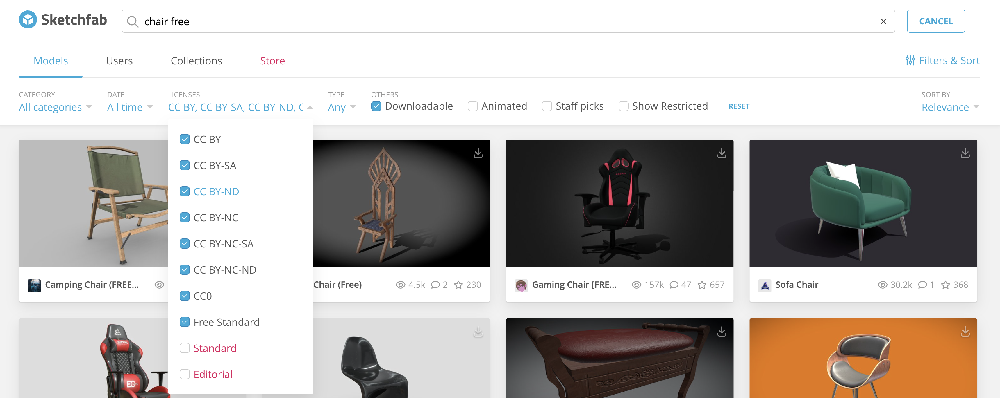
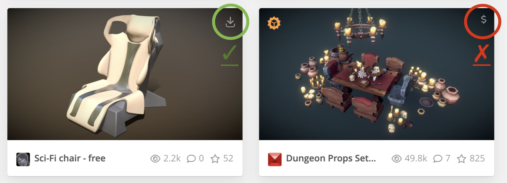
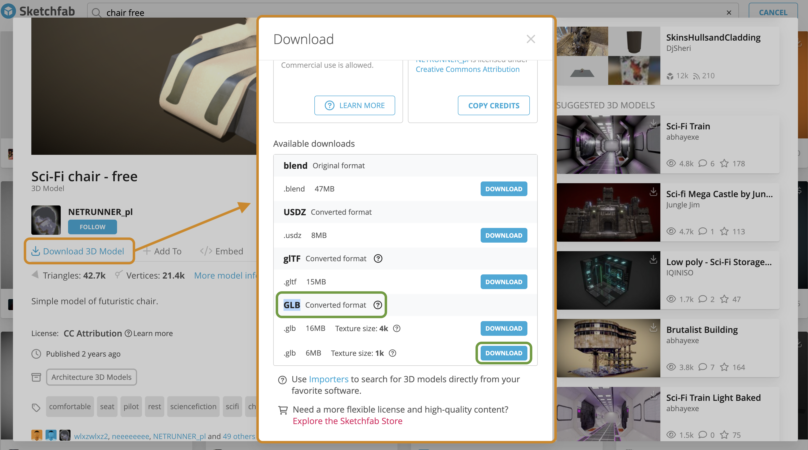

[Blender Tutorials](README.md)

---

# 🌆 Environment Modeling: Importing 3D objects (optional)

This optional tutorial shows you how to continue developing your Blender scene by **importing 3D objects into your environment**. You will learn how to bring external models into your scene, place them in 3D space, and adjust their size, position, and rotation so they fit your world.

---

## 📦 Sketchfab: Download a 3D Model

### Step 1: Open a Sketchfab Account

<a href="https://sketchfab.com/search" target="_blank">https://sketchfab.com/search</a>

- Create an account and log in.

### Step 2: Browse for a Model

- Search for keywords such as: `"chair free"`, `"rock free"`, `"tree free"`, etc.
- Use the filters:
  - **Downloadable**
  - **License: CC**

{: .tutorial-image }

### Step 3: Select a Model

- Click on the object you want to download.
- Check that the model has a **download icon**.
- Make sure the model does **not** have a dollar symbol **($)**, because that means it is not free.

{: .tutorial-image }

### Step 4: Download the Model

- If the model is free and downloadable, you will see the option **Download 3D Model**.
- Click **Download 3D Model**.
- In the download window, choose either **.OBJ** or **.GLB**.
- Save the file in your project folder.

{: .tutorial-image }

### File Types

An **OBJ** file is a common 3D model format that stores the shape or geometry of an object. It may need separate image or material files to show colours and textures correctly.

A **GLB** file is a compact 3D model format that can include the object, materials, colours, and textures in one file. GLB files are often easier to import because most of the visual information stays together.

---

## ⬆️ Blender: Import

- Go to your Blender file
- `File → Import → .obj` or `File → Import → .glb`
- Locate your downloaded file  
- Use `G` and `S` to position and scale

## Tutorial

  <iframe
    src="https://www.youtube.com/embed/wlcbHnW12NM?si=MgsKhfUANAJesqrb"
    title="Organic character modelling with the Skin Modifier"
    style="width: 100%; height: 100%; border: 0;"
    allow="accelerometer; autoplay; clipboard-write; encrypted-media; gyroscope; picture-in-picture; web-share"
    referrerpolicy="strict-origin-when-cross-origin"
    allowfullscreen>
  </iframe>

---
