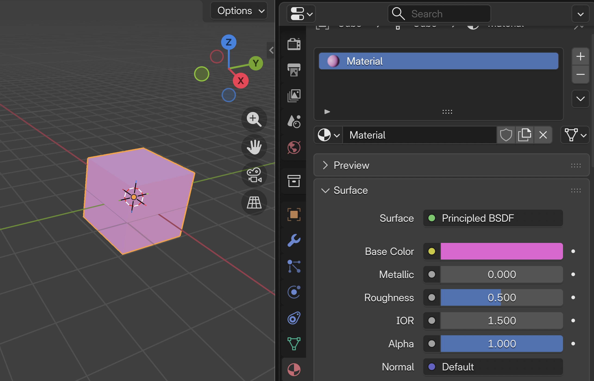

[Blender Tutorials](README.md)

-------------------------------------------------------------------------------

# 💡 Intro to Materials  

**Objective:** Use materials to bring your scene to life. Create atmosphere and emotion using color, surface, and texture.

---

## Mood & Material Planning  
Before diving in, ask yourself:

- What mood do you want? (warm, eerie, soft, mysterious?)  
- What kind of materials would help? (glass, metal, cloth, plastic?)  
- Where is the light coming from in your world? Is it comming from the sun? the moon? a spot light? other type of light source?

### Tips for Mood and Atmosphere  

| Mood        | Color Palette | Light Style         | Material Ideas             |
|-------------|---------------|---------------------|----------------------------|
| Cozy/Warm   | Orange, red   | Soft, area lights    | Matte, rough, warm tones   |
| Mysterious  | Purple, blue  | Low spotlight        | Glossy, glowing elements   |
| Futuristic  | Cyan, silver  | Bright sun, contrast | Metal, glass, neon colors  |
| Nature-like | Green, brown  | Sunlight, warm fill  | Earth tones, rough texture |

---

## Add Materials  

1. Click `Z` to open the user's perspective menu and choose **Material Preview**
2. Select an object  
3. Go to the **Material Properties tab** (icon in bottom-right panel)  
4. Click **+ New**  
5. Change:
   - **Base Color**  
   - **Roughness** (smooth vs. matte)  
   - **Metallic** (non-metal to chrome)

{: .tutorial-image }

## 💾 Save Your Work!  
- `File → Save`  
- Use filename: `YourName_SceneMaterials.blend`  
- Save it to your class folder

---

### Tutorials

### ADDING MATERIALS in Blender | The BASICS

  <iframe
    src="https://www.youtube.com/embed/E42OxbroToM?si=NSdq5r6-jMjThlDb"
    title="ADDING MATERIALS in Blender | The BASICS"
    style="width: 100%; height: 100%; border: 0;"
    allow="accelerometer; autoplay; clipboard-write; encrypted-media; gyroscope; picture-in-picture; web-share"
    referrerpolicy="strict-origin-when-cross-origin"
    allowfullscreen>
  </iframe>

### Create Emissive Material in Blender | Glow - Neon

  <iframe
    src="https://www.youtube.com/embed/F4EaA4LUhgc?si=EyEY-eCK5T92BrmG"
    title="Create Emissive Material in Blender | Glow - Neon"
    style="width: 100%; height: 100%; border: 0;"
    allow="accelerometer; autoplay; clipboard-write; encrypted-media; gyroscope; picture-in-picture; web-share"
    referrerpolicy="strict-origin-when-cross-origin"
    allowfullscreen>
  </iframe>

### Create Realistic Steel Material

  <iframe
    src="https://www.youtube.com/embed/73hPexS1YAY?si=h81I7VEMvAOvYhyI"
    title="Create Realistic Steel Material"
    style="width: 100%; height: 100%; border: 0;"
    allow="accelerometer; autoplay; clipboard-write; encrypted-media; gyroscope; picture-in-picture; web-share"
    referrerpolicy="strict-origin-when-cross-origin"
    allowfullscreen>
  </iframe>

### Blender Beginner Tutorial: Glass in 1 Minute

  <iframe
    src="https://www.youtube.com/embed/K4qT5zNPxiY?si=P2hKTA1Ula16vXkM"
    title="Blender Beginner Tutorial: Glass in 1 Minute"
    style="width: 100%; height: 100%; border: 0;"
    allow="accelerometer; autoplay; clipboard-write; encrypted-media; gyroscope; picture-in-picture; web-share"
    referrerpolicy="strict-origin-when-cross-origin"
    allowfullscreen>
  </iframe>

### Create realistic grass in 1 minute

  <iframe
    src="https://www.youtube.com/embed/5cD0ZfS2Uug?si=7R02245i_7MNmj-M"
    title="Create realistic grass in 1 minute"
    style="width: 100%; height: 100%; border: 0;"
    allow="accelerometer; autoplay; clipboard-write; encrypted-media; gyroscope; picture-in-picture; web-share"
    referrerpolicy="strict-origin-when-cross-origin"
    allowfullscreen>
  </iframe>

### Create dynamic Fur/Hair in Blender

  <iframe
    src="https://www.youtube.com/embed/TnmCOeqfZ5o?si=IxXrhTra9uYJofTr"
    title="Create dynamic Fur/Hair in Blender"
    style="width: 100%; height: 100%; border: 0;"
    allow="accelerometer; autoplay; clipboard-write; encrypted-media; gyroscope; picture-in-picture; web-share"
    referrerpolicy="strict-origin-when-cross-origin"
    allowfullscreen>
  </iframe>

### Endless Ocean Loop In Blender

  <iframe
    src="https://www.youtube.com/embed/p03fspwMY64?si=gKkn96D_icZzrYfl"
    title="Endless Ocean Loop In Blender"
    style="width: 100%; height: 100%; border: 0;"
    allow="accelerometer; autoplay; clipboard-write; encrypted-media; gyroscope; picture-in-picture; web-share"
    referrerpolicy="strict-origin-when-cross-origin"
    allowfullscreen>
  </iframe>

### Add A (Image) Texture to An Object 

  <iframe
    src="https://www.youtube.com/embed/mURA2g1rOSc?si=VT-p8E8OXcAiYEM1"
    title="Add A (Image) Texture to An Object"
    style="width: 100%; height: 100%; border: 0;"
    allow="accelerometer; autoplay; clipboard-write; encrypted-media; gyroscope; picture-in-picture; web-share"
    referrerpolicy="strict-origin-when-cross-origin"
    allowfullscreen>
  </iframe>

### Copy material from one object to another object

  <iframe
    src="https://www.youtube.com/embed/oqNcOrxHKbU?si=C2jJBmK_9H6o9MaO"
    title="lender Basics: Copy material from one object to another object"
    style="width: 100%; height: 100%; border: 0;"
    allow="accelerometer; autoplay; clipboard-write; encrypted-media; gyroscope; picture-in-picture; web-share"
    referrerpolicy="strict-origin-when-cross-origin"
    allowfullscreen>
  </iframe>

---

## 📝 Reflection 
**What kind of mood or feeling do your materials create?**  
→ Describe it in one or two words!

---

## Optional Workflow

Once you finish, you can go do the following: 🌆 [Environment Modelling: Importing 3D objects (optional)](10_Environment_Modeling_Session2.md)

---