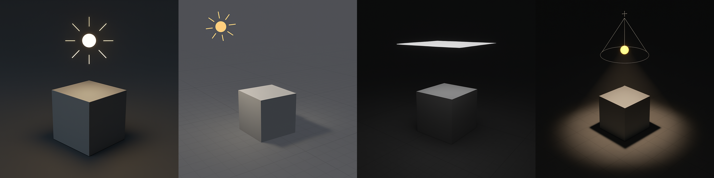

[Blender Tutorials](README.md) | [Home](../../README.md)

---

# 💡 Lighting & 🎥 Camera  

**Objective:** Learn how to set up lighting and a camera in Blender to create a mood or focus attention in your scene. Experiment with color, strength, and angle to change how your scene feels.  

## 🔧 Tools You’ll Use

| Tool / Feature               | Shortcut / Location                | Purpose / Use                                                   |
|-----------------------------|------------------------------------|-----------------------------------------------------------------|
| **Add Light**               | `Shift + A → Light`                | Add Point, Sun, Area, or Spot lights                            |
| **Move / Rotate**           | `G`, `R`                           | Position lights and cameras                                     |
| **Rendered View**           | `Z → Rendered`                     | Preview lighting in real-time                                   |
| **Light Settings**          | Light Properties Tab (💡 icon)     | Adjust strength, color, softness                                |
| **Add Camera**              | `Shift + A → Camera`               | Add a camera to your scene                                      |
| **Look Through Camera**     | `Numpad 0`                         | Switch to camera view                                           |
| **Lock Camera to View**     | `N → View → Lock Camera to View`   | Move the camera using viewport navigation                       |
| **Camera Settings**         | Camera Properties Tab (📷 icon)    | Adjust focal length, depth of field, and other options          |
| **Save Your Work**          | `File → Save`                      | Keep progress safe; use clear filenames                         |

---

## Add Lighting  

### Step 1: Add a Light  
- `Shift + A → Light`  
- Choose from:  
  - **Point** – Emits light from one spot in all directions  
  - **Sun** – Mimics sunlight, great for outdoor scenes  
  - **Area** – Soft, rectangular light source (good for studio or room lighting)  
  - **Spot** – Cone-shaped light (useful for dramatic or focused light)

### Step 2: Position the Light  
- Use `G` to **move**, `R` to **rotate**

### Step 3: Adjust Light Settings  
- In the **Light Properties tab** (green lightbulb icon):  
  - Change **Strength** to make it brighter or dimmer  
  - Pick a **Color** to set mood  
  - Adjust **Size** (Area Light) or **Angle** (Sun Light) for softness

### Step 4: Preview the Lighting  
- `Z → Rendered` OR click the shaded ball in the top-right viewport corner  
- Switch to **Rendered View** to see how the light affects your scene

---

## 💡 Lighting Preset Ideas

| Style/Setting        | Setup Tips                                                                  |
|----------------------|-----------------------------------------------------------------------------|
| 🌞 Sunny Day         | Use **Sun Light** with slight yellow tint, medium strength, soft shadows    |
| 💡 Cozy Room         | Use **Area Light** near the ceiling + **Point Light** near objects          |
| 🎭 Dramatic          | Use **Spot Light** from the side, high contrast, colored rim light          |
| 🧪 Sci-Fi/Neon       | Use colored **Point Lights** (blue, green, pink), low ambient light         |
| 🌫️ Foggy/Moody       | Use **Sun Light** with grayish color, soft shadows, low intensity           |
| 🎬 3-Point Studio    | Use **Key Light**, **Fill Light**, and **Back Light** with Area or Spot     |

---

## Tutorials

### Light Types

  <iframe
    src="https://www.youtube.com/embed/FdbnzfjoOJU?si=b_qj-pza7Kndc7h2"
    title="Light Types - Blender 2.80 Fundamentals"
    style="width: 100%; height: 100%; border: 0;"
    allow="accelerometer; autoplay; clipboard-write; encrypted-media; gyroscope; picture-in-picture; web-share"
    referrerpolicy="strict-origin-when-cross-origin"
    allowfullscreen>
  </iframe>

### How to Use Blender's Light Objects 

  <iframe
    src="https://www.youtube.com/embed/JJV8l6MaXxA?si=kIEPy6l0rxPCI2jS"
    title="How to Use Blender's Light Objects"
    style="width: 100%; height: 100%; border: 0;"
    allow="accelerometer; autoplay; clipboard-write; encrypted-media; gyroscope; picture-in-picture; web-share"
    referrerpolicy="strict-origin-when-cross-origin"
    allowfullscreen>
  </iframe>

---

## 🎥 Add a Camera  

### Step 1: Add and Position  
- `Shift + A → Camera`  
- Use `G` to move, `R` to rotate  
- Press `Numpad 0` to **look through the camera**  
- Use `G` and `R` in Camera View to reframe the shot
- ⚠️ For now, we’re only working with still cameras. **Don’t animate your camera yet**.

### Step 2: Lock Camera to View (Optional)  
- Press `N` → View → Check **Lock Camera to View**  
- Now navigate in viewport to position your shot

### Step 3: Change Camera Settings  
- Select camera → **Camera Properties tab**  
  - Adjust **Focal Length** for wide/zoomed view  
  - Choose **Depth of Field** to blur background (optional)

---

## 📸 Camera Preset Ideas

| Camera Type              | Description & Use                                                         |
|--------------------------|---------------------------------------------------------------------------|
| 👁️ Over-the-Shoulder     | Great for storytelling; place camera behind character                     |
| 🐜 Low Angle             | Camera placed near the ground, looking up — makes subject feel powerful   |
| 🛰️ Top Down (Bird’s Eye) | Use for maps, layouts, or god-like perspective                            |
| 🪟 Framed View           | Position camera through a window or doorway for visual framing            |
| 🤖 Dolly/Tracking Shot   | Animate camera moving beside a character or object                        |
| 🎬 Close-Up              | Zoom in on a face, detail, or emotion; tight framing with shallow depth   |
| 🌍 Wide Shot             | Show the whole environment; helps with mood and scale                     |

---

## Tutorials

### Camera to View Tutorial 

  <iframe
    src="https://www.youtube.com/embed/0sDZ0zRVn1M?si=itt5NR0yr4NRvYTW"
    title="Blender 3 Camera to View Tutorial"
    style="width: 100%; height: 100%; border: 0;"
    allow="accelerometer; autoplay; clipboard-write; encrypted-media; gyroscope; picture-in-picture; web-share"
    referrerpolicy="strict-origin-when-cross-origin"
    allowfullscreen>
  </iframe>

### How to move camera in Blender with WASD (View Navigate) 

  <iframe
    src="https://www.youtube.com/embed/oOS7gO7GNQk?si=mkUSm7Yb5oCIHe2c&amp;start=32"
    title="How to move camera in Blender with WASD (View Navigate)"
    style="width: 100%; height: 100%; border: 0;"
    allow="accelerometer; autoplay; clipboard-write; encrypted-media; gyroscope; picture-in-picture; web-share"
    referrerpolicy="strict-origin-when-cross-origin"
    allowfullscreen>
  </iframe>

### Learn more about the Camera settings - ⚠️ Watch it only until 9:16 

  <iframe
    src="https://www.youtube.com/embed/aY04h4ujrlY?si=l-VcJvGLSdknDt8H"
    title="Best Way to Render High Quality Images in Blender"
    style="width: 100%; height: 100%; border: 0;"
    allow="accelerometer; autoplay; clipboard-write; encrypted-media; gyroscope; picture-in-picture; web-share"
    referrerpolicy="strict-origin-when-cross-origin"
    allowfullscreen>
  </iframe>

### Best Way to Render High Quality Images in Blender 

  <iframe
    src="https://www.youtube.com/embed/fTVED78bnio?si=3UclY175KnzWIcY-"
    title="Best Way to Render High Quality Images in Blender"
    style="width: 100%; height: 100%; border: 0;"
    allow="accelerometer; autoplay; clipboard-write; encrypted-media; gyroscope; picture-in-picture; web-share"
    referrerpolicy="strict-origin-when-cross-origin"
    allowfullscreen>
  </iframe>

### Learn how to have two views at the same time

  <iframe
    src="https://www.youtube.com/embed/3Q_-R4UjtB8?si=8iqCxJ6WnJLAWzXd"
    title="Best Way to Render High Quality Images in Blender"
    style="width: 100%; height: 100%; border: 0;"
    allow="accelerometer; autoplay; clipboard-write; encrypted-media; gyroscope; picture-in-picture; web-share"
    referrerpolicy="strict-origin-when-cross-origin"
    allowfullscreen>
  </iframe>

---

## 💾 Save Your Work  
- `File → Save`  
- Filename: `YourName_SceneLights.blend`  
- Save to your class folder

---

## 📝 Reflection  
**What kind of mood or feeling do your lighting and camera choices create?**  
→ Write down **1–2 words**: _(e.g., “dreamy,” “mysterious,” “playful,” “cinematic”)_

---
