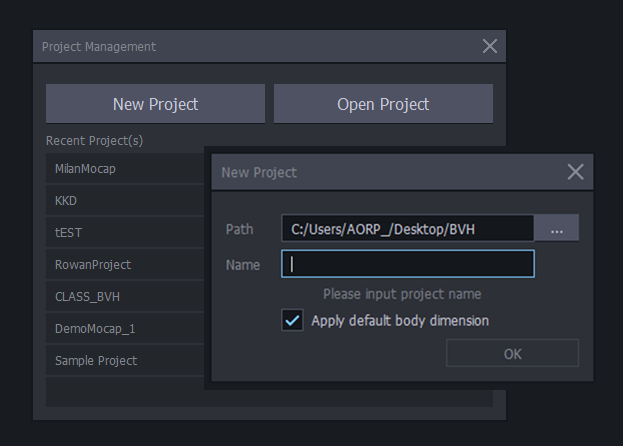
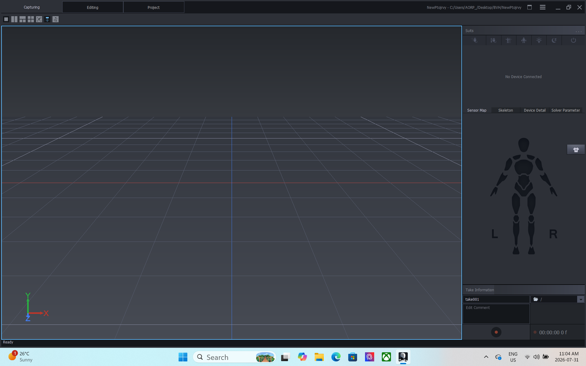
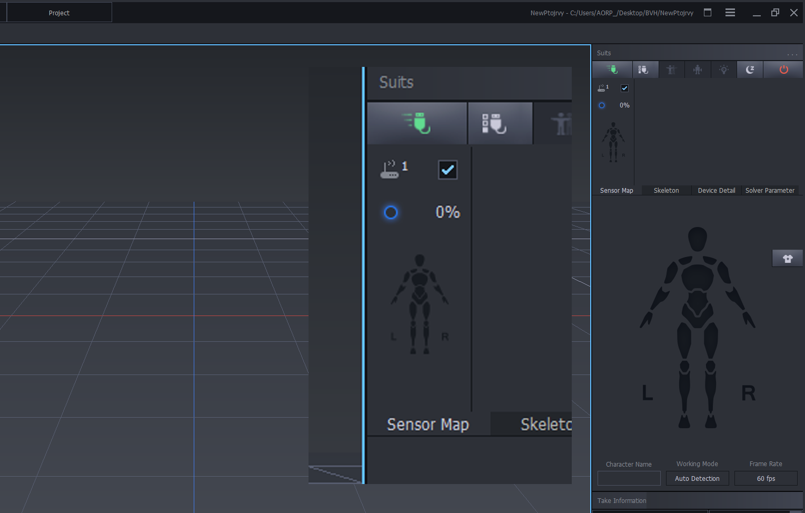
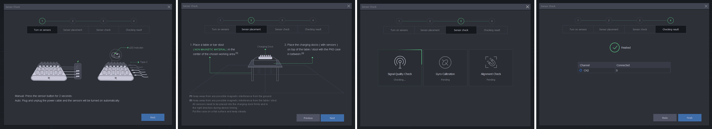
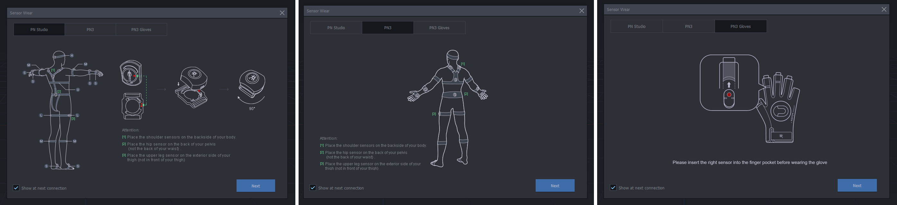
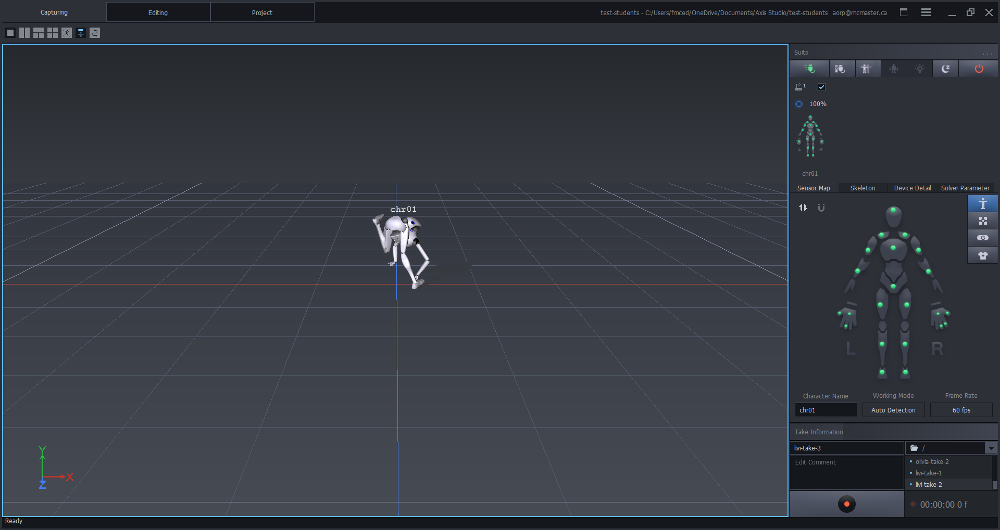

[MOCAP Tutorials](README.md) | [Home](../../README.md)

---

# ⚙️ PN3 QuickStart Guide

**Activity:** Set up the Perception Neuron 3 body kit, check sensor connection, and prepare the suit for posture calibration in Axis Studio.

**Goal:** Initialize the PN3 sensors correctly before recording motion capture.   

his guide helps you check that the hub, sensors, receiver, and Axis Studio are connected before the performer puts on the suit and completes posture calibration.

---

## 🧰 What You Need

Before starting, make sure you have:

- Fully charged **PN3 sensors**
- Fully charged **PN3 hub**
- PN3 **suit or straps**
- **Axis Studio** installed on the computer
- USB **receiver plugged into the computer**
- A clear **3 × 3 meter workspace**
- A space away from metal objects, speakers, or magnetic surfaces

---

## 📦 Perception Neuron 3 Body Kit Overview

Watch this video for a general overview of the PN3 Body Kit.

  <iframe
    src="https://www.youtube.com/embed/MgAUYQAoXyk?si=TJ8aVa9u7bq6OLuC"
    title="Perception Neuron 3 Body Kit Unboxing"
    style="width: 100%; height: 100%; border: 0;"
    allow="accelerometer; autoplay; clipboard-write; encrypted-media; gyroscope; picture-in-picture; web-share"
    referrerpolicy="strict-origin-when-cross-origin"
    allowfullscreen>
  </iframe>

---

<!--
/////////////////
SECTION 1
/////////////////
-->

  <strong>1. Open Axis Studio and Create a Project</strong>
   
  
    Connect the USB dongle, open Axis Studio, create a project, and confirm that the PN3 device is connected.
  

### 1. Plug in the USB Dongle

Plug the **USB dongle** into the computer.

This dongle is necessary to open **Axis Studio**.

### 2. Open Axis Studio

Open **Axis Studio**.

If the USB dongle is not connected, the software may ask you to log in. If this happens, connect the dongle, close Axis Studio, and open it again.

### 3. Create a New Project

Select **Create New Project**.

### 4. Open the Capturing Tab

Go to the **Capturing** tab.

At this stage, the sensors may not be connected yet.

### 5. Connect the USB-C Receiver

Connect the **USB-C receiver** to the computer.

This receiver allows the PN3 sensors to communicate with Axis Studio.

### 6. Turn On the Sensors

Turn on all of the sensors.

You can do this by connecting the charging cable to the dock. The sensors should turn on while they are lined up in the case.

### 7. Confirm the Device Is Connected

Confirm that the device appears as **Connected** in Axis Studio.

### 8. Keep the Sensors in the Case

For now, keep the sensors in their case until you are ready to continue with the sensor check and placement.

<!--
/////////////////
SECTION 2
/////////////////
-->

## 2. Run Sensor Check

Go to:

**Axis Studio → Capturing Tab → Sensor Check**

Follow the on-screen instructions.

{: .tutorial-image }

---

## 3. Turn On the Sensors

Choose one method:

### Option A: Manual Start

- Hold the power button on the hub for **2 seconds**.

### Option B: Auto Start

- Unplug and reconnect the USB-C power cable to auto-start the sensors.

Then click **Next**.

---

## 4. Prepare the Sensors for Checking

Place the sensors on the charging dock before running the check.

Make sure:

- The sensors are on a **non-magnetic table or stool**
- The sensors are not on a metal desk
- The sensors are away from speakers, magnets, phones, or other electronic interference
- The dock is stable and not being moved

Click **Next**.

---

## 5. Complete the Sensor Diagnostics

Axis Studio will automatically check:

| Diagnostic | What it checks |
|---|---|
| **Signal Quality Check** | Confirms that the sensors have a stable wireless connection |
| **Gyro Calibration** | Aligns the sensors’ internal orientation tracking |
| **Alignment Check** | Confirms that the sensors are responding correctly |

---

## 6. Check the Results

Before continuing, confirm that:

- All sensors appear as **Connected**
- No sensors are missing
- No sensors show warning messages
- The hub and receiver are working correctly

When everything is connected, click **Finish**.

---

## 🎥 Sensor Calibration Video

Watch this video for a visual explanation of the sensor calibration process.

  <iframe
    src="https://www.youtube.com/embed/8yB58PIHUVw?si=XxTpHW7UXU7YPR9a"
    title="Perception Neuron 3 Sensor Calibration"
    style="width: 100%; height: 100%; border: 0;"
    allow="accelerometer; autoplay; clipboard-write; encrypted-media; gyroscope; picture-in-picture; web-share"
    referrerpolicy="strict-origin-when-cross-origin"
    allowfullscreen>
  </iframe>

---

## 7. Wear the Sensors

Use the sensor placement guide in Axis Studio as a reference.

{: .tutorial-image }

Place the sensors carefully and symmetrically.

Important sensor locations:

| Body area | Placement |
|---|---|
| **Shoulders** | Attach to the upper back of each shoulder |
| **Hip** | Place firmly on the back of the pelvis, not the lower back |
| **Upper legs** | Attach on the outside of each thigh, not the front |
| **Feet, arms, and wrists** | Follow the strap guides and keep placement symmetrical |

---

## 🧠 How the Sensors Work

Each PN3 sensor uses an **inertial measurement unit**, or **IMU**, to track movement.

The sensors detect:

- Acceleration
- Rotation
- Orientation
- Body movement in space

The hub receives data wirelessly from the sensors and sends it to **Axis Studio** in real time. Axis Studio then translates the performer’s physical movement into digital motion.

---

## 8. Complete the Initial Calibration

After putting on the sensors:

1. Click **Next** in Axis Studio.
2. Follow the instructions on screen.
3. Complete the initial calibration.

This first calibration helps Axis Studio recognize the sensor setup, but it is not the final body alignment.

You will still need to complete a full **Posture Calibration** before recording.

{: .tutorial-image }

---

## ✅ Final Check

Before moving to posture calibration, confirm that:

- [ ] Axis Studio is open.
- [ ] The project has been created.
- [ ] The USB receiver is connected.
- [ ] The PN3 hub is turned on.
- [ ] All sensors are connected.
- [ ] The sensors passed the sensor check.
- [ ] The performer is wearing the sensors correctly.
- [ ] The workspace is clear of obstacles.
- [ ] The performer is away from metal or magnetic interference.

---

## 9. Continue to Posture Calibration

After the sensors are connected and worn correctly, continue with:

[🧍 Posture Calibration in Axis Studio](2_Body_Callibration.md)

---