[MOCAP Tutorials](README.md) | [Home](../../README.md)

---

# ⚙️ PN3 QuickStart Guide

**Activity:** Set up the Perception Neuron 3 body kit, check sensor connection, and prepare the suit for posture calibration in Axis Studio.

This guide helps you check that the hub, sensors, receiver, and Axis Studio are connected before the performer puts on the suit and completes posture calibration.

---

<!--
/////////////////
SECTION 1
/////////////////
-->

  <strong>1. 👁 What You Need + PN3 Body Kit Overview</strong>
   
  
    Review the required equipment and watch a short overview of the Perception Neuron 3 Body Kit.
  

## What You Need

Before starting, make sure you have:

- Fully charged **PN3 sensors**
- Fully charged **PN3 hub**
- PN3 **suit or straps**
- **Axis Studio** installed on the computer
- USB **receiver plugged into the computer**
- A clear **3 × 3 meter workspace**
- A space away from metal objects, speakers, or magnetic surfaces

---

## Perception Neuron 3 Body Kit Overview

Watch this video for a general overview of the PN3 Body Kit.

  <iframe
    src="https://www.youtube.com/embed/MgAUYQAoXyk?si=TJ8aVa9u7bq6OLuC"
    title="Perception Neuron 3 Body Kit Unboxing"
    style="width: 100%; height: 100%; border: 0;"
    allow="accelerometer; autoplay; clipboard-write; encrypted-media; gyroscope; picture-in-picture; web-share"
    referrerpolicy="strict-origin-when-cross-origin"
    allowfullscreen>
  </iframe>

---

<!--
/////////////////
SECTION 2
/////////////////
-->

  <strong>2. 🚀 Launch Axis Studio and Create a Project</strong>
   
  
    Connect the USB dongle, open Axis Studio, create a project, and confirm that the PN3 device is connected.
  

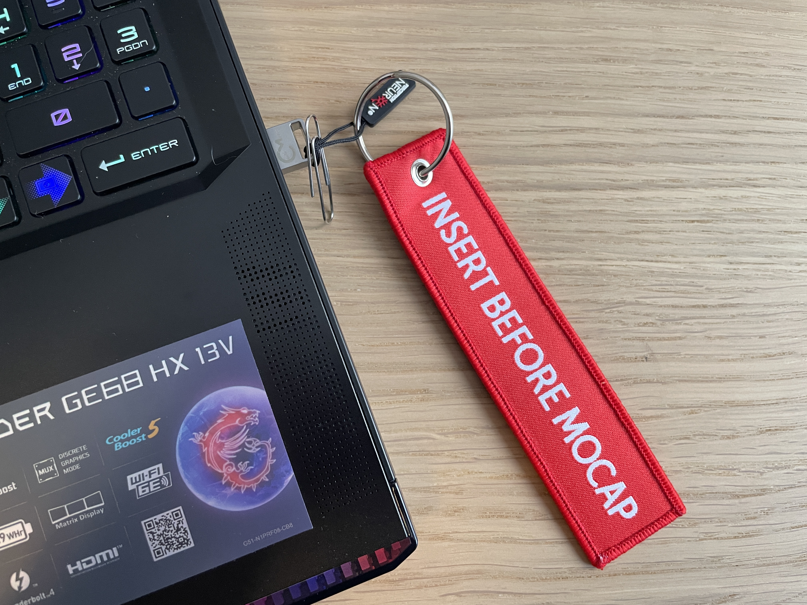

### 1. Plug in the USB Dongle

Plug the **USB dongle** into the computer.

This dongle is necessary to open **Axis Studio**.

### 2. Open Axis Studio

Open **Axis Studio**.

If the USB dongle is not connected, the software may ask you to log in. If this happens, connect the dongle, close Axis Studio, and open it again.

### 3. Create a New Project

Select **Create New Project**.

### 4. Open the Capturing Tab

Go to the **Capturing** tab.

At this stage, the sensors may not be connected yet.

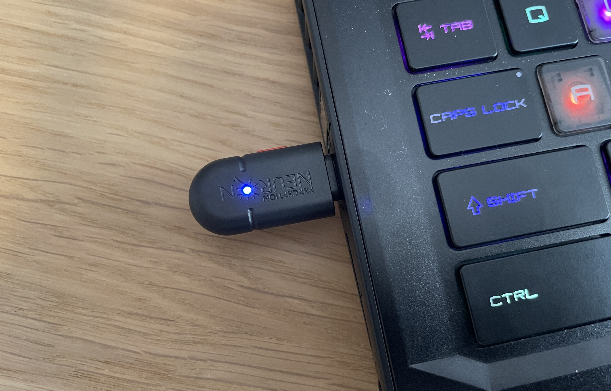

### 5. Connect the USB-C Receiver

Connect the **USB-C receiver** to the computer.

This receiver allows the PN3 sensors to communicate with Axis Studio.

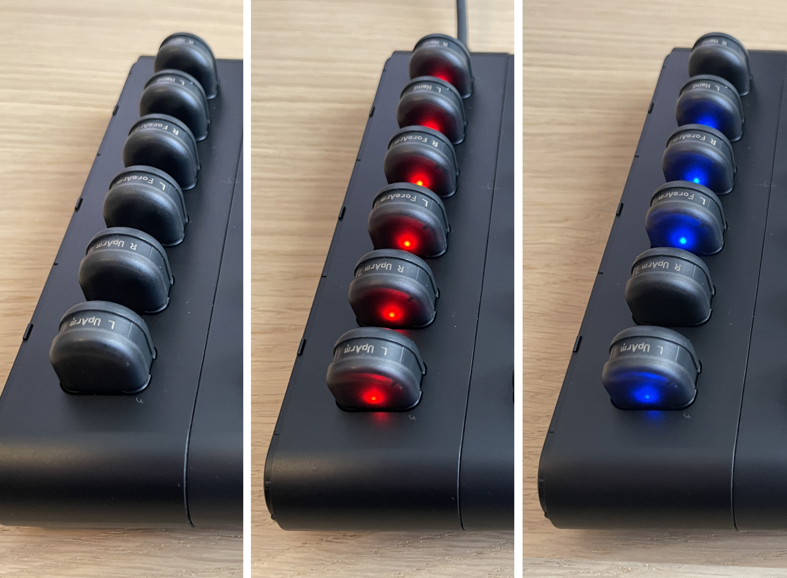

### 6. Turn On the Sensors

Turn on all of the sensors.

You can do this by connecting the charging cable to the dock. The sensors should turn on while they are lined up in the case.

### 7. Confirm the Device Is Connected

Confirm that the device appears as **Connected** in Axis Studio.

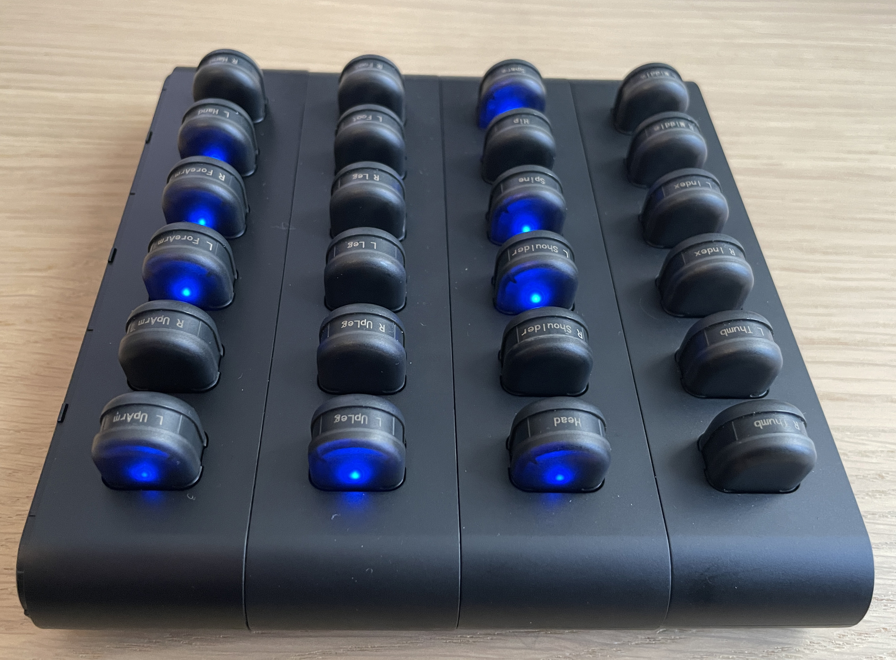

### 8. Keep the Sensors in the Case

For now, keep the sensors in their case until you are ready to continue with the sensor check and placement.

<!--
/////////////////
SECTION 3
/////////////////
-->

  <strong>3. ⚙️ Run Sensor Check</strong>
   
  
    Prepare the sensors, run the Sensor Check in Axis Studio, and confirm that all sensors are connected correctly.
  

## Prepare the Sensors for Checking

Before running the Sensor Check, place the sensors on the charging dock.

Make sure:

- The sensors are fully charged. Charging may take **3–4 hours** until the red light is turn off.
- The sensors are on a **non-magnetic table or stool**.
- The sensors are **not** on a metal desk.
- The sensors are away from speakers, magnets, phones, or other electronic interference.
- The dock is stable and not being moved.

---

## Sensor Check Steps

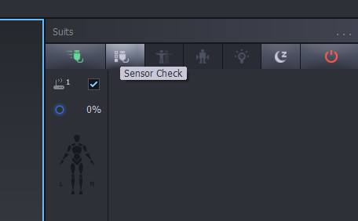

### 1. Open Sensor Check

In the **Capturing** tab, go to **Suits** and click **Sensor Check**.

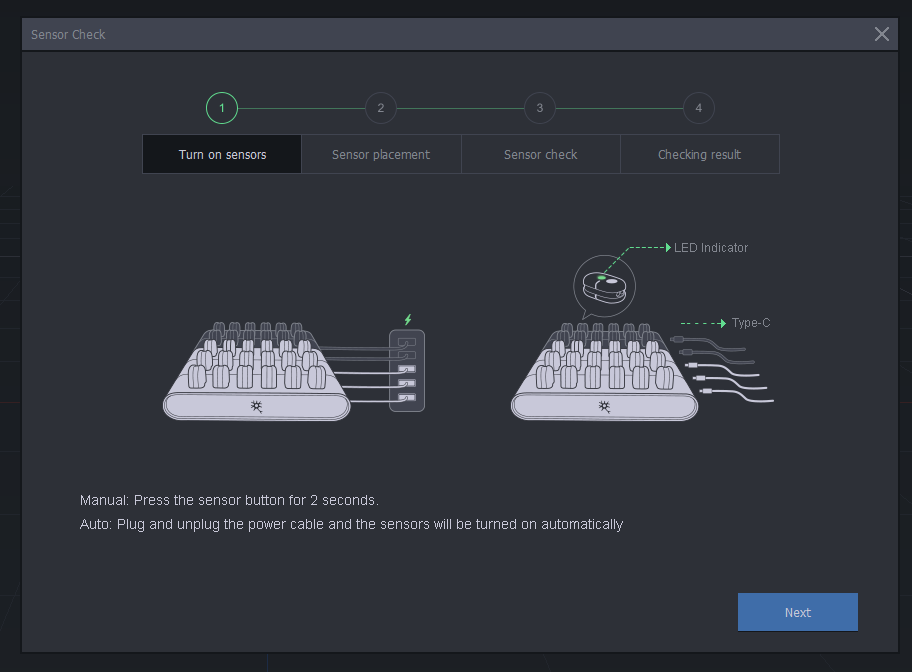

### 2. Turn On the Sensors

Turn on all sensors.

Then click **Next**.

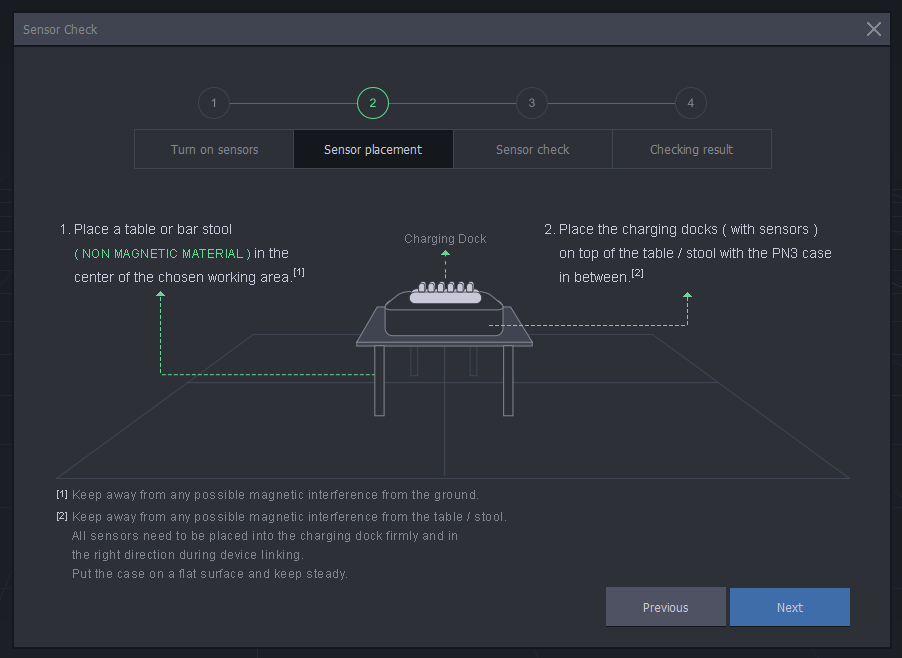

### 3. Place Sensors on a Stable Surface

Place the sensors on the charging dock on a steady table or bar stool.

Avoid metal or magnetic surfaces.

Click **Next**.

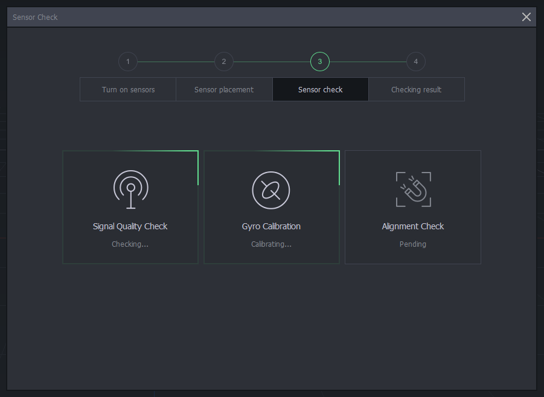

### 4. Wait for the Sensor Check

Wait while Axis Studio checks the sensors.

Do not move the sensors or the dock while the check is running.

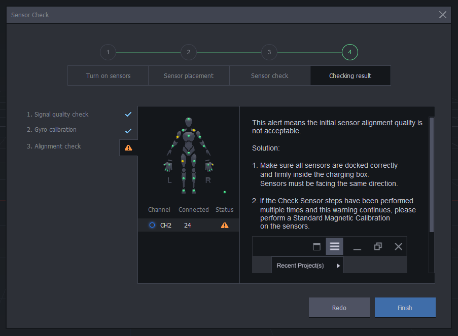

### 5. Check the Results: Warnings

Confirm that all sensors appear as connected.

If you get a warning, it may be because the battery is low or you must run the magnetic calligration (check video below).

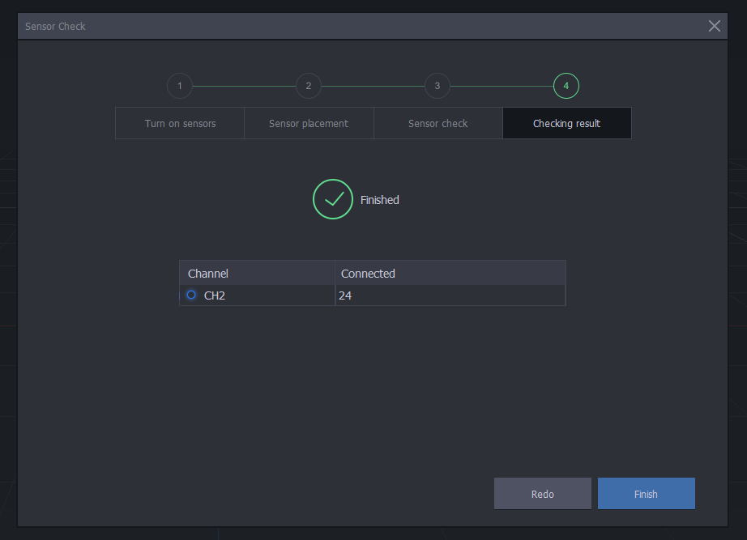

### 5. Check the Results: Finished

If the sensors are all working correctly, you will get this message. Click Finish. 

---

## 🎥 Sensor Calibration Videos

### Perception Neuron 3 | Sensor Calibration

  <iframe
    src="https://www.youtube.com/embed/8yB58PIHUVw?si=XxTpHW7UXU7YPR9a"
    title="Perception Neuron 3 | Sensor Calibration"
    style="width: 100%; height: 100%; border: 0;"
    allow="accelerometer; autoplay; clipboard-write; encrypted-media; gyroscope; picture-in-picture; web-share"
    referrerpolicy="strict-origin-when-cross-origin"
    allowfullscreen>
  </iframe>

### Perception Neuron | Multi-Actor Calibration

  <iframe
    src="https://www.youtube.com/embed/_2yBt1xjFaE?si=G4yZPmR0c5BU2Ew1"
    title="Perception Neuron | Multi-Actor Calibration"
    style="width: 100%; height: 100%; border: 0;"
    allow="accelerometer; autoplay; clipboard-write; encrypted-media; gyroscope; picture-in-picture; web-share"
    referrerpolicy="strict-origin-when-cross-origin"
    allowfullscreen>
  </iframe>

---

<!--
/////////////////
SECTION 4
/////////////////
-->

  <strong>4. 👖 Wear and Connect Sensors</strong>
   
  
    Put on the PN3 suit or straps and place each sensor carefully before calibration.
  

## 4. Wear and Place the Sensors

Use the sensor placement guide in **Axis Studio** as a reference.

{: .tutorial-image-full }

Place the sensors carefully and symmetrically. Sensor placement affects how accurately Axis Studio reads the performer’s movement.

Make sure:

- Sensors are attached firmly.
- Sensors are placed on the correct body parts.
- Left and right sensors are placed symmetrically.
- Straps are secure but not uncomfortable.
- Sensors do not slide when the performer moves.

---

## Important Sensor Locations

| Body area | Placement |
|---|---|
| **Shoulders** | Attach to the upper back of each shoulder |
| **Hip** | Place firmly on the back of the pelvis, not the lower back |
| **Upper legs** | Attach on the outside of each thigh, not the front |
| **Feet, arms, and wrists** | Follow the strap guides and keep placement symmetrical |

---

## How the Sensors Work

Each PN3 sensor uses an **inertial measurement unit**, or **IMU**, to track movement.

The sensors detect:

- Acceleration
- Rotation
- Orientation
- Body movement in space

The hub receives data wirelessly from each sensor and sends it to **Axis Studio** in real time. Axis Studio then translates the performer’s physical movement into digital motion.

---

## ✅ Before Continuing

Check that:

- [ ] The performer is wearing all required sensors.
- [ ] The sensors match the placement guide in Axis Studio.
- [ ] The left and right sides are symmetrical.
- [ ] The hip sensor is placed on the back of the pelvis.
- [ ] The shoulder sensors are placed on the upper back.
- [ ] The upper-leg sensors are placed on the outside of the thighs.
- [ ] The performer can move comfortably.
- [ ] The sensors stay in place when the performer moves.

<!--
/////////////////
SECTION 5
/////////////////
-->

  <strong>5. 🔗 Complete the Initial Connection</strong>
   
  
    Connect the suit in Axis Studio and complete the first automatic sensor alignment before posture calibration.
  

After putting on the sensors, complete the first connection step in **Axis Studio**.

This step helps Axis Studio recognize the sensor setup and confirm that the performer is ready for calibration.

---

## Initial Connection Steps

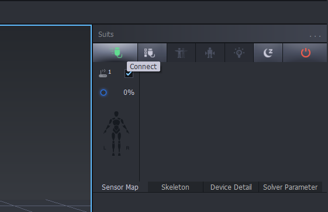

### 1. Click Connect

In the **Capturing** tab, go to **Suits** and click **Connect**.

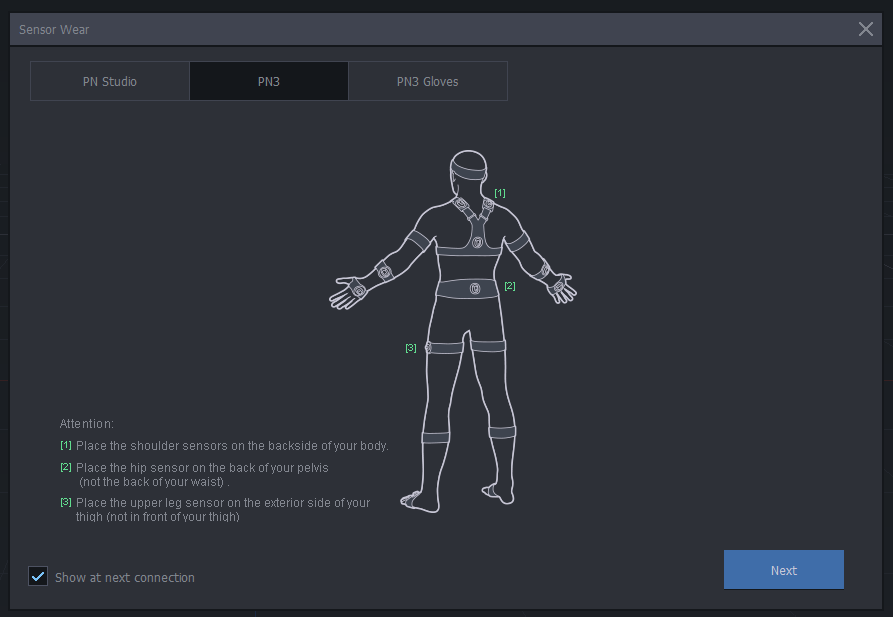

### 2. Check Sensor Placement

Axis Studio will show instructions to check the placement of the sensors.

Review the placement carefully, then click **Next**.

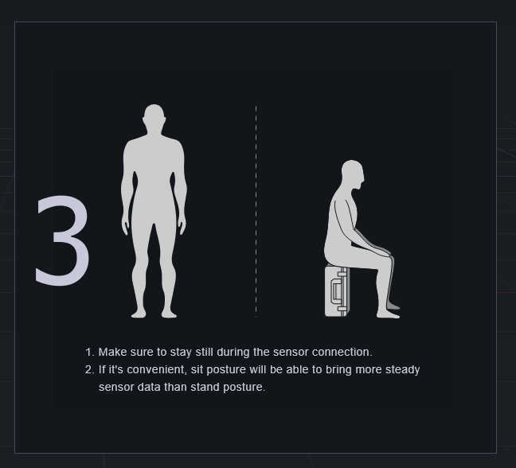

### 3. Stay Still

Stand still, or sit without moving, while Axis Studio completes the automatic connection step.

Do not move until the software tells you to continue.

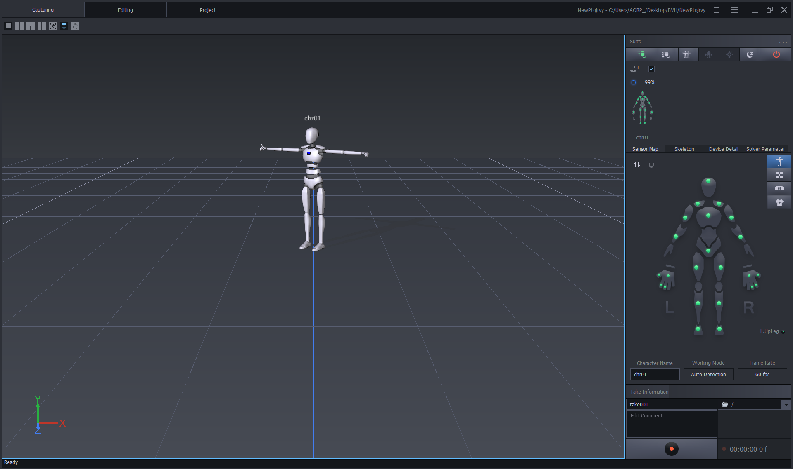

### 4. Confirm the Connection

Your initial connection should now be ready.

Check that the suit appears connected and that there are no warning messages.

---

## Important Note

This first connection helps Axis Studio recognize the sensor setup, but it is **not** the final body alignment.

You still need to complete a full **Posture Calibration** before recording motion capture.

---

## ✅ Before Continuing

Make sure:

- [ ] The suit appears as connected in Axis Studio.
- [ ] The performer stayed still during the connection process.
- [ ] No sensor warnings appear.
- [ ] The sensors are still placed correctly.
- [ ] You are ready to continue to **Posture Calibration**.

---

## Continue to Posture Calibration

After the sensors are connected and worn correctly, continue with:

[👤 Posture Calibration in Axis Studio](02_Body_Callibration.md){:target="_blank"}

---

---