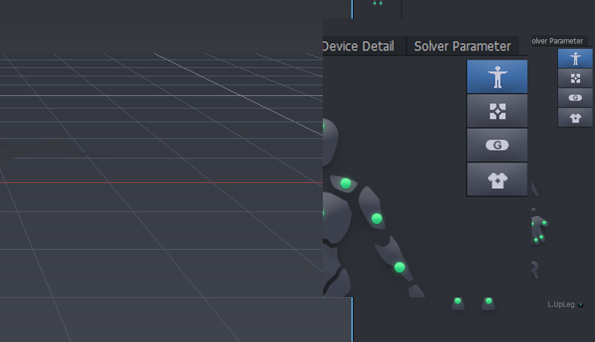
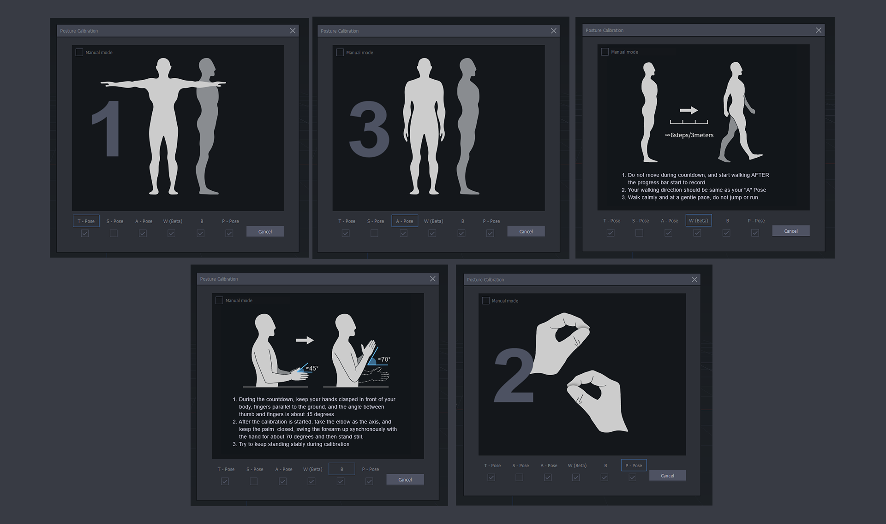
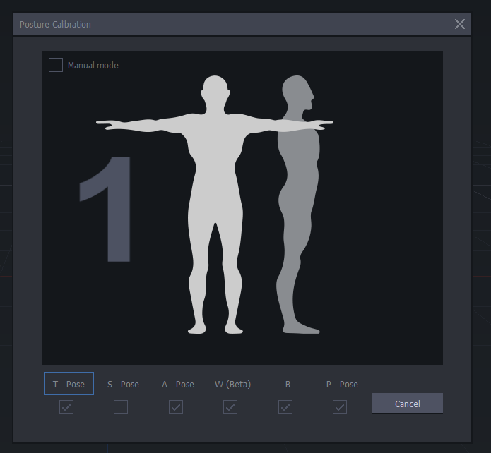
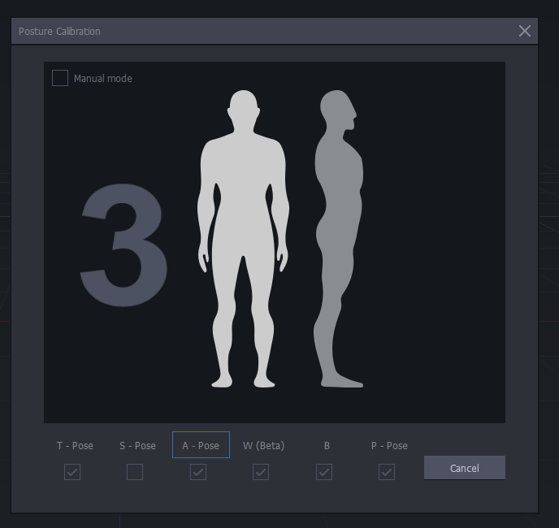
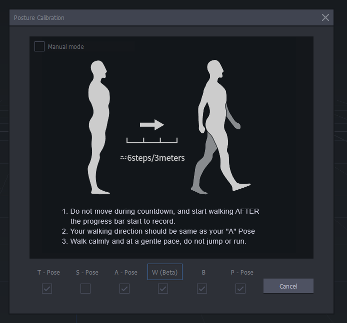
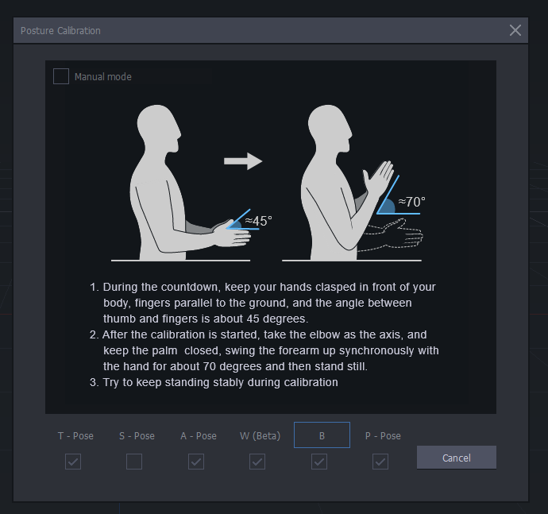
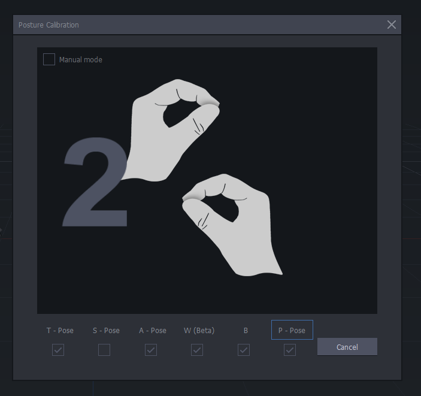

[MOCAP Tutorials](README.md)

---

# 👤 Posture Calibration in Axis Studio

**Activity:** Complete posture calibration in Axis Studio by aligning the Perception Neuron 3 system with the performer’s body and preparing the suit for motion-capture recording.

This guide helps you complete the required calibration poses, check that the digital avatar follows the performer’s movements correctly, and confirm that the suit is ready before recording motion capture.

---

  <strong>🛠️ Before You Begin</strong>
   
  
    Check the sensors, suit, hub, and performer setup before starting posture calibration.
  

## What Is Body Calibration?

**Body calibration** is the process of aligning the motion-capture system with the performer’s body.

It helps Axis Studio create a digital skeleton that matches the performer’s:

- Body proportions
- Neutral posture
- Arm and leg orientation
- Joint placement
- Movement range

Accurate calibration is essential for clean motion-capture data. If the calibration is incorrect, the avatar may show problems such as twisted arms, incorrect posture, drifting, jittering, or inaccurate walking movement.

## Before starting

- All **PN3 sensors are charged**.
- All sensors are paired and properly attached to the **PN3 straps or suit**.
- The **hub** and receiver are connected.
- **Axis Studio** is open.
- The PN3 suit appears as connected.
- The performer has enough space to stand and move safely.
- Sensors have not shifted after being placed on the body.

---

## Tips

- Recalibrate whenever sensors shift.
- Recalibrate if the avatar looks twisted, delayed, or inaccurate.
- Each performer must calibrate separately.
- The performer should remain still when instructed.
- Do not rush the pose countdowns.

---

  <strong>1. ✨ Start Posture Calibration</strong>
   
  
    Open the posture calibration panel, enable the required poses, and begin calibration.
  

## Setup and Calibration Steps

### 1. Confirm the Suit Is Connected

Open **Axis Studio** and confirm that the PN3 suit is connected.

Check that the hub and sensors appear active before continuing.

### 2. Open Posture Calibration

Click the **T-Pose icon** on the right-side toolbar.

This opens the **Posture Calibration** panel.

### 3. Enable the Required Poses and Start Calibration

Enable the posture types required for calibration.

Use the poses requested by Axis Studio, such as **T-Pose**, **W**, and **P-Pose**.

Click **Start Calibration**.

### 4. Remain Still

During each countdown, the performer must remain completely still.

Wait until Axis Studio tells you to move to the next pose.

### 5. Confirm Calibration

After calibration, a success message should appear.

Check that the virtual avatar mirrors the performer’s movement smoothly.

---

  <strong>2. Calibration Poses Explained</strong>
   
  
    Review each posture and what it helps Axis Studio calibrate.
  

Each posture calibrates a specific part of the body-tracking system. Perform each pose exactly as shown.

### 🅣 T-Pose

The **T-Pose** calibrates full-body joint orientation.

Stand upright with feet together. Extend both arms horizontally to form a **T** shape.

Keep:

- Head facing forward
- Arms straight
- Palms facing down
- Knees relaxed
- Body still

### 🅐 A-Pose

The **A-Pose** supports shoulder and arm calibration.

Stand with arms lowered naturally beside the body.

Keep:

- Hands near the sides of the thighs
- Palms facing inward
- Shoulders relaxed
- Body still

### 🅦 W Pose

The **W** calibration helps with walking, balance, and gait.

Begin still. After the countdown, walk forward slowly for approximately **6 steps** or **3 meters**.

Avoid:

- Running
- Jumping
- Turning
- Changing direction

### 🅑 B Pose

The **B** calibration refines forearm swing and elbow movement.

Clasp hands loosely in front of the body. When instructed, rotate the forearms upward using the elbows.

Then stand still again.

### 🅟 P-Pose

The **P-Pose** calibrates finger gestures and hand shape.

Touch the thumb and index finger together to form an **OK** gesture.

Keep:

- Both hands matching each other
- Other fingers curved and relaxed
- Body still

---

  <strong>3. Check the Calibration</strong>
   
  
    Test the avatar and repeat calibration if the movement looks inaccurate.
  

## Test the Motion

### 1. Move Slowly

Perform simple movements first.

Try:

- Raising both arms
- Turning the torso
- Bending the knees slightly
- Taking a few slow steps

### 2. Check the Avatar

Watch the avatar carefully.

The avatar should mirror the performer’s movement smoothly, without twisting, snapping, drifting, or jittering.

### 3. Fix Problems

If the avatar looks incorrect, check the sensor placement.

A sensor may have shifted, been placed on the wrong side, or become loose.

### 4. Recalibrate if Needed

Repeat posture calibration if tracking is inaccurate.

Recalibration is normal and may be necessary when switching performers.

---

## ✅ Before Recording

Make sure:

- [ ] The avatar stands naturally.
- [ ] Arms and legs are not twisted.
- [ ] Walking looks stable.
- [ ] There is no major drifting.
- [ ] The performer can move comfortably.
- [ ] The sensors are still secure.
- [ ] The motion looks clean enough to record.

---

  <strong>🎥 Perception Neuron 3 First Launch Video</strong>
   
  
    Watch a video guide for launching and setting up Perception Neuron 3.
  

## Perception Neuron 3 | First Launch

  <iframe
    src="https://www.youtube.com/embed/KdryfjN8pvs?si=ANNxJWdKtMohntUB"
    title="Perception Neuron 3 | First Launch"
    style="width: 100%; height: 100%; border: 0;"
    allow="accelerometer; autoplay; clipboard-write; encrypted-media; gyroscope; picture-in-picture; web-share"
    referrerpolicy="strict-origin-when-cross-origin"
    allowfullscreen>
  </iframe>

---