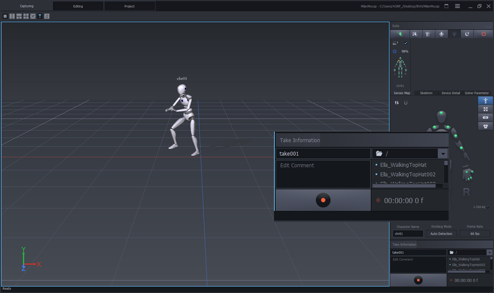
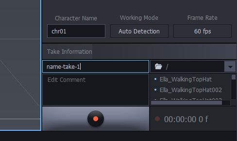
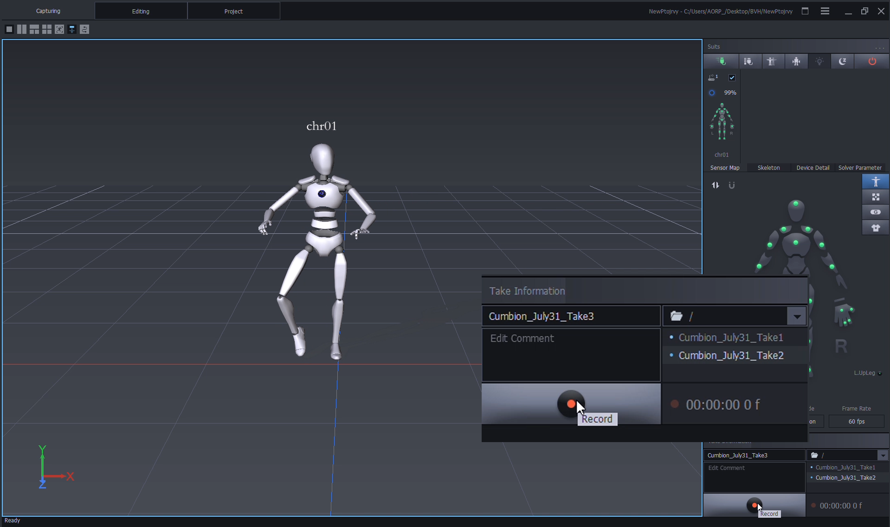
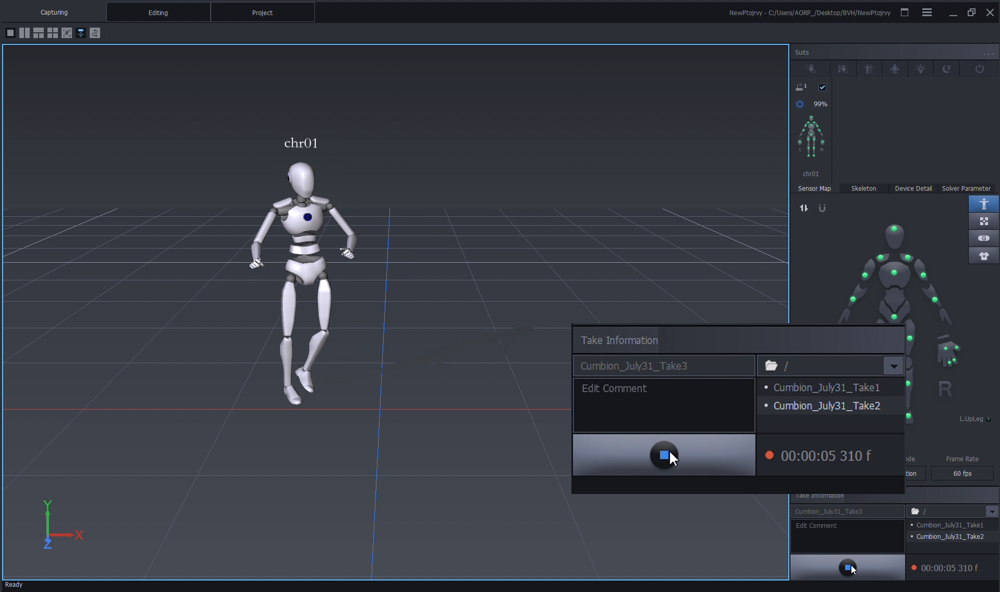
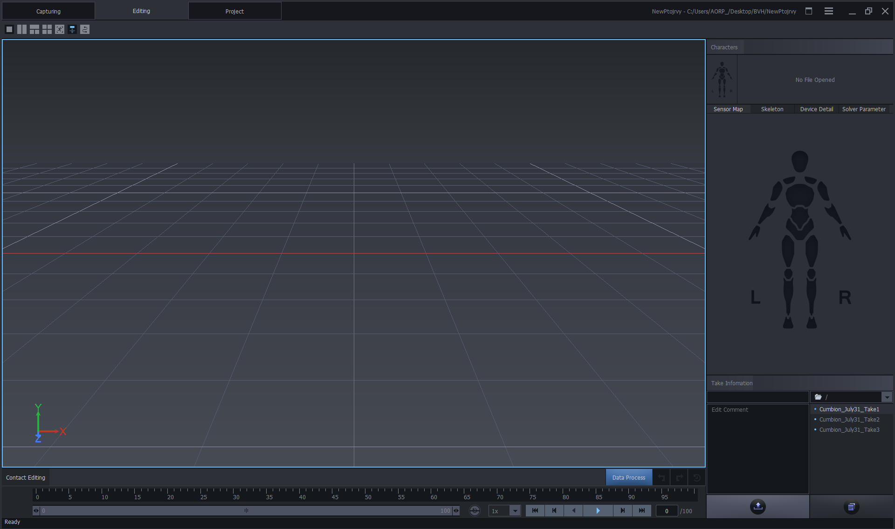
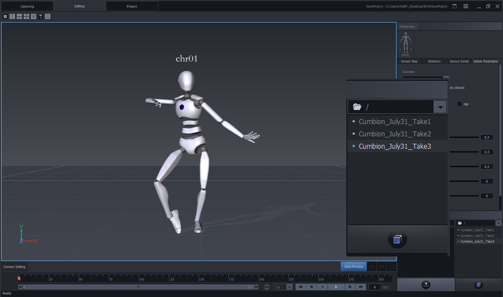
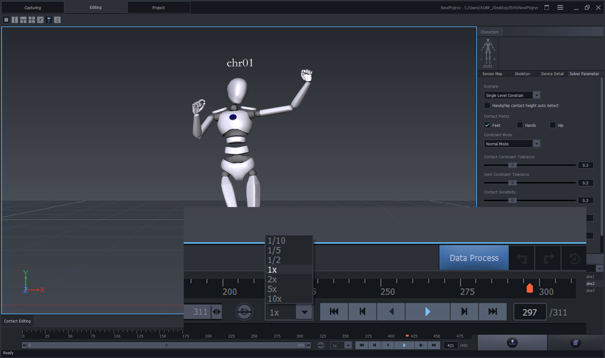
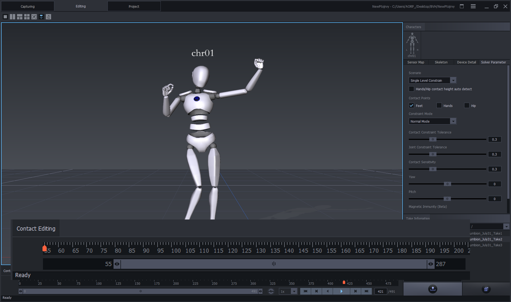

[MOCAP Tutorials](README.md)

---

# 🎥 Record and Export Motion Data in Axis Studio

**Activity:** Record motion-capture data in Axis Studio using the Perception Neuron 3 system and export the recording as a `.bvh` file.

This guide walks you through how to record a movement take, review it in Axis Studio, and export the motion data for use in Blender or other `.bvh`-compatible software.

---

  <strong>Preparation</strong>
   
  
    Check calibration, avatar tracking, and workspace safety before recording.
  

Before recording, make sure:

- [ ] The sensors are fully calibrated.
- [ ] The avatar in Axis Studio accurately mirrors the performer’s movement.
- [ ] The workspace is clear.
- [ ] Tracking looks smooth.
- [ ] There is no major drifting, snapping, or jittering.
- [ ] The performer has enough room to move safely.
- [ ] You know what movement you want to record.

---

  <strong>1️⃣ Record Motion Data</strong>
   
  
    Name the take, start recording, perform the movement, and stop the recording.
  

## Recording Steps

### 1. Open Take Information

In the **Capturing** window, go to the right-side panel.

Find the **Take Information** section.

### 2. Rename the Take

Rename the take clearly before recording.

Use a name that identifies the person, date, and take, for example: `Cumbion_Jul31_take1.bvh`

### 3. Start Recording

Click the **Record** icon.

Wait a moment before moving so the beginning of the recording is clean.

### 4. Perform the Movement

Perform your movement.

Move clearly and avoid rushing. Stay within the safe recording space.

### 5. Stop Recording

Click the **Record** icon again to stop recording.

Axis Studio automatically saves the recording in the selected output folder.

## Tips

- Use consistent file names, such as: `performer_date_take.bvh`
- Rename each take before recording.
- Recalibrate if the performer changes.
- Recalibrate if tracking looks inaccurate.
- Record short tests before recording the final movement.
- Keep movements clear and intentional.

---

  <strong>2️⃣ Review and Export the Recording</strong>
   
  
    Open the recorded take, review the motion, and export it as a .bvh file.
  

## Reviewing and Exporting Steps

### 1. Open the Editing Window

Go to the **Editing** window in Axis Studio.

### 2. Select the Recording

On the right-side panel, under **Take Information**, select your recording.

For example:

`walk_cycle_001`

### 3. Review the Motion

Use the timeline panel to play the recording.

Check that the motion looks clean before exporting.

### 4. Open Export Settings

Click the **Export** icon on the right-side panel.

### 5. Choose BVH Format

Confirm that the file type is set to `.bvh`.

Set the frame range you want to export.

### 6. Select Directory and Export

Choose the folder where you want to save the file.

Click **Export**.

## Tips

- Avoid leaving extra empty time at the beginning or end of the exported file.
- Review the motion in **Axis Studio playback** before exporting.

---

  <strong>Locate the Recorded File</strong>
   
  
    Find the exported .bvh file and prepare it for use in Blender or other software.
  

After exporting:

- Open your selected **output folder** in File Explorer.
- Look for the `.bvh` file you just exported.
- Confirm that the file name is clear and easy to identify.
- Move or copy the `.bvh` file into your project folder if needed.

You can open and preview `.bvh` files in:

- **Blender**
- **MotionBuilder**
- **DeepMotion**
- Any `.bvh`-compatible animation software

---