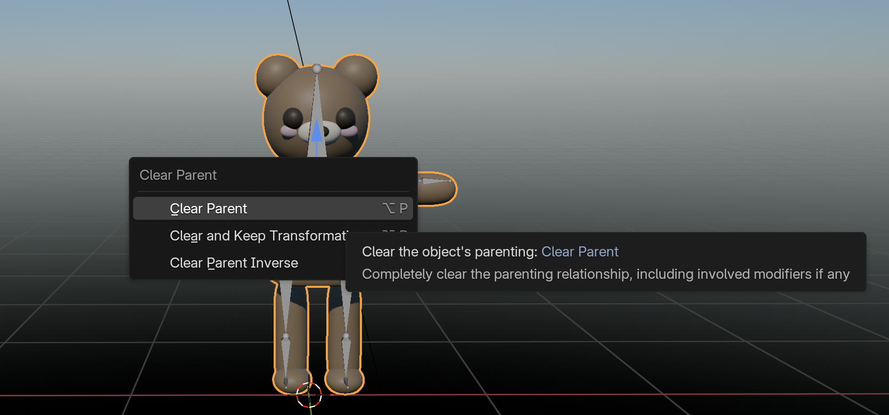
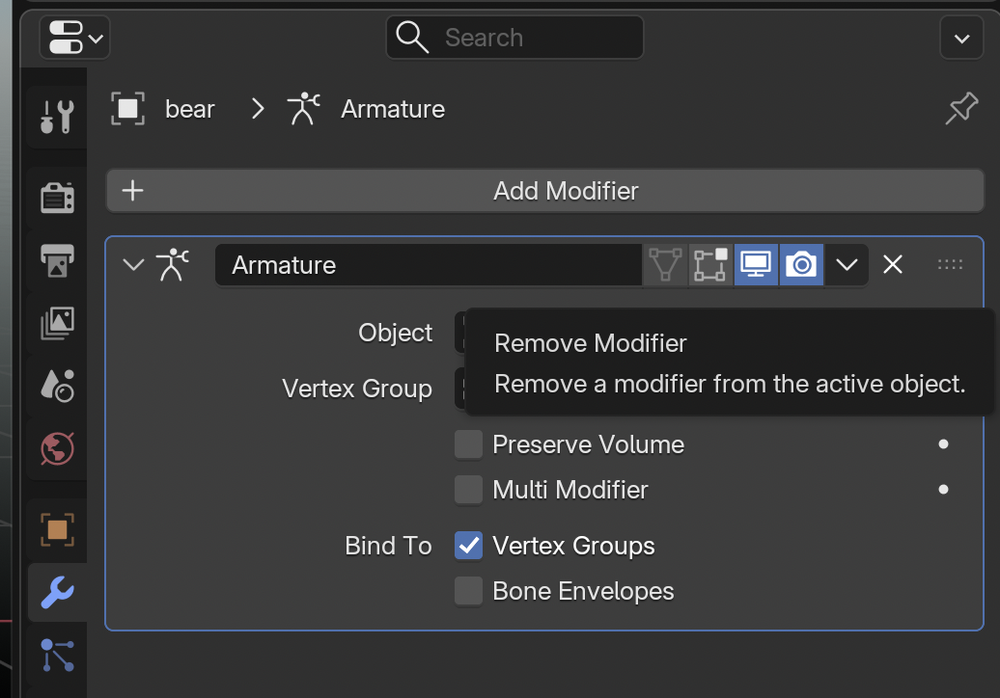
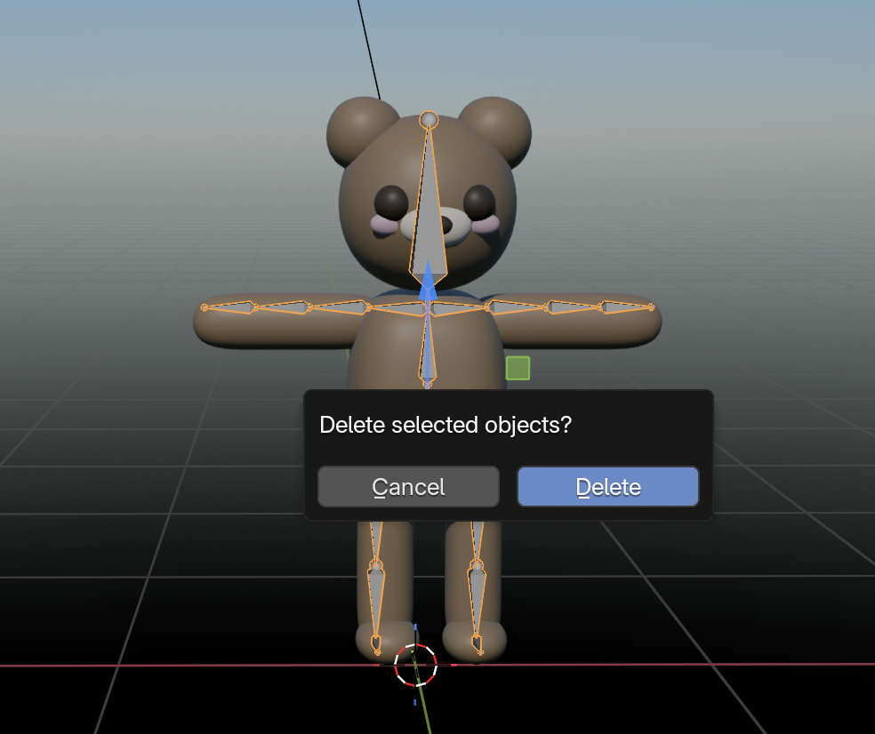
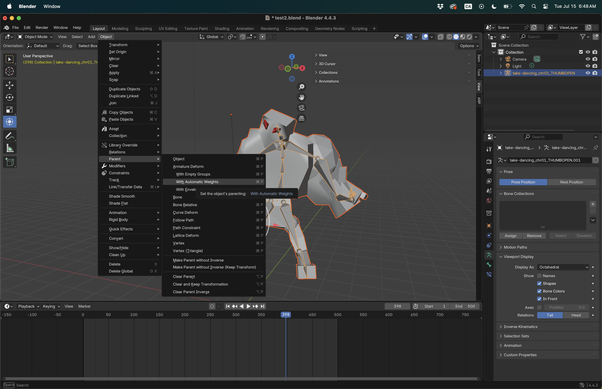
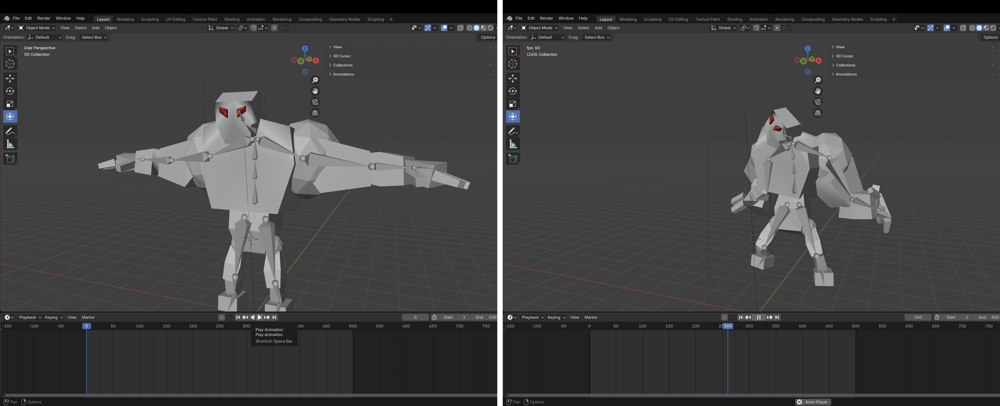

[MOCAP Tutorials](README.md)

-------------------------------------------------------------------------------

# 🦴 Rigging Movements in Blender  
## Using Motion Capture Data from Perception Neuron 3 (.bvh)

---

### 📌 What is MOCAP .bvh file?

A **.bvh (Biovision Hierarchy) file** is a standard motion capture (MOCAP) file format used in 3D animation. It **contains only skeletal structure data and movement information** (animation curves)—no 3D character models, colors, or textures.

Since .bvh skeletons are usually just stick-figure armatures, **"rigging" it involves matching the mocap skeleton to your character** so your 3D model moves exactly like the motion data.

---

## Manual Retargeting (No Armature on Import)

This method works best when you want to manually align BVH motion to a static mesh model without pre-existing rig constraints.

### 💡 Tips
- Make sure your character is in **T-pose or A-pose** before rigging
- Avoid scaling bones in **Edit Mode** — this can break animation playback  
- Use orthographic views (`Numpad 1/3/7`) to check alignment  
- You can clean up or simplify keyframes using the **Graph Editor**

### ❗❗❗ Important

Before starting, remove any existing armatures from your model:

- Select your model(s)
- Press option + P in your keyboard
- Select **Clear Parent**

{: .tutorial-image }

- Go to **Modifier Properties** and delete your Armature by clicking on the **X**

{: .tutorial-image }

- Select your armature, click **X** to delete.

{: .tutorial-image }

---

### Step-by-Step Instructions

#### 1. **Import Your BVH File**  
   - Go to `File → Import → Motion Capture (.bvh)`  
   - Select your `.bvh` file  
   - Before importing: In the **Transform** panel on the right, set the **Scale** to `0.1`  
   - Click **Import BVH**  
   - This will create a **BVH armature** with baked motion keyframes
   - Before going to the next step, **go to frame 0 in your timeline**. This will show the imported **armature in T pose**.

{: .tutorial-image }

#### 2. **Align BVH Scale with Character**  
   - Your mocap character may appear larger/smaller than your mesh  
   - Use **`S` (scale)** on the **BVH armature only** (Object Mode)  
   - Do **not scale the armature in Edit Mode** or using non-uniform transforms

{: .tutorial-image }

#### 4. **Match Bone Positions**  
   - Select the **BVH armature**  
   - Enter **Edit Mode**  
   - Move and adjust bones so they **visually align with your character’s mesh**  
   - Focus on key joints like the **shoulders, hips, knees, and feet** for accurate alignment

{: .tutorial-image }

#### 5. **Parent the Mesh**  
   - To apply the BVH armature to your mesh, select the **mesh first**, then **Shift+click the armature**  
   - Press `Ctrl+P` and choose **With Automatic Weights**  
   - **Note**: This works best if your mesh is **roughly aligned** with the armature
   - Clean the hands, removing any weight paint on them if not need it.  
   - **Tip**: Use **Weight Paint mode** to fine-tune how bones influence the mesh if deformations look incorrect and/or re-parent **With Empty Groups**.
   - 🖍️ [Tips for Weight Painting in Blender](../Blender/16_Weight_Painting.md)

{: .tutorial-image }

#### 6. **Play the Timeline**  
   - Press `Spacebar` or drag the timeline to preview the movement  
   - Your BVH skeleton should animate based on the captured motion
  
{: .tutorial-image }

#### 7. **Export short video**  
   - Go to the **Output Properties** tab (printer icon in the Properties Panel).
   - Set the **frame range** to max 1-500.
   - Under **Output**, choose a location to save and set the file format to `FFmpeg video`.
   - In the **Encoding** section (appears when FFmpeg is selected):
      - Set **Container** to `MPEG-4`
      - Set **Video Codec** to `H.264`
   - Go to **Render → Render Animation** (`Ctrl + F12`).
   - Once done, your video file will be saved in the selected folder.

### How to Export Video in Blender

  <iframe
    src="https://www.youtube.com/embed/3eJmISziyIY?si=ZCpno06akClY-OWQ"
    title="How to Export Video in Blender"
    style="width: 100%; height: 100%; border: 0;"
    allow="accelerometer; autoplay; clipboard-write; encrypted-media; gyroscope; picture-in-picture; web-share"
    referrerpolicy="strict-origin-when-cross-origin"
    allowfullscreen>
  </iframe>

---

