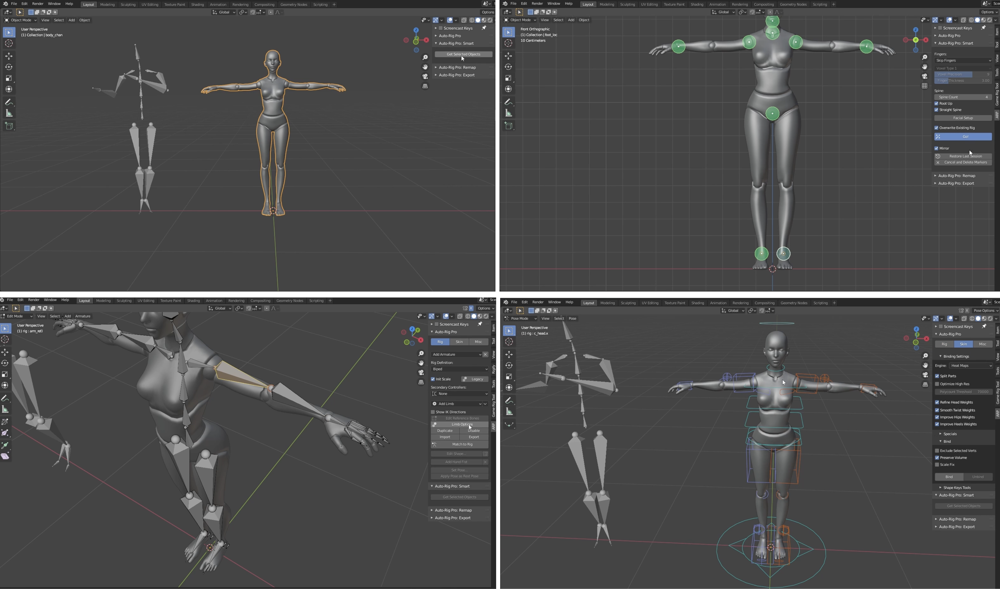
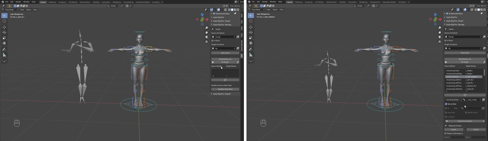
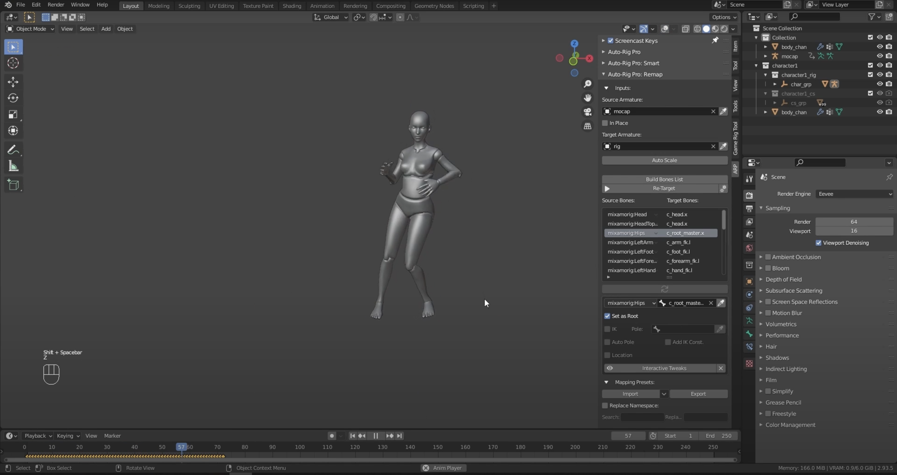

[MOCAP Tutorials](README.md)

-------------------------------------------------------------------------------

# 🌀 Re-targeting Movements in Blender  
## Using Motion Capture Data from Perception Neuron 3 (.bvh)

---

### 📌 What is MOCAP and Retargeting?

**Motion Capture (MOCAP)** is a technique for recording human movement and translating it to a digital character. In this guide, we use **.bvh files** captured with Perception Neuron 3 (PN3) and apply that movement to a custom 3D model in **Blender**.

**Retargeting** refers to the process of **mapping motion data from one skeleton (e.g., a BVH armature)** onto another (e.g., your character model), allowing different rigs or body types to perform the same animation.

---

  <strong>1️⃣ Option 1: Retargeting with Auto-Rig Pro – Smart + Remap</strong>
   
  
    This option uses the Auto-Rig Pro add-on for Blender — a powerful tool designed to simplify rigging, animation retargeting, and character preparation for games or film.
  

## 💡 Tips
- Make sure your character is in **T-pose or A-pose** before rigging
- If joints don’t align properly, you can manually adjust bone mapping in the **Remap** tab
- Auto-Rig Pro also supports batch retargeting for multiple animations

---

## Install Auto-Rig Pro

**Auto-Rig Pro** is a paid Blender add-on that provides tools for:
- Creating advanced rigging systems with controllers and constraints
- Retargeting motion from external sources (like BVH or FBX files)
- Exporting animations to game engines

➡️ Download and install it from your Blender Preferences:
- `Edit → Preferences → Add-ons → Install...`
- Select the `.zip` file, install, and enable **Auto-Rig Pro: Rig Tools**

---

## Step-by-Step Instructions

First, create a new Blender project and **save the file** as `Character-with-MOCAP-2.blend`.
Then, follow these steps:

1. **Import Your Character Mesh**  
   - In Blender, go to `File → Import → OBJ/FBX` (or whatever format your model is in)  
   - Make sure your model **does not include an armature**

2. **Watch the video tutorial**
   - 🎥 **Follow only the first 10 minutes of the linked tutorial video** to complete the steps below.
   - The rest of the video covers advanced features that are not required for this exercise.

3. **Play the Timeline**  
   - Press `Spacebar` or scrub through the timeline to preview the animation on your character

4. **Export a Short Video**  
   - Use `Render → Render Animation` to export a short `.mp4` showcasing the result

---

## Overview of the process

### Create a Rig with Auto-Rig Pro: Smart

- Select your **character mesh**  
- Open the **Auto-Rig Pro → Smart** panel (found in the `N` sidebar under the Auto-Rig tab)
- Place the rig markers following your character’s anatomy (chin, shoulders, hips, knees, etc.)
- Click **Go!** to generate a full Auto-Rig Pro armature

🛠️ You can tweak the rig to better fit your model after generation.

{: .tutorial-image }

### Retarget Using Auto-Rig Pro: Remap

- Go to **Auto-Rig Pro → Remap**
- Set:
  - **Source Armature** → your imported **BVH armature**
  - **Target Armature** → your newly created **Auto-Rig Pro rig**

Then configure the following:
- Enable **Auto-Scale** to match proportions
- Check **Retarget Actions** to transfer animation
- Set **Root Bone** to the **hip** of the source rig (usually `hip` or `Hips`)

Click **Remap** to complete the transfer.

{: .tutorial-image }

### Preview & Adjust

Play the timeline to see your character animated with the mocap data

{: .tutorial-image }
     
---

## Retargetting using Auto-Rig Pro

  <iframe
    src="https://www.youtube.com/embed/HHnt-3uLSUo?si=HYVElLSfyM7YldYb"
    title="Retargetting using Auto-Rig Pro"
    style="width: 100%; height: 100%; border: 0;"
    allow="accelerometer; autoplay; clipboard-write; encrypted-media; gyroscope; picture-in-picture; web-share"
    referrerpolicy="strict-origin-when-cross-origin"
    allowfullscreen>
  </iframe>

---

  <strong>2️⃣ Option 2: Retargeting with Auto-Rig Pro – Existing Rig + Remap</strong>
   
  
    This method is ideal if your character already comes fully rigged with Auto-Rig Pro, such as a model you purchased or prepared earlier. Instead of creating a new rig from scratch, you simply retarget motion capture data onto the existing rig using Auto-Rig Pro’s Remap tool.
  

## Step-by-Step Instructions

First, create a new Blender project and **save the file** as:  
`Character-with-MOCAP-3.blend`

Then, follow these steps:

1. **Import Your Character Mesh**  
   - Go to `File → Import → FBX` or open a Blender file that includes your **Auto-Rig Pro rigged character**

2. **Import the BVH File**  
   - Go to `File → Import → Motion Capture (.bvh)`  
   - Set **scale to 0.1** in the Transform panel before importing

3. **Use Auto-Rig Pro → Remap**  
   - Open the **Remap** panel from the Auto-Rig Pro tab  
   - Set the **BVH Armature** as the **source**  
   - Set your **existing Auto-Rig Pro rig** as the **target**  
   - Enable **Auto-Scale**, **Retarget Actions**, and **set the hip bone as Root**
   - Click **Remap**

⚠️ **Warning**: Before retargeting, make sure your **existing character rig** has:
- Bone names that **match the BVH armature** (e.g., `hip`, `spine`, `left_arm`)  
- Adjusted bone positions that align with the **BVH motion structure**

If needed, enter **Edit Mode** on the target armature to rename or reposition bones.

## 💡 Tips
- If animations look off, check the bone mapping or realign your source and target rigs 

---

4. **Play the Timeline**  
   - Press `Spacebar` or scrub through the timeline to preview the animation on your character

5. **Export a Short Video**  
   - Use `Render → Render Animation` to export a short `.mp4` showcasing the result

---

### Perception Neuron 3 | Retargeting data in Blender

  <iframe
    src="https://www.youtube.com/embed/dv2oS0OsJqE?si=snc_H0h28BKN6cwC"
    title="Perception Neuron 3 | Retargeting data in Blender"
    style="width: 100%; height: 100%; border: 0;"
    allow="accelerometer; autoplay; clipboard-write; encrypted-media; gyroscope; picture-in-picture; web-share"
    referrerpolicy="strict-origin-when-cross-origin"
    allowfullscreen>
  </iframe>

---