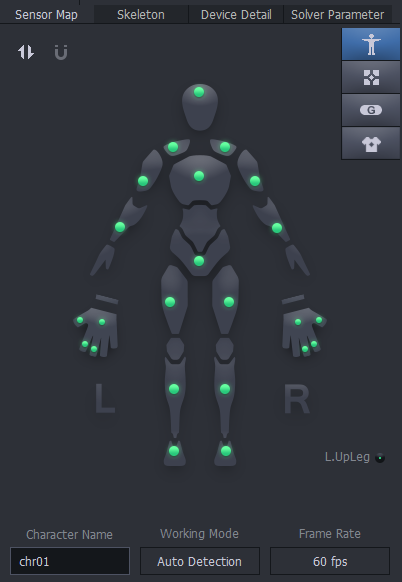
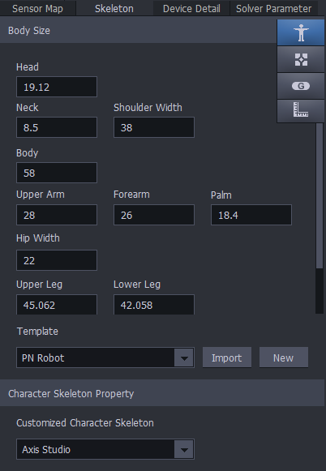
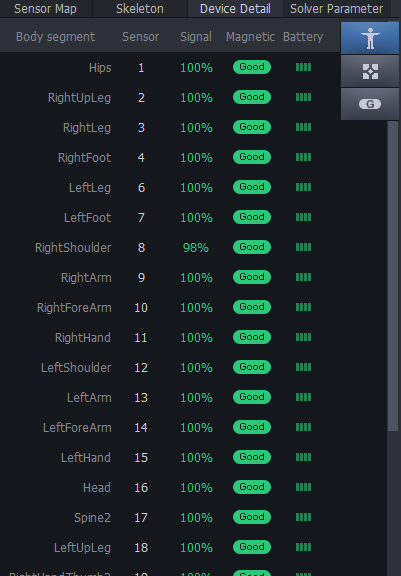
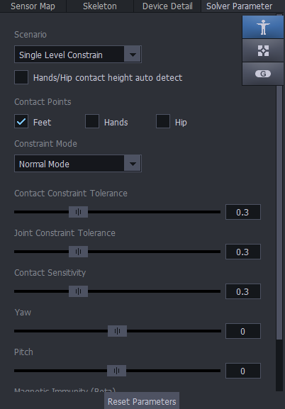

[MOCAP Tutorials](README.md)

---

# ⚙️ Advanced Axis Studio Setup Panels

**Activity:** Review the advanced setup panels in Axis Studio and learn how to check sensor mapping, skeleton settings, device details, and solver parameters before recording motion capture.

This guide explains the main setup panels in Axis Studio. These panels are useful when troubleshooting sensor problems, checking body measurements, reviewing signal quality, or confirming that the software is interpreting the performer’s movement correctly.

---

## Important Note

Most of these settings should be **checked**, not changed.

Only adjust advanced settings if:

- The instructor asks you to.
- A sensor is missing or placed incorrectly.
- The avatar does not match the performer’s body.
- The avatar is drifting, twisting, or reacting incorrectly.
- The motion data looks unstable after calibration.

When in doubt, keep the default settings and ask for help before changing advanced parameters.

---

## Axis Studio Setup Panels

### 1. Sensor Map

The **Sensor Map** shows where each sensor is placed on the digital body.

Use this panel to check that:

- All expected sensors appear.
- Each sensor is assigned to the correct body part.
- The left and right sides are not reversed.
- The green sensor indicators are active.
- The suit is being recognized by Axis Studio.

The letters **L** and **R** help you confirm the left and right sides of the body.

If a sensor is missing, inactive, or mapped to the wrong body part, check the physical sensor placement and repeat the connection or sensor check process.

### 2. Skeleton

The **Skeleton** panel contains the performer’s body-size settings.

These measurements help Axis Studio create a digital skeleton that matches the performer’s proportions.

You may see settings such as:

- Head
- Neck
- Body
- Shoulder width
- Upper arm
- Forearm
- Palm
- Hip width
- Upper leg
- Lower leg

For most class activities, use the default template unless the avatar looks very different from the performer’s body.

Only adjust body measurements if the instructor asks you to or if accurate body proportions are needed for the recording.

### 3. Device Detail

The **Device Detail** panel shows the status of each individual sensor.

Use this panel to check:

- Body segment
- Sensor number
- Signal strength
- Magnetic status
- Battery level

Before recording, most sensors should show strong signal and good battery status.

If a sensor shows a warning, weak signal, low battery, or magnetic interference, stop and fix the issue before recording.

### 4. Solver Parameter

The **Solver Parameter** panel controls how Axis Studio interprets the performer’s movement.

These settings affect:

- Floor contact
- Foot contact
- Balance
- Contact points
- Motion stability
- How the avatar solves body movement

For beginner and class projects, keep the default settings unless the instructor asks you to change them.

Check that **Feet** contact is enabled when the performer is standing or walking on the floor.

---

## Sensor Map Panel

The **Sensor Map** is one of the most important panels for setup. It gives a visual overview of the PN3 sensor system.

Use it to confirm that the digital body is receiving information from the sensors.

Check:

- The body map shows active sensors.
- The sensors are placed on the correct parts of the body.
- The performer’s left side matches the avatar’s left side.
- The performer’s right side matches the avatar’s right side.
- The character name is correct.
- The working mode is appropriate for the setup.
- The frame rate is set correctly.

In most cases, the working mode can stay on **Auto Detection**.

---

## Skeleton Panel

The **Skeleton** panel controls the performer’s digital body proportions.

This panel is useful if the avatar looks too tall, too short, too wide, or if the arms and legs do not match the performer’s movement correctly.

Use this panel carefully. Changing measurements can affect how the motion is interpreted.

Only adjust measurements when:

- The avatar proportions are clearly inaccurate.
- Arm movement looks stretched or compressed.
- Leg movement does not match the performer.
- The instructor asks you to enter specific body measurements.

For quick class projects, the default **PN Robot** template is usually enough.

---

## Device Detail Panel

The **Device Detail** panel is useful for troubleshooting.

Each row represents one sensor and its assigned body segment.

Important columns include:

| Column | What it means |
|---|---|
| **Body Segment** | The body part assigned to the sensor |
| **Sensor** | The sensor number |
| **Signal** | The wireless connection strength |
| **Magnetic** | Whether the sensor is affected by magnetic interference |
| **Battery** | The battery level of the sensor |

Before continuing, check that:

- Signal levels are strong.
- Magnetic status is good.
- Battery levels are not low.
- No sensors are missing.
- No sensors are assigned to the wrong body part.

If a sensor has a problem, check the sensor, strap, receiver, and workspace before recording.

---

## Solver Parameter Panel

The **Solver Parameter** panel controls how Axis Studio interprets sensor data and converts it into body movement.

This panel affects how the avatar understands:

- Feet touching the floor
- Hand contact
- Hip contact
- Balance
- Walking stability
- Body constraints
- Contact sensitivity

For most recordings, leave the solver settings at their default values.

You may check:

- **Scenario:** Use a single-level setup when the performer is moving on one flat surface.
- **Contact Points:** Feet should usually be enabled for standing or walking.
- **Constraint Mode:** Use the default mode unless instructed otherwise.
- **Yaw and Pitch:** Keep these unchanged unless correcting a specific tracking issue.

Use **Reset Parameters** if the settings have been changed accidentally and the avatar is behaving incorrectly.

---

## Troubleshooting Checklist

Use this checklist if the avatar is not moving correctly.

- [ ] All sensors are turned on.
- [ ] All sensors are charged.
- [ ] The receiver is connected.
- [ ] The hub is connected.
- [ ] The Sensor Map shows the correct body placement.
- [ ] Left and right sensors are not reversed.
- [ ] The Device Detail panel shows good signal.
- [ ] The Device Detail panel shows good magnetic status.
- [ ] The batteries are not low.
- [ ] The performer is away from metal objects, speakers, magnets, or electronic interference.
- [ ] The skeleton settings have not been changed accidentally.
- [ ] Solver parameters are still on the default settings.
- [ ] The performer has completed posture calibration.
- [ ] The avatar has been tested before recording.

---

## When to Recalibrate

Recalibrate when:

- A new performer uses the suit.
- Sensors shift on the body.
- A sensor is removed and reattached.
- The avatar looks twisted.
- Arms or legs move incorrectly.
- The avatar drifts or jitters.
- Walking looks unstable.
- The motion does not match the performer.

Recalibration is a normal part of motion-capture work. It is better to recalibrate before recording than to export motion data that is difficult to use later.

---

## Before Recording

Before recording motion capture, confirm that:

- [ ] Sensor Map looks correct.
- [ ] Skeleton settings are acceptable.
- [ ] Device Detail shows good signal and battery.
- [ ] Solver Parameter settings are not accidentally changed.
- [ ] The performer has completed posture calibration.
- [ ] The avatar mirrors the performer smoothly.
- [ ] The workspace is clear.
- [ ] The motion looks clean enough to record.

---

## Continue to Recording and Export

After the advanced setup has been checked, continue with:

[🎥 Intro to Record and Export Motion Data in Axis Studio](03_Record_Export_Axis_Studio.md)