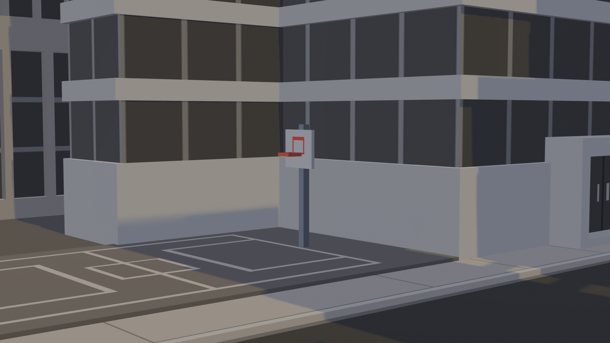
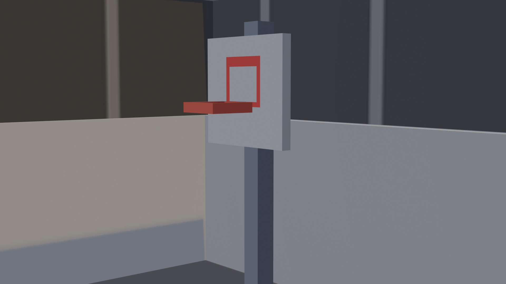
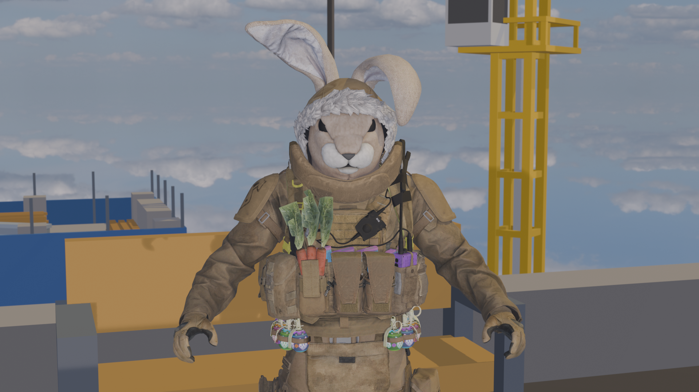
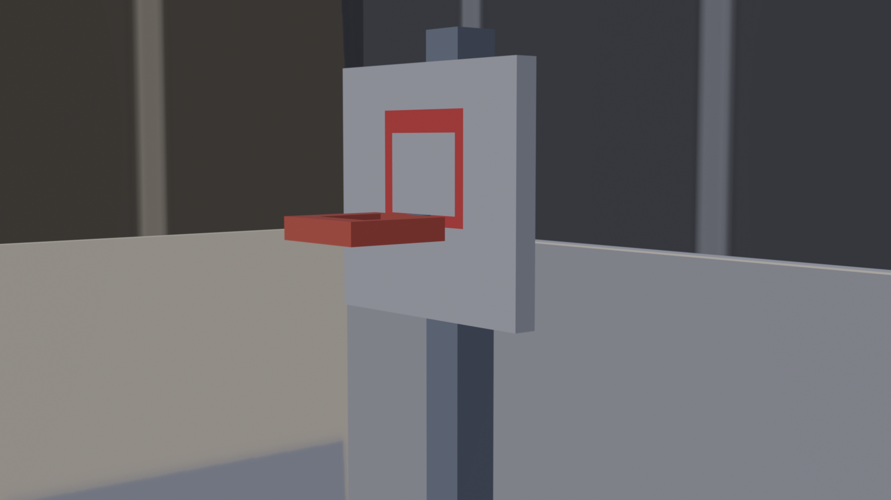
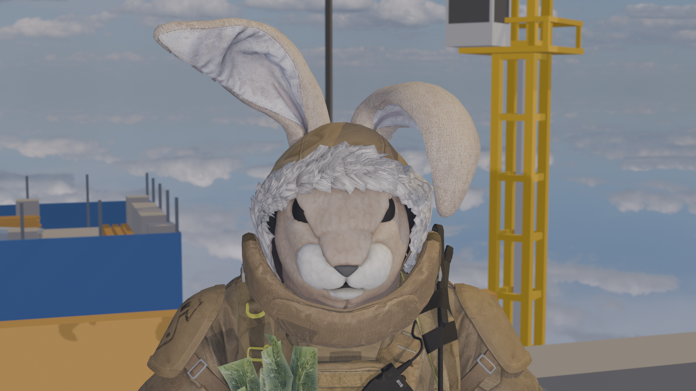
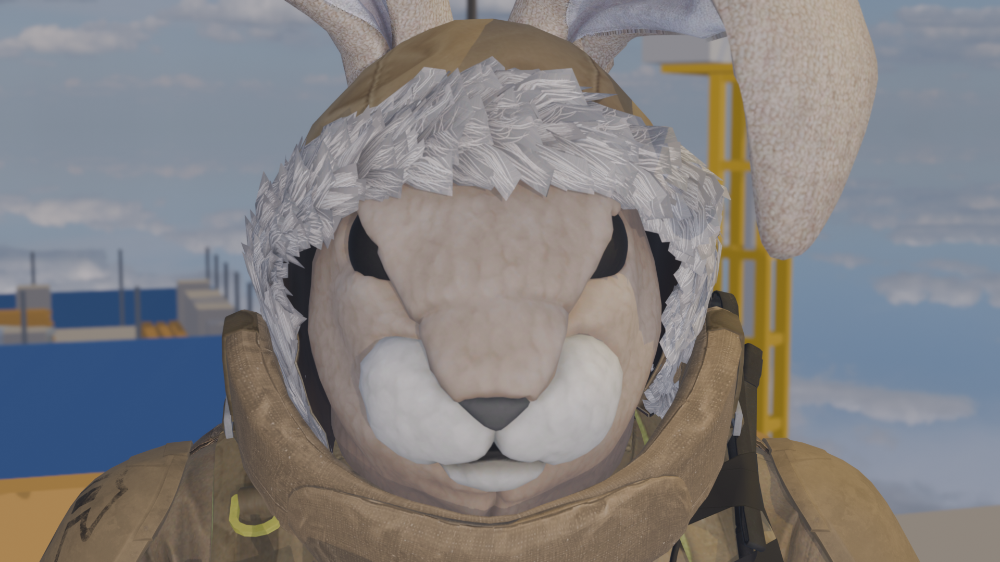
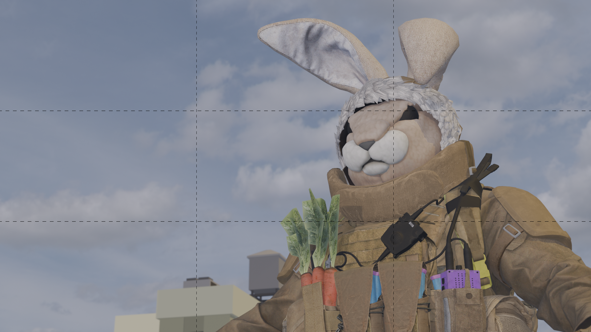
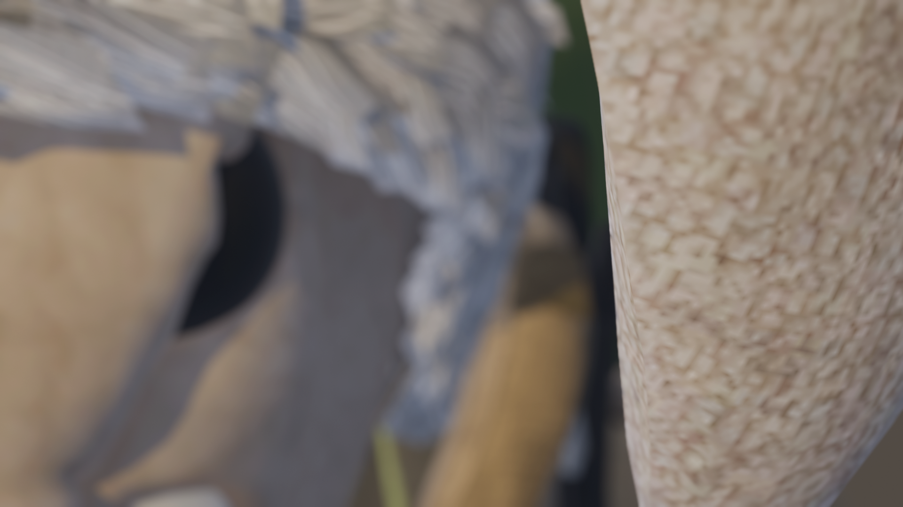
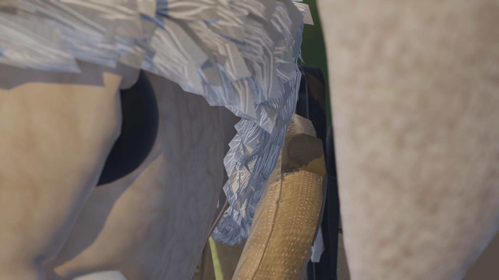

[Photography Tutorials](README.md)

---

# 📐 Photography Composition Reference Guide

**Goal:** Learn how shot size, subject placement, visual structure, and depth of field shape a photograph.

Use this guide while planning, photographing, and reviewing your images. The examples include both human subjects and objects so the same ideas can be applied to portraits, still-life photography, landscapes, and environmental photographs.

---

## What Is Photographic Composition?

**Photographic composition** describes how subjects, objects, lines, and empty spaces are organized inside the frame.

Composition helps determine:

- What the viewer notices first
- How much of the subject and environment is visible
- How the eye moves through the image
- Whether the photograph feels balanced, calm, dynamic, crowded, or isolated
- How focus and depth of field direct attention

The examples below are starting points rather than strict rules. Choose the approach that best supports your subject, location, and idea.

---

## Types of shots

Shot size determines how much of the subject and surrounding space appears within the frame.

Each row shows one shot size using a human subject and an object.

**Select each photograph to read its description.**

  <!-- Long shot -->
  <section class="photography-example-row">
    <h3>Long Shot</h3>

    

      

        <input
          class="photo-reveal-card__toggle screen-reader-only"
          type="checkbox"
          id="long-shot-human"
        >

        <label
          class="photo-reveal-card__image"
          for="long-shot-human"
        >
          
          
            Select to learn more
          
        </label>

        

           A long shot shows the complete person from a distance while giving significant visual importance to the surrounding environment.
        

      

      

        <input
          class="photo-reveal-card__toggle screen-reader-only"
          type="checkbox"
          id="long-shot-object"
        >

        <label
          class="photo-reveal-card__image"
          for="long-shot-object"
        >
          
          
            Select to learn more
          
        </label>

        

          A long shot presents the object from a distance so its relationship to the surrounding location remains important.
        

      

    

  </section>

  <!-- Full Shot -->
<section class="photography-example-row">
  <h3>Full Shot</h3>

  

    

      <input
        class="photo-reveal-card__toggle screen-reader-only"
        type="checkbox"
        id="full-shot-human"
      >

      <label
        class="photo-reveal-card__image"
        for="full-shot-human"
      >
        
        
          Select to learn more
        
      </label>

      

        A full shot frames the entire person from head to toe while keeping the body as the main focus of the photograph.
      

    

    

      <input
        class="photo-reveal-card__toggle screen-reader-only"
        type="checkbox"
        id="full-shot-object"
      >

      <label
        class="photo-reveal-card__image"
        for="full-shot-object"
      >
        
        
          Select to learn more
        
      </label>

      

        A full shot shows the complete object while reducing the amount of surrounding space visible in the frame.
      

    

  

</section>

<!-- Medium Full Shot / Cowboy Shot -->
<section class="photography-example-row">
  <h3>Medium Full Shot / Cowboy Shot</h3>

  

    

      <input
        class="photo-reveal-card__toggle screen-reader-only"
        type="checkbox"
        id="medium-full-shot-human"
      >

      <label
        class="photo-reveal-card__image"
        for="medium-full-shot-human"
      >
        
        
          Select to learn more
        
      </label>

      

        A medium full shot frames a person from approximately the head to the knees or mid-thigh, showing gesture and body language.
      

    

    

      <input
        class="photo-reveal-card__toggle screen-reader-only"
        type="checkbox"
        id="medium-full-shot-object"
      >

      <label
        class="photo-reveal-card__image"
        for="medium-full-shot-object"
      >
        
        
          Select to learn more
        
      </label>

      

        A medium full shot frames most of the object while retaining enough surrounding space to provide context.
      

    

  

</section>

  <!-- Medium shot -->
  <section class="photography-example-row">
    <h3>Medium Shot</h3>

    

      

        <input
          class="photo-reveal-card__toggle screen-reader-only"
          type="checkbox"
          id="medium-shot-human"
        >

        <label
          class="photo-reveal-card__image"
          for="medium-shot-human"
        >
          
          
            Select to learn more
          
        </label>

        

          A medium shot usually frames a person from approximately the waist up while retaining some surrounding context.
        

      

      

        <input
          class="photo-reveal-card__toggle screen-reader-only"
          type="checkbox"
          id="medium-shot-object"
        >

        <label
          class="photo-reveal-card__image"
          for="medium-shot-object"
        >
          
          
            Select to learn more
          
        </label>

        

          A medium shot gives the object greater visual importance while still showing part of its surroundings.
        

      

    

  </section>

  <!-- Medium Close-Up -->
<section class="photography-example-row">
  <h3>Medium Close-Up</h3>

  

    

      <input
        class="photo-reveal-card__toggle screen-reader-only"
        type="checkbox"
        id="medium-close-up-human"
      >

      <label
        class="photo-reveal-card__image"
        for="medium-close-up-human"
      >
        
        
          Select to learn more
        
      </label>

      

        A medium close-up usually frames a person from the chest or shoulders upward, emphasizing facial expression while retaining some body language.
      

    

    

      <input
        class="photo-reveal-card__toggle screen-reader-only"
        type="checkbox"
        id="medium-close-up-object"
      >

      <label
        class="photo-reveal-card__image"
        for="medium-close-up-object"
      >
        
        
          Select to learn more
        
      </label>

      

        A medium close-up presents a large portion of the object while keeping a small amount of surrounding context visible.
      

    

  

</section>

  <!-- Close-up -->
  <section class="photography-example-row">
    <h3>Close-Up</h3>

    

      

        <input
          class="photo-reveal-card__toggle screen-reader-only"
          type="checkbox"
          id="close-up-human"
        >

        <label
          class="photo-reveal-card__image"
          for="close-up-human"
        >
          
          
            Select to learn more
          
        </label>

        

          A close-up emphasizes the face, expression, or gesture while reducing the surrounding visual information.
        

      

      

        <input
          class="photo-reveal-card__toggle screen-reader-only"
          type="checkbox"
          id="close-up-object"
        >

        <label
          class="photo-reveal-card__image"
          for="close-up-object"
        >
          
          
            Select to learn more
          
        </label>

        

          A close-up directs attention toward the object’s form, surface, function, or important details.
        

      

    

  </section>

  <!-- Extreme close-up -->
  <section class="photography-example-row">
    <h3>Extreme Close-Up</h3>

    

      

        <input
          class="photo-reveal-card__toggle screen-reader-only"
          type="checkbox"
          id="extreme-close-up-human"
        >

        <label
          class="photo-reveal-card__image"
          for="extreme-close-up-human"
        >
          
          
            Select to learn more
          
        </label>

        

          An extreme close-up isolates a small bodily detail, such as an eye, hand, or section of the face.
        

      

      

        <input
          class="photo-reveal-card__toggle screen-reader-only"
          type="checkbox"
          id="extreme-close-up-object"
        >

        <label
          class="photo-reveal-card__image"
          for="extreme-close-up-object"
        >
          
          
            Select to learn more
          
        </label>

        

          An extreme close-up isolates a small detail and emphasizes texture, material, pattern, or shape.
        

      

    

  </section>

## Compositional frameworks

Composition describes how subjects, objects, lines, and empty spaces are organized within the photographic frame.

**Select each photograph to learn how the composition is structured.**

  <!-- First row -->
  <section class="photography-example-row">

    

      

        <input
          class="photo-reveal-card__toggle screen-reader-only"
          type="checkbox"
          id="composition-rule-of-thirds"
        >

        <label
          class="photo-reveal-card__image"
          for="composition-rule-of-thirds"
        >
          

          
            Rule of Thirds
          

          
            Select to learn more
          
        </label>

        

          The subject is positioned along an imaginary grid line or intersection instead of directly in the centre.
        

      

      

        <input
          class="photo-reveal-card__toggle screen-reader-only"
          type="checkbox"
          id="composition-golden-ratio"
        >

        <label
          class="photo-reveal-card__image"
          for="composition-golden-ratio"
        >
          

          
            Golden Ratio
          

          
            Select to learn more
          
        </label>

        

          The visual elements follow a proportional or spiral arrangement that guides the viewer’s eye through the frame.
        

      

    

  </section>

  <!-- Second row -->
  <section class="photography-example-row">

    

      

        <input
          class="photo-reveal-card__toggle screen-reader-only"
          type="checkbox"
          id="composition-leading-lines"
        >

        <label
          class="photo-reveal-card__image"
          for="composition-leading-lines"
        >
          

          
            Leading Lines
          

          
            Select to learn more
          
        </label>

        

          Visible lines guide the viewer’s eye through the frame or toward the main subject.
        

      

      

        <input
          class="photo-reveal-card__toggle screen-reader-only"
          type="checkbox"
          id="composition-centred-symmetrical"
        >

        <label
          class="photo-reveal-card__image"
          for="composition-centred-symmetrical"
        >
          

          
            Centred and Symmetrical
          

          
            Select to learn more
          
        </label>

        

          The subject is placed near the centre while visual elements are balanced across both sides of the frame.
        

      

    

  </section>

> These frameworks are starting points rather than strict rules. Choose the approach that best supports the subject, space, and mood of your photograph.

## Depth of Field

Depth of field describes how much of the image appears sharp.

**Select each image to learn more.**

  

    <input
      class="photo-reveal-card__toggle screen-reader-only"
      type="checkbox"
      id="depth-of-field-1"
    >

    <label
      class="photo-reveal-card__image"
      for="depth-of-field-1"
    >
      
      
        Deep Depth of Field
      
      
        Select to learn more
      
    </label>

    

      Most areas of the image appear sharp, so attention is shared across the scene.
    

  

  

    <input
      class="photo-reveal-card__toggle screen-reader-only"
      type="checkbox"
      id="depth-of-field-2"
    >

    <label
      class="photo-reveal-card__image"
      for="depth-of-field-2"
    >
      
      
        Shallow Depth of Field
      
      
        Select to learn more
      
    </label>

    

      Only one part of the image is in focus, while the rest becomes blurred.
    

  

  

    <input
      class="photo-reveal-card__toggle screen-reader-only"
      type="checkbox"
      id="depth-of-field-3"
    >

    <label
      class="photo-reveal-card__image"
      for="depth-of-field-3"
    >
      
      
        Shifted Focus
      
      
        Select to learn more
      
    </label>

    

      The focus has moved to a different area, changing which part of the image stands out.
    

  

> A shallow depth of field helps direct attention to a specific part of the image, while a deep depth of field keeps more of the scene visible and sharp.

---

## Quick Composition Checklist

Before taking a photograph, check:

- [ ] What is the main subject?
- [ ] Which shot size best supports the subject?
- [ ] Is the subject placed intentionally?
- [ ] Are important body parts or object details cut off?
- [ ] Are the frame edges free from distractions?
- [ ] Do the background and empty spaces support the subject?
- [ ] Is the most important area in focus?
- [ ] Does the depth of field direct attention effectively?
- [ ] Does the composition communicate the intended mood or idea?

---

## Practice Activity: One Subject, Three Approaches

Choose one person, object, or location. Create three different photographs:

1. **Context:** Use a long shot or full shot to show the subject and its environment.
2. **Relationship:** Use a medium shot and one compositional framework.
3. **Detail:** Use a close-up or extreme close-up with intentional depth of field.

Review the three images together. Identify how changes in distance, framing, subject placement, and focus affect what each photograph communicates.

---

Credits: Jessica A. Rodríguez
