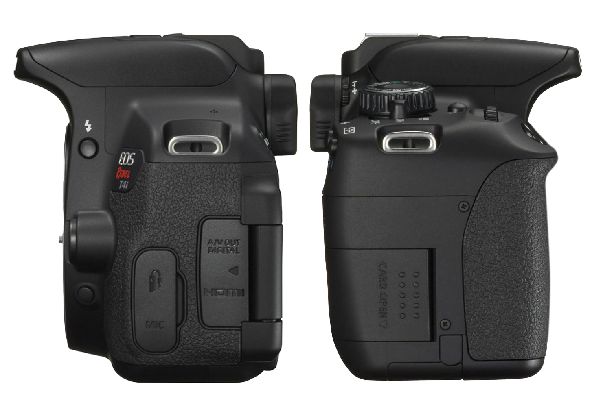

[Photography Tutorials](README.md)

---

# 📷 Canon Rebel T4i Camera and Lens Anatomy

**Time:** 45–60 minutes  

**Goal:** Identify the main controls on the Canon Rebel T4i camera body and the 18–55 mm kit lens before changing camera settings or taking photographs.

This guide focuses on the controls you will use throughout the photography camp. Select each numbered hotspot to learn the name and purpose of that camera part.

> Handle the camera with both hands or use the neck strap. Do not touch the lens glass, force a button or dial, or remove the lens or SD card while the camera is turned on.

---

  

    1. Camera body: top controls
    
      Locate the shutter button, control dial, ISO button, mode dial, and power switch.
    
  

  

  

    

    <button
      class="image-hotspot is-active"
      style="--hotspot-x: 84%; --hotspot-y: 29%;"
      type="button"
      aria-label="Shutter button"
      aria-pressed="true"
      data-target="camera-shutter"
    >
      1
    </button>

    <button
      class="image-hotspot"
      style="--hotspot-x: 88%; --hotspot-y: 41%;"
      type="button"
      aria-label="Main control dial"
      aria-pressed="false"
      data-target="camera-control-dial"
    >
      2
    </button>

    <button
      class="image-hotspot"
      style="--hotspot-x: 75%; --hotspot-y: 49%;"
      type="button"
      aria-label="ISO button"
      aria-pressed="false"
      data-target="camera-iso"
    >
      3
    </button>

    <button
      class="image-hotspot"
      style="--hotspot-x: 74%; --hotspot-y: 68%;"
      type="button"
      aria-label="Mode dial"
      aria-pressed="false"
      data-target="camera-mode"
    >
      4
    </button>

    <button
      class="image-hotspot"
      style="--hotspot-x: 89%; --hotspot-y: 67%;"
      type="button"
      aria-label="Power switch"
      aria-pressed="false"
      data-target="camera-power"
    >
      5
    </button>

  

  

    <section
      id="camera-shutter"
      class="image-information-panel"
    >
      
Control 1

      <h3>Shutter button</h3>

      

        Press halfway to activate autofocus and prepare the exposure. Press fully to take the photograph.
      

    </section>

    <section
      id="camera-control-dial"
      class="image-information-panel"
      hidden
    >
      
Control 2

      <h3>Main control dial</h3>

      

        Turn this dial to change the selected camera setting. In Aperture Priority mode, it changes the aperture.
      

    </section>

    <section
      id="camera-iso"
      class="image-information-panel"
      hidden
    >
      
Control 3

      <h3>ISO button</h3>

      

        Press this button to open the ISO settings. ISO controls the camera sensor’s sensitivity and affects image noise.
      

    </section>

    <section
      id="camera-mode"
      class="image-information-panel"
      hidden
    >
      
Control 4

      <h3>Mode dial</h3>

      

        Selects the shooting mode. During the first activities, you will turn this dial to <code>Av</code> for Aperture Priority mode.
      

    </section>

    <section
      id="camera-power"
      class="image-information-panel"
      hidden
    >
      
Control 5

      <h3>Power switch</h3>

      

        Turns the camera on and off. Turn the camera off before removing the SD card, battery, or lens.
      

    </section>

  

  

  

    2. Lens controls
    
      Locate the focus switch, focus ring, zoom ring, and Image Stabilization switch.
    
  

  

  

    

    <button
      class="image-hotspot is-active"
      style="--hotspot-x: 66%; --hotspot-y: 36%;"
      type="button"
      aria-label="Autofocus and manual focus switch"
      aria-pressed="true"
      data-target="lens-focus-switch"
    >
      1
    </button>

    <button
      class="image-hotspot"
      style="--hotspot-x: 34%; --hotspot-y: 37%;"
      type="button"
      aria-label="Focus ring"
      aria-pressed="false"
      data-target="lens-focus-ring"
    >
      2
    </button>

    <button
      class="image-hotspot"
      style="--hotspot-x: 53%; --hotspot-y: 45%;"
      type="button"
      aria-label="Zoom ring"
      aria-pressed="false"
      data-target="lens-zoom-ring"
    >
      3
    </button>

    <button
      class="image-hotspot"
      style="--hotspot-x: 68%; --hotspot-y: 49%;"
      type="button"
      aria-label="Image Stabilization switch"
      aria-pressed="false"
      data-target="lens-stabilizer"
    >
      4
    </button>

  

  

    <section
      id="lens-focus-switch"
      class="image-information-panel"
    >
      
Control 1

      <h3>AF/MF switch</h3>

      

        Use <code>AF</code> for autofocus. Use <code>MF</code> when you want to focus manually with the focus ring.
      

      

        Begin with <code>AF</code> unless the activity asks you to use manual focus.
      

    </section>

    <section
      id="lens-focus-ring"
      class="image-information-panel"
      hidden
    >
      
Control 2

      <h3>Focus ring</h3>

      

        Turn this ring to adjust focus when the lens is set to <code>MF</code>. Turn it slowly while checking the screen or viewfinder to see which part of the image becomes sharp.
      

    </section>

    <section
      id="lens-zoom-ring"
      class="image-information-panel"
      hidden
    >
      
Control 3

      <h3>Zoom ring</h3>

      

        Turn this ring to change the focal length. On the kit lens, the markings run from approximately <code>18 mm</code> to <code>55 mm</code>.
      

      

        A shorter focal length shows a wider view. A longer focal length shows a narrower view and makes distant subjects appear larger in the frame.
      

    </section>

    <section
      id="lens-stabilizer"
      class="image-information-panel"
      hidden
    >
      
Control 4

      <h3>Image Stabilization switch</h3>

      

        Turn Image Stabilization <strong>on</strong> when photographing handheld to reduce visible camera shake.
      

      

        Turn it <strong>off</strong> when the camera is mounted securely on a tripod.
      

    </section>

  

> The lens release button is located on the camera body beside the lens mount. Do not press it unless the instructor is supervising a lens change.

  

  

    3. Viewing and back controls
    
      Locate the viewfinder, LCD screen, Live View, menu, playback, and navigation controls.
    
  

  

  

    

    <button
      class="image-hotspot is-active"
      style="--hotspot-x: 56%; --hotspot-y: 23%;"
      type="button"
      aria-label="Viewfinder"
      aria-pressed="true"
      data-target="back-viewfinder"
    >
      1
    </button>

    <button
      class="image-hotspot"
      style="--hotspot-x: 42%; --hotspot-y: 62%;"
      type="button"
      aria-label="LCD screen"
      aria-pressed="false"
      data-target="back-lcd"
    >
      2
    </button>

    <button
      class="image-hotspot"
      style="--hotspot-x: 75%; --hotspot-y: 28%;"
      type="button"
      aria-label="Live View button"
      aria-pressed="false"
      data-target="back-liveview"
    >
      3
    </button>

    <button
      class="image-hotspot"
      style="--hotspot-x: 22%; --hotspot-y: 36%;"
      type="button"
      aria-label="Menu button"
      aria-pressed="false"
      data-target="back-menu"
    >
      4
    </button>

    <button
      class="image-hotspot"
      style="--hotspot-x: 35%; --hotspot-y: 36%;"
      type="button"
      aria-label="Info button"
      aria-pressed="false"
      data-target="back-info"
    >
      5
    </button>

    <button
      class="image-hotspot"
      style="--hotspot-x: 78%; --hotspot-y: 72%;"
      type="button"
      aria-label="Playback button"
      aria-pressed="false"
      data-target="back-playback"
    >
      6
    </button>

    <button
      class="image-hotspot"
      style="--hotspot-x: 82%; --hotspot-y: 50%;"
      type="button"
      aria-label="Navigation and SET controls"
      aria-pressed="false"
      data-target="back-controls"
    >
      7
    </button>

  

  

    <section
      id="back-viewfinder"
      class="image-information-panel"
    >
      
Control 1

      <h3>Viewfinder</h3>

      

        Look through the viewfinder to frame a photograph. It is especially useful outdoors when bright light makes the LCD screen difficult to see.
      

    </section>

    <section
      id="back-lcd"
      class="image-information-panel"
      hidden
    >
      
Control 2

      <h3>LCD screen</h3>

      

        Displays camera settings, menus, Live View, and captured photographs. Use it to review framing, focus, and exposure.
      

    </section>

    <section
      id="back-liveview"
      class="image-information-panel"
      hidden
    >
      
Control 3

      <h3>Live View button</h3>

      

        Activates Live View so you can compose the photograph on the LCD screen instead of using the viewfinder.
      

    </section>

    <section
      id="back-menu"
      class="image-information-panel"
      hidden
    >
      
Control 4

      <h3>Menu button</h3>

      

        Opens the main camera menu, where you can change settings such as image quality, card formatting, and custom white balance.
      

    </section>

    <section
      id="back-info"
      class="image-information-panel"
      hidden
    >
      
Control 5

      <h3>Info button</h3>

      

        Changes the information displayed on the LCD screen. Use it to show or hide shooting information while you work.
      

    </section>

    <section
      id="back-playback"
      class="image-information-panel"
      hidden
    >
      
Control 6

      <h3>Playback button</h3>

      

        Opens captured photographs on the LCD screen. Review each important image for framing, focus, and exposure before moving on.
      

    </section>

    <section
      id="back-controls"
      class="image-information-panel"
      hidden
    >
      
Control 7

      <h3>Navigation and SET controls</h3>

      

        Use the directional buttons to move through menus and settings. Press <code>SET</code> to confirm a selection.
      

    </section>

  

  

  

    4. Bottom controls
    
      Locate the battery compartment and tripod mount.
    
  

  

  

    

    <button
      class="image-hotspot is-active"
      style="--hotspot-x: 21%; --hotspot-y: 69%;"
      type="button"
      aria-label="Battery compartment"
      aria-pressed="true"
      data-target="bottom-battery"
    >
      1
    </button>

    <button
      class="image-hotspot"
      style="--hotspot-x: 59%; --hotspot-y: 76%;"
      type="button"
      aria-label="Tripod mount"
      aria-pressed="false"
      data-target="bottom-tripod"
    >
      2
    </button>

  

  

    <section
      id="bottom-battery"
      class="image-information-panel"
    >
      
Control 1

      <h3>Battery compartment</h3>

      

        Open this compartment to insert or remove the battery. Turn the camera off first and check the battery level before beginning a shoot.
      

    </section>

    <section
      id="bottom-tripod"
      class="image-information-panel"
      hidden
    >
      
Control 2

      <h3>Tripod mount</h3>

      

        The threaded mount connects the camera to a tripod or tripod plate. Tighten the plate until the camera is secure, but do not overtighten it.
      

    </section>

  

  

  

    5. Storage and cable connections
    
      Locate the SD card slot and the camera’s cable ports.
    
  

  

  

    

    <button
      class="image-hotspot is-active"
      style="--hotspot-x: 68%; --hotspot-y: 70%;"
      type="button"
      aria-label="SD card slot"
      aria-pressed="true"
      data-target="side-sd-card"
    >
      1
    </button>

    <button
      class="image-hotspot"
      style="--hotspot-x: 35%; --hotspot-y: 69%;"
      type="button"
      aria-label="A/V output and HDMI ports"
      aria-pressed="false"
      data-target="side-video-ports"
    >
      2
    </button>

    <button
      class="image-hotspot"
      style="--hotspot-x: 25%; --hotspot-y: 72%;"
      type="button"
      aria-label="Microphone port"
      aria-pressed="false"
      data-target="side-microphone"
    >
      3
    </button>

  

  

    <section
      id="side-sd-card"
      class="image-information-panel"
    >
      
Control 1

      <h3>SD card slot</h3>

      

        The SD card stores photographs and video files. Turn the camera off before inserting or removing the card.
      

    </section>

    <section
      id="side-video-ports"
      class="image-information-panel"
      hidden
    >
      
Control 2

      <h3>Digital output and HDMI ports</h3>

      

        These ports connect the camera to compatible displays and devices. Keep the protective cover closed when the ports are not in use.
      

    </section>

    <section
      id="side-microphone"
      class="image-information-panel"
      hidden
    >
      
Control 3

      <h3>Microphone port</h3>

      

        Connects a compatible external microphone using a 3.5 mm audio cable. This port is mainly used for video recording.
      

    </section>

  

  

---

## Camera Anatomy Check

Before continuing, locate each item on the physical camera:

- [ ] Shutter button
- [ ] Main control dial
- [ ] ISO button
- [ ] Mode dial
- [ ] Power switch
- [ ] AF/MF switch
- [ ] Focus ring
- [ ] Zoom ring and focal-length markings
- [ ] Image Stabilization switch
- [ ] Viewfinder
- [ ] LCD screen
- [ ] Menu and playback buttons
- [ ] Navigation and <code>SET</code> controls
- [ ] Battery compartment
- [ ] Tripod mount
- [ ] SD card slot

Choose one control and explain to a partner:

1. What is it called?
2. What does it change or control?
3. When will you use it during the camp?

---

## What Is Next?

Continue with 🎛️ [Camera Setup and Aperture Priority Mode](02_Camera_Setup_and_Av_Mode.md).

---
