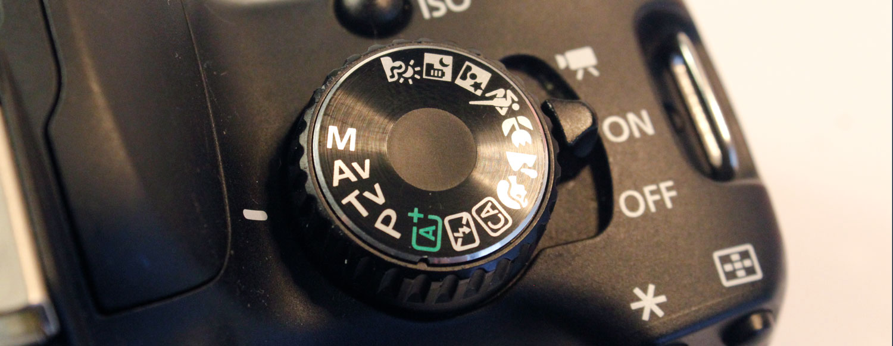
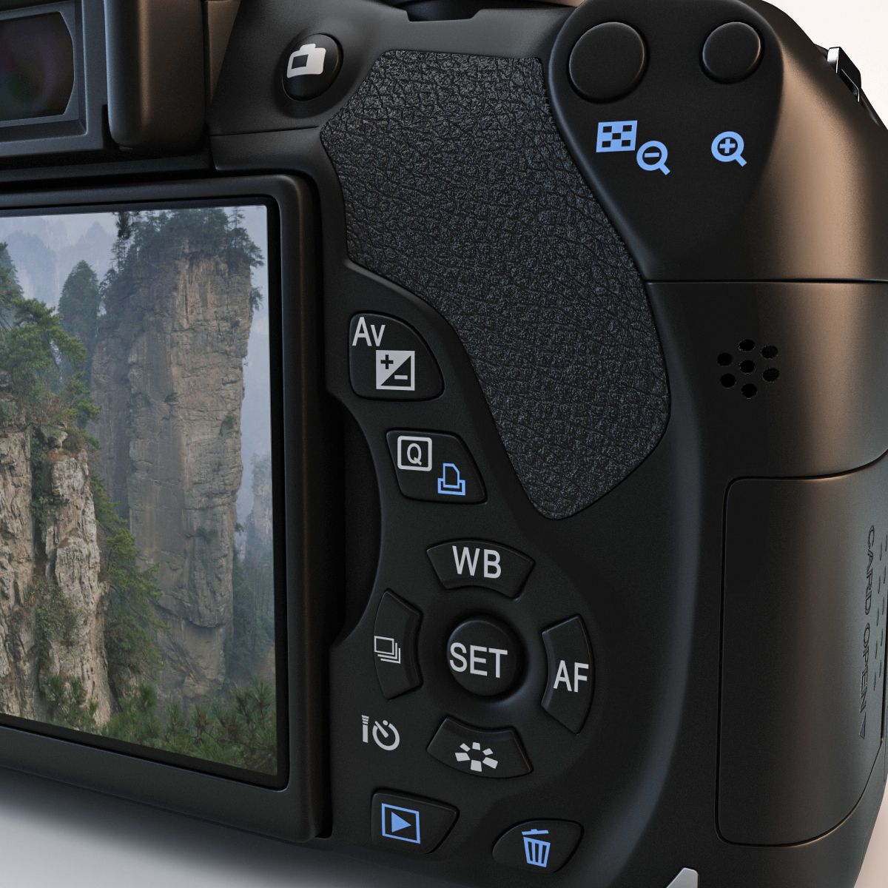
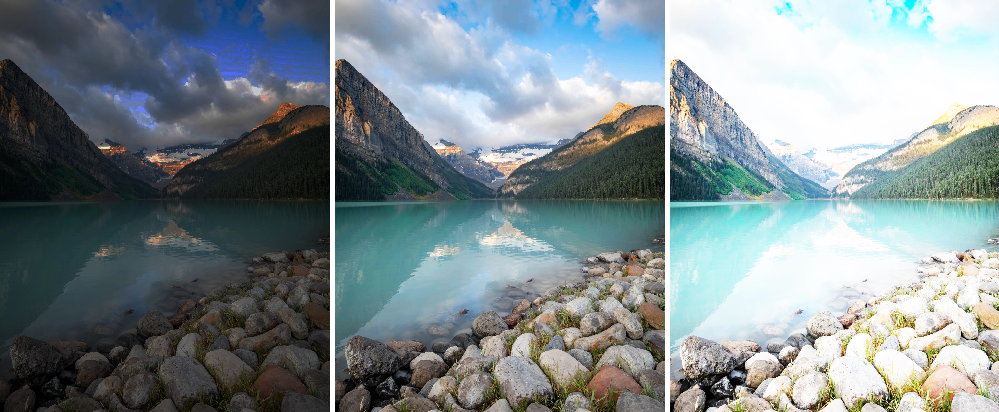
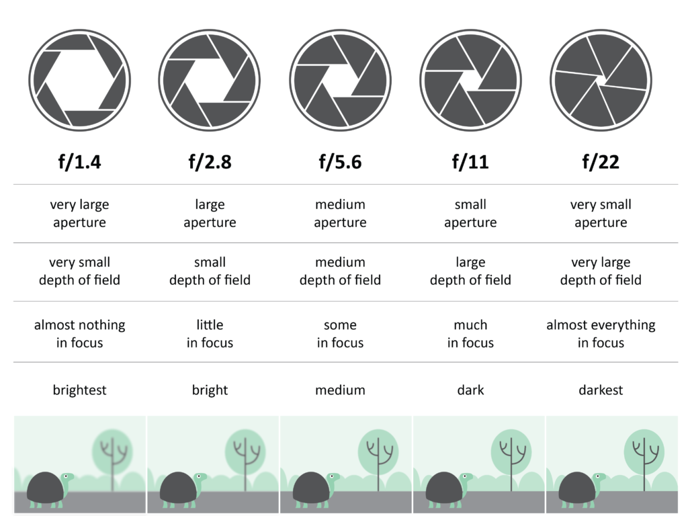
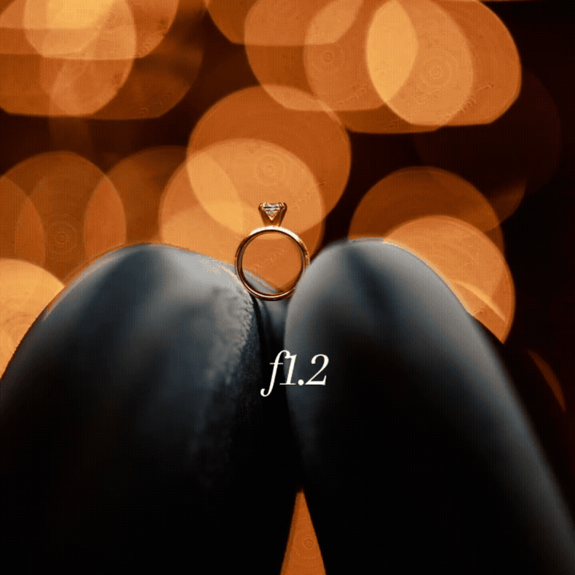
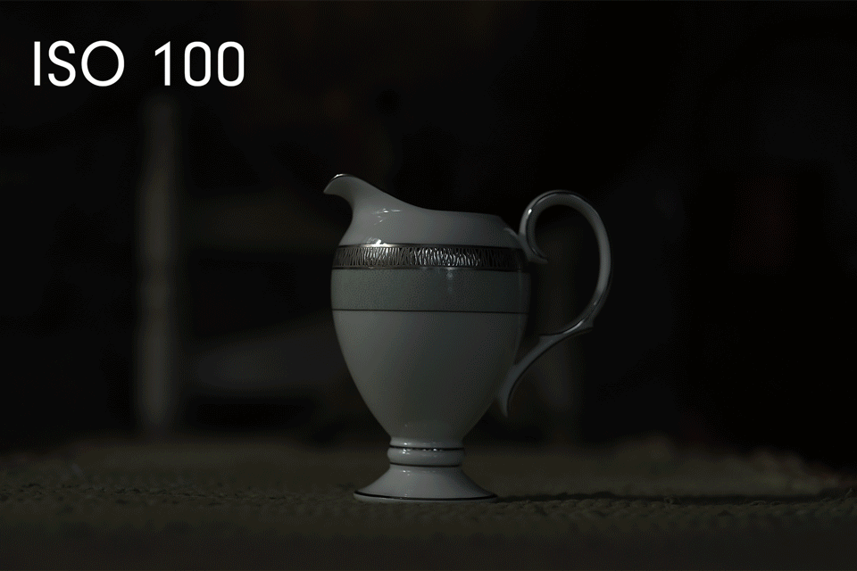
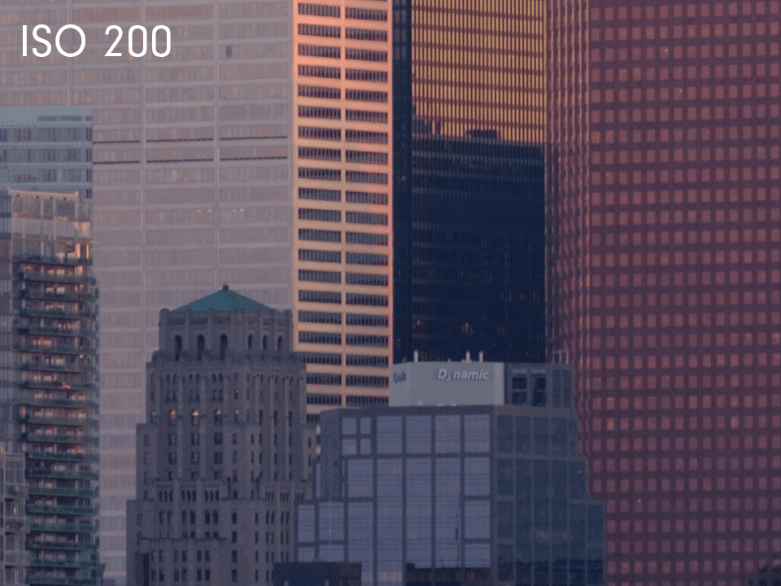

[Photography Tutorials](README.md)

---

# 📸 Camera Setup and Aperture Priority Mode

**Time:** 60–75 minutes  

**Goal:** Prepare the Canon Rebel T4i for photography, format the SD card, use the main menu and control buttons, understand exposure, and set aperture, ISO, and white balance.

---

<!--
/////////////////
SECTION 1
/////////////////
-->

  

    1. Prepare the camera and configure the recording settings
    
      Check the equipment, format the SD card, and set the image quality, grid, and aspect ratio.
    
  

## Before turning on the camera

<fieldset class="equipment-checklist">
  <legend>Camera preparation checklist</legend>

  <label class="checklist-item">
    <input type="checkbox">
    
      <strong>Keep the camera turned off.</strong>
      Leave the power switch set to <code>OFF</code> while preparing the equipment.
    
  </label>

  <label class="checklist-item">
    <input type="checkbox">
    
      <strong>Check the battery.</strong>
      Confirm that the battery is charged and inserted correctly.
    
  </label>

  <label class="checklist-item">
    <input type="checkbox">
    
      <strong>Insert the SD card.</strong>
      Make sure the card faces the correct direction and clicks into place.
    
  </label>

  <label class="checklist-item">
    <input type="checkbox">
    
      <strong>Check the lens.</strong>
      Confirm that the lens is securely attached to the camera body.
    
  </label>

  <label class="checklist-item">
    <input type="checkbox">
    
      <strong>Remove and store the lens cap.</strong>
      Keep the cap somewhere safe while photographing.
    
  </label>
</fieldset>

## Turn on the camera and select Av mode

1. Turn on the camera.
2. Rotate the Mode Dial to <code>Av</code>.

The camera must be in a Creative Zone mode, such as <code>Av</code>, to access the RAW image-quality settings.

Section 2 explains how Aperture Priority mode works.

## Format the SD card

Formatting prepares the card for a new shoot and removes all existing files.

> **Warning:** Formatting permanently deletes every file on the SD card. Only format an instructor-provided card after confirming that its previous files have been transferred and are no longer needed.

1. Press the <strong>MENU</strong> button.
2. Use the navigation buttons to locate the yellow **Setup** menu.
3. Select **Format card**.
4. Select **OK** and press <strong>SET</strong>.
5. Wait until the camera finishes formatting the card.

Do not remove the card or turn off the camera while formatting is in progress.

  <iframe
    src="https://www.youtube.com/embed/lrHP-7HTn3o?si=Hkpjs8w1LbQtn7zG"
    title="How to format an SD card in a Canon DSLR camera"
    allow="accelerometer; autoplay; clipboard-write; encrypted-media; gyroscope; picture-in-picture; web-share"
    referrerpolicy="strict-origin-when-cross-origin"
    allowfullscreen>
  </iframe>

## Set the image quality to RAW + JPEG

Using RAW + JPEG creates two versions of every photograph:

- The **RAW file** retains more image information for editing.
- The **JPEG file** is processed by the camera and can be reviewed or shared quickly.

### Steps

1. Press the <strong>Q</strong> button to open the Quick Control screen.
2. Use the navigation buttons to select **Image Quality**.
3. Select the option that displays both **RAW** and **Large/Fine JPEG**.
4. Press <strong>SET</strong> to confirm.

{: .tutorial-image }

> Keep both files when transferring the photographs to a computer.

## Activate the composition grid

The grid helps with:

- Subject placement
- Rule of thirds
- Horizon alignment
- Visual balance
- Consistent framing

### Steps

1. Press the **Live View** button so the camera image appears on the LCD screen.
2. Press the <strong>MENU</strong> button.
3. Open the **Live View shooting** menu.
4. Select **Grid display**.
5. Select **Grid 1**.
6. Press <strong>SET</strong> to confirm.

Return to Live View and confirm that the grid appears over the camera image.

## Set the aspect ratio to 16:9

The aspect ratio controls the proportional relationship between the width and height of the photograph.

A **16:9 aspect ratio** creates a wide, horizontal frame that matches standard widescreen video.

### Steps

1. Remain in the **Live View shooting** menu.
2. Select **Aspect ratio**.
3. Select <code>16:9</code>.
4. Press <strong>SET</strong> to confirm.
5. Exit the menu and return to Live View.

The areas outside the 16:9 frame will appear masked on the LCD screen.

> The JPEG version will be saved at 16:9. The RAW file retains the full 3:2 image and stores the 16:9 crop as additional information. Keep important subjects inside the visible 16:9 frame.

## Confirm the recording settings

<fieldset class="equipment-checklist">
  <legend>Initial recording settings</legend>

  <label class="checklist-item">
    <input type="checkbox">
    
      <strong>Shooting mode set to <code>Av</code></strong>
    
  </label>

  <label class="checklist-item">
    <input type="checkbox">
    
      <strong>SD card formatted</strong>
    
  </label>

  <label class="checklist-item">
    <input type="checkbox">
    
      <strong>Image quality set to RAW + JPEG</strong>
    
  </label>

  <label class="checklist-item">
    <input type="checkbox">
    
      <strong>Grid display set to Grid 1</strong>
    
  </label>

  <label class="checklist-item">
    <input type="checkbox">
    
      <strong>Aspect ratio set to <code>16:9</code></strong>
    
  </label>

  <label class="checklist-item">
    <input type="checkbox">
    
      <strong>Live View checked</strong>
      Confirm that the grid and 16:9 frame are visible on the LCD screen.
    
  </label>
</fieldset>

<!--
/////////////////
SECTION 2
/////////////////
-->

  

    2. Select Aperture Priority and use the camera controls
    
      Set the camera to Av mode and use the back controls to change and review settings.
    
  

## Select Aperture Priority mode

1. Turn the camera on.
2. Rotate the Mode Dial until <code>Av</code> aligns with the mode marker.

{: .tutorial-image }

In **Aperture Priority mode**, you choose the aperture and ISO. The camera automatically selects the shutter speed needed for the available light.

> Keep the camera in <code>Av</code> mode throughout the Day 1 activities.

## Main back controls

Select the numbered controls to review their functions.

  

    

    <button
      class="image-hotspot is-active"
      style="--hotspot-x: 46%; --hotspot-y: 38%;"
      type="button"
      aria-label="Exposure compensation button"
      aria-pressed="true"
      data-target="setup-exposure-button"
    >
      1
    </button>

    <button
      class="image-hotspot"
      style="--hotspot-x: 50%; --hotspot-y: 50%;"
      type="button"
      aria-label="Quick Control button"
      aria-pressed="false"
      data-target="setup-q-button"
    >
      2
    </button>

    <button
      class="image-hotspot"
      style="--hotspot-x: 54%; --hotspot-y: 63%;"
      type="button"
      aria-label="White balance button"
      aria-pressed="false"
      data-target="setup-wb-button"
    >
      3
    </button>

    <button
      class="image-hotspot"
      style="--hotspot-x: 55%; --hotspot-y: 75%;"
      type="button"
      aria-label="SET button and navigation controls"
      aria-pressed="false"
      data-target="setup-set-button"
    >
      4
    </button>

    <button
      class="image-hotspot"
      style="--hotspot-x: 45%; --hotspot-y: 92%;"
      type="button"
      aria-label="Playback button"
      aria-pressed="false"
      data-target="setup-playback-button"
    >
      5
    </button>

    <button
      class="image-hotspot"
      style="--hotspot-x: 82%; --hotspot-y: 7%;"
      type="button"
      aria-label="Zoom in button"
      aria-pressed="false"
      data-target="setup-zoom-button"
    >
      6
    </button>

  

  

    <section
      id="setup-exposure-button"
      class="image-information-panel"
      tabindex="-1"
    >
      
Control 1

      <h3>Av +/- button</h3>
      

        This button is part of the camera’s exposure controls. It can be used with the main control dial to adjust exposure compensation.
      

    </section>

    <section
      id="setup-q-button"
      class="image-information-panel"
      tabindex="-1"
      hidden
    >
      
Control 2

      <h3>Q button</h3>
      

        Press <code>Q</code> to open the Quick Control screen. Use it to access image quality, aperture, ISO, focus, and other common settings.
      

    </section>

    <section
      id="setup-wb-button"
      class="image-information-panel"
      tabindex="-1"
      hidden
    >
      
Control 3

      <h3>WB button</h3>
      

        Press this button to open the white-balance presets. Use the navigation buttons to choose a setting, then press <code>SET</code>.
      

    </section>

    <section
      id="setup-set-button"
      class="image-information-panel"
      tabindex="-1"
      hidden
    >
      
Control 4

      <h3>SET and navigation controls</h3>
      

        Use the directional buttons to move through menus and settings. Press the central <code>SET</code> button to confirm a selection.
      

    </section>

    <section
      id="setup-playback-button"
      class="image-information-panel"
      tabindex="-1"
      hidden
    >
      
Control 5

      <h3>Playback button</h3>
      

        Displays the photographs stored on the SD card. Review images regularly to check exposure, framing, and focus.
      

    </section>

    <section
      id="setup-zoom-button"
      class="image-information-panel"
      tabindex="-1"
      hidden
    >
      
Control 6

      <h3>Zoom in button</h3>
      

        Magnifies a photograph during playback. Use it to check whether the most important part of the image is sharp.
      

    </section>

  

## Use the Quick Control screen

{: .tutorial-image }

Press <code>Q</code>, use the navigation buttons to select a setting, turn the Main Control Dial to change it, and press <code>SET</code> to confirm.

### Initial Day 1 setup

<fieldset class="equipment-checklist">
  <legend>Default camera settings</legend>

  <label class="checklist-item">
    <input type="checkbox">
    
      <strong>Shooting mode: <code>Av</code></strong>
      You control aperture and ISO; the camera controls shutter speed.
    
  </label>

  <label class="checklist-item">
    <input type="checkbox">
    
      <strong>Image quality: RAW + JPEG</strong>
      Keep both files. RAW is used for editing; JPEG is useful for quick review and GIF creation.
    
  </label>

  <label class="checklist-item">
    <input type="checkbox">
    
      <strong>Focus: AF</strong>
      Begin with autofocus. Use manual focus only when an activity specifically requires it.
    
  </label>

  <label class="checklist-item">
    <input type="checkbox">
    
      <strong>White balance: Daylight</strong>
      A fixed white-balance setting keeps colour consistent during the aperture and ISO comparisons.
    
  </label>

  <label class="checklist-item">
    <input type="checkbox">
    
      <strong>ISO: 100</strong>
      Begin with the lowest standard ISO and increase it only when necessary.
    
  </label>

  <label class="checklist-item">
    <input type="checkbox">
    
      <strong>Flash: Off</strong>
      Do not use the built-in flash during the Day 1 activities.
    
  </label>
</fieldset>

> Check these settings whenever you receive a camera. A previous user may have changed them.

  <iframe
    src="https://www.youtube.com/embed/XZxC7vGaQWE?si=A5YPSkFbYKYX-90F"
    title="Canon DSLR menu and basic settings"
    allow="accelerometer; autoplay; clipboard-write; encrypted-media; gyroscope; picture-in-picture; web-share"
    referrerpolicy="strict-origin-when-cross-origin"
    allowfullscreen>
  </iframe>

<!--
/////////////////
SECTION 3
/////////////////
-->

  

    3. Understand exposure
    
      Recognize underexposed, balanced, and overexposed photographs.
    
  

## What is exposure?

**Exposure** describes how light or dark a photograph appears.

{: .tutorial-image }

| Exposure | What it looks like |
|---|---|
| **Underexposed** | The photograph is too dark and important shadow details may be difficult to see. |
| **Balanced exposure** | Useful detail remains visible in both brighter and darker areas. |
| **Overexposed** | The photograph is too bright and important highlight details may become white. |

A darker or brighter photograph can be an intentional creative choice. Begin by creating an exposure that preserves useful detail.

## What controls exposure?

Exposure is affected by three connected settings:

- **Aperture:** The size of the opening inside the lens
- **Shutter speed:** How long the sensor receives light
- **ISO:** The camera sensor’s amplification setting

In <code>Av</code> mode:

- You select the **aperture**
- You select the **ISO**
- The camera selects the **shutter speed**

When you change aperture or ISO, watch the shutter-speed value selected by the camera.

> When photographing handheld, a shutter speed slower than approximately <code>1/60</code> second may create accidental camera shake. Increase the ISO, use a wider aperture, or place the camera on a tripod.

<!--
/////////////////
SECTION 4
/////////////////
-->

  

    4. Set the aperture
    
      Use the f-stop to control light and how much of the photograph appears sharp.
    
  

  <figure class="media-card">
    
    <figcaption>
      Aperture scale and f-stop values
    </figcaption>
  </figure>

  <figure class="media-card">
    
    <figcaption>
      Aperture and depth of field
    </figcaption>
  </figure>

## What is aperture?

**Aperture** is the adjustable opening inside the lens. It affects how much light enters the camera and how much of the scene appears sharp.

Aperture is measured in **f-stops**.

- A **lower f-number**, such as <code>f/3.5</code> or <code>f/5.6</code>, creates a wider opening and can produce a shallower depth of field.
- A **higher f-number**, such as <code>f/8</code> or <code>f/11</code>, creates a narrower opening and can keep more of the scene sharp.

> A smaller f-number means a wider aperture. A larger f-number means a narrower aperture.

## The 18–55 mm kit lens

The widest available aperture changes as the lens zooms:

- At approximately <code>18 mm</code>, the lens may open as wide as <code>f/3.5</code>
- At approximately <code>55 mm</code>, the widest available aperture is approximately <code>f/5.6</code>

The camera will not allow an aperture wider than the lens can provide at the selected focal length.

## Change the aperture

1. Confirm that the Mode Dial is set to <code>Av</code>.
2. Turn the Main Control Dial to change the f-stop.
3. You may also press <code>Q</code>, select **Aperture (F#)**, and turn the Main Control Dial.
4. Watch the f-number and the shutter speed change on the screen.
5. Begin at approximately <code>f/5.6</code>.

The next activity will ask you to photograph the same subject at several aperture settings.

  <iframe
    src="https://www.youtube.com/embed/OBf9pbXMMC0?si=7cP-9zbh_uJloTqH"
    title="How to set aperture on a Canon DSLR camera"
    allow="accelerometer; autoplay; clipboard-write; encrypted-media; gyroscope; picture-in-picture; web-share"
    referrerpolicy="strict-origin-when-cross-origin"
    allowfullscreen>
  </iframe>

<!--
/////////////////
SECTION 5
/////////////////
-->

  

    5. Set the ISO
    
      Begin with ISO 100 and increase it when you need a faster shutter speed.
    
  

## What is ISO?

ISO controls how strongly the camera amplifies the light recorded by the sensor.

- A **lower ISO** produces a cleaner image with less visible digital noise.
- A **higher ISO** can help the camera use a faster shutter speed in darker conditions, but it may increase noise and reduce fine detail.

  <figure class="media-card">
    
    <figcaption>
      Increasing ISO changes how the camera responds to available light
    </figcaption>
  </figure>

  <figure class="media-card">
    
    <figcaption>
      Higher ISO can increase visible digital noise
    </figcaption>
  </figure>

> In <code>Av</code> mode, the camera usually compensates for a change in ISO by selecting a different shutter speed. The photograph may remain similarly bright while the shutter speed and image noise change.

## Change the ISO

1. Confirm that the camera is set to <code>Av</code>.
2. Press the <strong>ISO</strong> button on top of the camera, or press <code>Q</code> and select **ISO**.
3. Turn the Main Control Dial to choose a value.
4. Press <code>SET</code> to confirm.
5. Begin at <code>ISO 100</code>.

| Situation | Suggested starting ISO |
|---|---:|
| Bright outdoor light | 100 |
| Cloudy weather or open shade | 200–400 |
| Bright indoor location | 400–800 |
| Darker indoor location | 800–1600 |

Use these values as starting points rather than fixed rules. Check the shutter speed and review the photograph after changing ISO.

  <iframe
    src="https://www.youtube.com/embed/VHa82yZ1Pjo?si=Sb5gCwQtmqSD3etl"
    title="How to set ISO on a Canon DSLR camera"
    allow="accelerometer; autoplay; clipboard-write; encrypted-media; gyroscope; picture-in-picture; web-share"
    referrerpolicy="strict-origin-when-cross-origin"
    allowfullscreen>
  </iframe>

<!--
/////////////////
SECTION 6
/////////////////
-->

  

    6. Set the white balance
    
      Choose how the camera interprets the colour of the light illuminating the scene.
    
  

## What is white balance?

**White balance** adjusts how the camera records the colour of the light in a scene.

Different light sources may make a photograph appear warmer, more orange, cooler, or more blue. White-balance presets help the camera compensate for these differences.

## White-balance presets

| Setting | When it is commonly used |
|---|---|
| **AWB / Auto** | The camera estimates the colour balance. Useful for quick general photography, but the result may change between photographs. |
| **Daylight** | Direct sunlight and general outdoor photography. |
| **Shade** | Subjects photographed in open shade. It adds warmth to compensate for cooler light. |
| **Cloudy** | Overcast skies or late-day outdoor light. It usually adds a small amount of warmth. |
| **Tungsten** | Warm household or studio bulbs. It adds blue to reduce an orange colour cast. |
| **White Fluorescent** | Fluorescent lighting, which may create green or cool colour casts. |
| **Flash** | Photographs illuminated by the built-in or an external flash. |
| **Custom** | Uses a photograph of a neutral white or grey reference to define the colour balance. Custom White Balance will be introduced in a later activity. |

## Default setting for Day 1

Use **Daylight** as the default setting for the aperture and ISO comparisons.

A fixed setting is important because:

- The camera will not reinterpret the colour between photographs
- The technical comparisons will remain consistent
- Changes in aperture and ISO will be easier to evaluate

For the White Balance Technical Card, you will temporarily photograph the same subject using each preset. Return the camera to **Daylight** after completing the comparison.

## Change the white balance

1. Press the <strong>WB</strong> button on the back of the camera.
2. Use the navigation buttons to choose a preset.
3. Press <code>SET</code> to confirm.
4. Review the symbol on the screen before photographing.

You can also press <code>Q</code> and select the White Balance setting from the Quick Control screen.

<!--
/////////////////
SECTION 7
/////////////////
-->

  

    7. Confirm the Day 1 setup
    
      Check every setting before beginning the technical-card activity.
    
  

<fieldset class="equipment-checklist">
  <legend>Day 1 final setup</legend>

  <label class="checklist-item">
    <input type="checkbox">
    <strong>SD card formatted</strong>
  </label>

  <label class="checklist-item">
    <input type="checkbox">
    <strong>Shooting mode set to <code>Av</code></strong>
  </label>

  <label class="checklist-item">
    <input type="checkbox">
    <strong>Image quality set to RAW + JPEG</strong>
  </label>

  <label class="checklist-item">
    <input type="checkbox">
    <strong>Autofocus set to <code>AF</code></strong>
  </label>

  <label class="checklist-item">
    <input type="checkbox">
    <strong>White balance set to Daylight</strong>
  </label>

  <label class="checklist-item">
    <input type="checkbox">
    <strong>ISO set to <code>100</code></strong>
  </label>

  <label class="checklist-item">
    <input type="checkbox">
    <strong>Starting aperture set to approximately <code>f/5.6</code></strong>
  </label>

  <label class="checklist-item">
    <input type="checkbox">
    <strong>Flash turned off</strong>
  </label>

  <label class="checklist-item">
    <input type="checkbox">
    <strong>Auto Exposure Bracketing turned off</strong>
  </label>

  <label class="checklist-item">
    <input type="checkbox">
    
      <strong>Test photograph reviewed</strong>
      Check the exposure and magnify the main subject to confirm focus.
    
  </label>
</fieldset>

---

## What is next?

Continue with 🌀 [Technical Cards: Aperture, ISO, and White Balance](03_Technical_Cards.md).

---

Credits: Jessica A. Rodríguez
