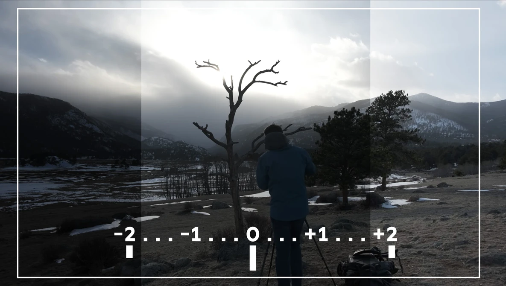

[Photography Tutorials](README.md)

---

# 📸 Additional DSLR Camera Settings

**Goal:** Use metering, the histogram, exposure compensation, Auto Exposure Bracketing, and Custom White Balance to respond to difficult lighting conditions.

<!--
/////////////////
SECTION 1
/////////////////
-->

<details class="tutorial-section">
  <summary>
    <span class="section-title">1. Prepare the camera</span>
    <span class="section-description">
      Confirm the standard settings before testing the additional exposure and colour controls.
    </span>
  </summary>

<div class="section-content" markdown="1">

<fieldset class="equipment-checklist">
  <legend>Setup</legend>

  <label class="checklist-item">
    <input type="checkbox">
    <span>
      <strong>Shooting mode: <code>Av</code></strong>
      You control aperture and ISO while the camera selects the shutter speed.
    </span>
  </label>

  <label class="checklist-item">
    <input type="checkbox">
    <span>
      <strong>Image quality: RAW + JPEG</strong>
      Keep both versions of every photograph.
    </span>
  </label>

  <label class="checklist-item">
    <input type="checkbox">
    <span>
      <strong>Aspect ratio: <code>16:9</code></strong>
      Keep important visual information inside the visible widescreen frame.
    </span>
  </label>

  <label class="checklist-item">
    <input type="checkbox">
    <span>
      <strong>Grid display: Grid 1</strong>
      Use the grid to keep the composition stable.
    </span>
  </label>

  <label class="checklist-item">
    <input type="checkbox">
    <span>
      <strong>Aperture: approximately <code>f/8</code></strong>
      This provides a useful starting depth of field.
    </span>
  </label>

  <label class="checklist-item">
    <input type="checkbox">
    <span>
      <strong>ISO: 100–400</strong>
      Choose the lowest ISO that provides a usable shutter speed.
    </span>
  </label>

  <label class="checklist-item">
    <input type="checkbox">
    <span>
      <strong>White balance: Daylight</strong>
      Keep a fixed preset until the Custom White Balance section.
    </span>
  </label>

  <label class="checklist-item">
    <input type="checkbox">
    <span>
      <strong>Flash: Off</strong>
      Use the existing light illuminating the scene.
    </span>
  </label>
</fieldset>

</div>
</details>

<!--
/////////////////
SECTION 2
/////////////////
-->

<details class="tutorial-section">
  <summary>
    <span class="section-title">2. Use metering and the histogram</span>
    <span class="section-description">
      Compare the camera’s exposure estimate with the brightness information recorded in the photograph.
    </span>
  </summary>

<div class="section-content" markdown="1">

## What is metering?

**Metering** is the camera system that measures the brightness of a scene and estimates an exposure.  

> Begin with **Evaluative metering**. The other modes provide greater control when the subject and background have significantly different brightness levels.

<!--
/////////////////
LIGHT METERING MODES
/////////////////
-->

<details class="tutorial-section">
  <summary>
    <span class="section-title">Light metering modes</span>
    <span class="section-description">
      Know more about the metering options in a Canon DSRL Camera. 
    </span>
  </summary>

<div class="section-content" markdown="1">

Select a numbered area to learn how each metering mode measures light.

<div
  class="interactive-reference"
  data-interactive-reference
  data-default-item="evaluative"
>
  <div class="interactive-reference__image">

    

    <button
      class="interactive-reference__hotspot is-active"
      type="button"
      style="left: 28%; top: 33%;"
      data-reference-button="evaluative"
      aria-label="Learn about Evaluative metering"
      aria-pressed="true"
    >
      1
    </button>

    <button
      class="interactive-reference__hotspot"
      type="button"
      style="left: 60%; top: 33%;"
      data-reference-button="center-weighted"
      aria-label="Learn about Center-weighted metering"
      aria-pressed="false"
    >
      2
    </button>

    <button
      class="interactive-reference__hotspot"
      type="button"
      style="left: 28%; top: 75%;"
      data-reference-button="partial"
      aria-label="Learn about Partial metering"
      aria-pressed="false"
    >
      3
    </button>

    <button
      class="interactive-reference__hotspot"
      type="button"
      style="left: 60%; top: 75%;"
      data-reference-button="spot"
      aria-label="Learn about Spot metering"
      aria-pressed="false"
    >
      4
    </button>

  </div>

  <aside
    class="interactive-reference__panel"
    aria-live="polite"
  >
    <div
      class="interactive-reference__content is-active"
      data-reference-content="evaluative"
    >
      <p class="interactive-reference__number">1</p>
      <h3>Evaluative metering</h3>

      <p>
        The camera analyzes light across the complete frame and combines information from several areas.
      </p>

      <p>
        This is the recommended general-purpose setting for most photographs.
      </p>

      <p><strong>Useful for:</strong> Everyday photography and scenes with balanced lighting.</p>
    </div>

    <div
      class="interactive-reference__content"
      data-reference-content="center-weighted"
      hidden
    >
      <p class="interactive-reference__number">2</p>
      <h3>Center-weighted average metering</h3>

      <p>
        The camera measures the complete frame but gives greater importance to the centre.
      </p>

      <p>
        It works best when the main subject is positioned near the middle of the composition.
      </p>

      <p><strong>Useful for:</strong> Centred portraits, objects, and symmetrical compositions.</p>
    </div>

    <div
      class="interactive-reference__content"
      data-reference-content="partial"
      hidden
    >
      <p class="interactive-reference__number">3</p>
      <h3>Partial metering</h3>

      <p>
        The camera measures a small area near the centre and ignores most of the surrounding frame.
      </p>

      <p>
        It is useful when the subject is much brighter or darker than the background.
      </p>

      <p><strong>Useful for:</strong> Backlit subjects and high-contrast scenes.</p>
    </div>

    <div
      class="interactive-reference__content"
      data-reference-content="spot"
      hidden
    >
      <p class="interactive-reference__number">4</p>
      <h3>Spot metering</h3>

      <p>
        The camera measures light from a very small area at the centre of the frame.
      </p>

      <p>
        It provides precise control but may produce an incorrect exposure when the selected area is not representative of the subject.
      </p>

      <p><strong>Useful for:</strong> Precise exposure readings and small subjects in difficult lighting.</p>
    </div>
  </aside>
</div>

</div>
</details>

## Set Evaluative Metering

1. Press the <strong>Q</strong> button.
2. Select the **Metering Mode** setting.
3. Select **Evaluative Metering**.
4. Press <strong>SET</strong> to confirm.

<div class="video-wrapper">
  <iframe
    src="https://www.youtube.com/embed/DQlqJDnVoS0?si=xXugLVuvGJTK2cQs"
    title="How to Change Metering Modes on a Canon DSLR Camera"
    loading="lazy"
    allow="accelerometer; autoplay; clipboard-write; encrypted-media; gyroscope; picture-in-picture; web-share"
    referrerpolicy="strict-origin-when-cross-origin"
    allowfullscreen>
  </iframe>
</div>

## What is a histogram?

A **histogram** is a graph showing how brightness values are distributed across the photograph.

{: .tutorial-image }

| Histogram area | Represents |
|---|---|
| **Left** | Shadows and darker values |
| **Centre** | Midtones |
| **Right** | Highlights and brighter values |

A histogram does not need to have one ideal shape. Its shape should reflect the photographed scene.

Watch for:

- A strong pile-up against the far right, which may indicate lost highlight detail
- A strong pile-up against the far left, which may indicate lost shadow detail
- Important information touching either edge

## Display the histogram

1. Take a photograph.
2. Press the **Playback** button.
3. Press the **INFO** button until the histogram appears.
4. Compare the graph with the visible photograph.
5. Magnify important bright and dark areas when necessary.

## Metering and histogram practice

Take one photograph using the camera’s recommended exposure.

Record:

| Setting | Observation |
|---|---|
| Aperture |  |
| ISO |  |
| Shutter speed selected by camera |  |
| Brightest area |  |
| Darkest area |  |
| Histogram touching the left edge? | Yes / No |
| Histogram touching the right edge? | Yes / No |
| Exposure adjustment needed? |  |

</div>
</details>

<!--
/////////////////
SECTION 3
/////////////////
-->

<details class="tutorial-section">
  <summary>
    <span class="section-title">3. Use exposure compensation</span>
    <span class="section-description">
      Make the camera’s recommended exposure intentionally darker or brighter.
    </span>
  </summary>

<div class="section-content" markdown="1">

## What is exposure compensation?

**Exposure compensation** changes the camera’s recommended exposure without leaving Aperture Priority mode.

- A negative value makes the photograph darker
- A positive value makes the photograph brighter
- A value of <code>0</code> uses the camera’s standard exposure estimate

Use exposure compensation when the photograph looks too dark or too bright even though the meter considers it balanced.

## Change exposure compensation

### Quick Control method

1. Confirm that the Mode Dial is set to <code>Av</code>.
2. Press <strong>Q</strong>.
3. Select the **Exposure Compensation/AEB** scale.
4. Use the navigation controls to activate the exposure-compensation adjustment.
5. Turn the Main Control Dial toward:
   - Negative values for a darker image
   - Positive values for a brighter image
6. Press <strong>SET</strong> to confirm.

### Button and dial method

1. Hold the <strong>Av +/-</strong> button.
2. Turn the Main Control Dial.
3. Release the button when the marker reaches the intended value.

## Create a three-photograph comparison

Photograph the same scene using:

```text
-1 exposure compensation
 0 exposure compensation
+1 exposure compensation
```

Do not move the camera or subject.

Compare:

- Highlight detail
- Shadow detail
- Subject visibility
- Histogram position
- Overall intention

| Photograph | Compensation | Which details are preserved? |
|---|---:|---|
| Darker | `-1` |  |
| Camera estimate | `0` |  |
| Brighter | `+1` |  |

> Return exposure compensation to <code>0</code> after completing the comparison.

</div>
</details>

<!--
/////////////////
SECTION 4
/////////////////
-->

<details class="tutorial-section">
  <summary>
    <span class="section-title">4. Use Auto Exposure Bracketing</span>
    <span class="section-description">
      Capture darker, camera-recommended, and brighter exposures of the same scene.
    </span>
  </summary>

<div class="section-content" markdown="1">

## What is Auto Exposure Bracketing?

**Auto Exposure Bracketing**, or **AEB**, prepares a sequence of photographs at different exposure levels.

A standard bracket includes:

- One darker photograph
- One photograph at the camera’s recommended exposure
- One brighter photograph

{: .tutorial-image }

Bracketing is useful when:

- The scene contains bright highlights and dark shadows
- The lighting is difficult to evaluate on the camera screen
- You are uncertain which exposure preserves the most useful information
- You want several options for later selection

For this activity, use bracketing for comparison and selection. Do not combine the images into HDR.

## Set Auto Exposure Bracketing

1. Confirm that the Mode Dial is set to <code>Av</code>.
2. Press <strong>Q</strong>.
3. Select the **Exposure Compensation/AEB** scale.
4. Turn the Main Control Dial until three exposure markers appear.
5. Begin with approximately one stop between the markers:
   - <code>-1</code>
   - <code>0</code>
   - <code>+1</code>
6. Press <strong>SET</strong> to confirm.
7. Keep the camera and subject stationary.
8. Press the shutter button to capture the three photographs.

Depending on the drive mode, you may need to press the shutter button three times.

<div class="video-wrapper">
  <iframe
    src="https://www.youtube.com/embed/ayH7Y_6-VVw?si=-P_L3h20kxe5xTdb"
    title="How to use Auto Exposure Bracketing on a Canon DSLR camera"
    allow="accelerometer; autoplay; clipboard-write; encrypted-media; gyroscope; picture-in-picture; web-share"
    referrerpolicy="strict-origin-when-cross-origin"
    allowfullscreen>
  </iframe>
</div>

## Review the bracket

Compare:

- Which image retains the most highlight detail?
- Which image retains the most shadow detail?
- Which exposure best supports the subject?
- Does the camera-recommended exposure provide the best result?
- Is the darker or brighter photograph more useful?

## Turn AEB off

1. Return to the **Exposure Compensation/AEB** scale.
2. Turn the Main Control Dial until the three markers come together.
3. Confirm that one marker appears at <code>0</code>.
4. Press <strong>SET</strong>.

> Always turn AEB off when finished. Otherwise, the camera may continue producing photographs at different exposure levels during the next activity.

</div>
</details>

<!--
/////////////////
SECTION 5
/////////////////
-->

<details class="tutorial-section">
  <summary>
    <span class="section-title">5. Set a Custom White Balance</span>
    <span class="section-description">
      Use a neutral reference to create a colour balance for the current lighting.
    </span>
  </summary>

<div class="section-content" markdown="1">

## What is Custom White Balance?

White balance adjusts how the camera records the colour of the light illuminating a scene.

Automatic and preset white-balance settings are general estimates. A **Custom White Balance** uses a photograph of a neutral reference to measure the light in the actual location.

Use Custom White Balance when:

- The scene combines different light sources
- Skin tones or neutral objects appear inaccurate
- Several photographs must maintain consistent colour
- Several cameras must record the same lighting consistently

## Prepare the reference

Use:

- A neutral grey card
- A white balance card
- A clean matte white sheet of paper when no neutral card is available

Avoid:

- Glossy paper
- Coloured paper
- A card reflecting light from another source
- An overexposed reference image with no visible detail

The reference must receive the same light as the subject.

## Set Custom White Balance

Complete the following steps only after the lighting has been finalized:

1. Place the neutral grey or white reference where the subject will be positioned.
2. Confirm that the reference receives the same light as the subject.
3. Fill most of the frame with the reference.
4. Adjust the exposure so the reference is bright but still retains visible detail.
5. Take a photograph.
6. Press <strong>MENU</strong>.
7. Select **Custom White Balance**.
8. Choose the reference photograph.
9. Confirm the selection.
10. Press the <strong>WB</strong> button.
11. Select the **Custom White Balance** symbol.
12. Press <strong>SET</strong>.

<div class="video-wrapper">
  <iframe
    src="https://www.youtube.com/embed/QwZGrSQ2IFI?si=hfWZiGNOUDEp6Zo_"
    title="How to set Custom White Balance on a Canon DSLR camera"
    allow="accelerometer; autoplay; clipboard-write; encrypted-media; gyroscope; picture-in-picture; web-share"
    referrerpolicy="strict-origin-when-cross-origin"
    allowfullscreen>
  </iframe>
</div>

> Create a new Custom White Balance whenever the light source, light colour, or subject position changes.

## Compare the results

Photograph the same scene using:

1. **AWB / Auto**
2. **Daylight**
3. **Custom White Balance**

Keep aperture, ISO, framing, focus, and lighting unchanged.

| White balance | Colour observation |
|---|---|
| AWB / Auto |  |
| Daylight |  |
| Custom |  |

Consider:

- Which setting makes the neutral reference appear most neutral?
- Which setting produces the most believable colours?
- Did AWB change the colour unexpectedly?
- Does Custom White Balance improve consistency?

</div>
</details>

<!--
/////////////////
SECTION 6
/////////////////
-->

<details class="tutorial-section">
  <summary>
    <span class="section-title">6. Return the camera to the standard settings</span>
    <span class="section-description">
      Turn off temporary settings so they do not affect the next photography activity.
    </span>
  </summary>

<div class="section-content" markdown="1">

<fieldset class="equipment-checklist">
  <legend>Return-to-default checklist</legend>

  <label class="checklist-item">
    <input type="checkbox">
    <span>
      <strong>Metering: Evaluative</strong>
      Keep the standard whole-frame metering mode.
    </span>
  </label>

  <label class="checklist-item">
    <input type="checkbox">
    <span>
      <strong>Exposure compensation: <code>0</code></strong>
      Confirm that the exposure marker is centred.
    </span>
  </label>

  <label class="checklist-item">
    <input type="checkbox">
    <span>
      <strong>Auto Exposure Bracketing: Off</strong>
      Confirm that the three markers have returned to one marker at <code>0</code>.
    </span>
  </label>

  <label class="checklist-item">
    <input type="checkbox">
    <span>
      <strong>White balance: Daylight</strong>
      Leave Custom White Balance only when the next activity specifically requires it.
    </span>
  </label>

  <label class="checklist-item">
    <input type="checkbox">
    <span>
      <strong>ISO: 100</strong>
      Return to the standard starting ISO.
    </span>
  </label>

  <label class="checklist-item">
    <input type="checkbox">
    <span>
      <strong>Image quality: RAW + JPEG</strong>
      Confirm that both file types remain active.
    </span>
  </label>

  <label class="checklist-item">
    <input type="checkbox">
    <span>
      <strong>Flash: Off</strong>
    </span>
  </label>
</fieldset>

---

## What is next?

Continue with 🖼️ [RAW Photography and Image Editing](06_RAW_Photography_and_Editing.md).

</div>
</details>

---

Credits: Jessica A. Rodríguez
