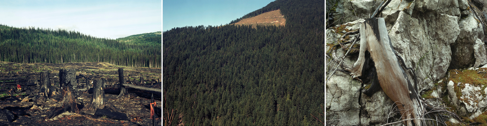
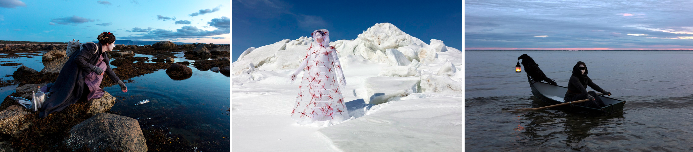
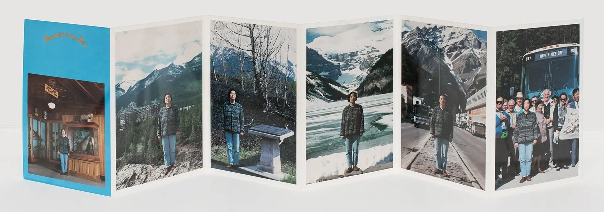

[Photography Tutorials](README.md)

---

# 🏞️ Mini-Project 1: Landscape Photography

**Time:** 2–2.5 hours

**Goal:** Create a coherent series of five photographs that communicates a sense of one specific place at McMaster University.

Your series should move between wider views and closer observations so that the viewer can understand both the overall space and its specific character.

---

<!-- 
/////////////////
SECTION 1
/////////////////
-->

<details class="tutorial-section">
  <summary>
    <span class="section-title">1. Review the examples</span>
    <span class="section-description">
      Examine how artists use wide views, close details, composition, and consistent visual treatments to communicate a sense of place.
    </span>
  </summary>

<div class="section-content" markdown="1">

## Lorraine Gilbert

{: .tutorial-image }

Lorraine Gilbert’s **Shaping the New Forest** was photographed while she worked as a tree planter in British Columbia and Quebec. The project combines landscapes, portraits, and panoramic views to document relationships between labour, forestry, and environmental change.

Notice how wide views establish the environment while closer photographs reveal people, materials, textures, and evidence of human activity.

- [Visit Lorraine Gilbert’s website](https://www.lorrainegilbert.ca/){:target="_blank"}
- [View *Shaping the New Forest*](https://www.lorrainegilbert.ca/shaping-the-new-forest){:target="_blank"}

## Meryl McMaster

{: .tutorial-image }

Meryl McMaster is an Ottawa-based artist of nêhiyaw and European ancestry. In **As Immense as the Sky** (2019), she uses landscape, staged photography, costume, and self-portraiture to explore ancestry, memory, migration, and relationships with the land.

- [Visit Meryl McMaster’s website](http://merylmcmaster.com/){:target="_blank"}
- [*As Immense as the Sky* project](http://merylmcmaster.com/){:target="_blank"}

## Jin-me Yoon

{: .tutorial-image }

Jin-me Yoon is a Korean-born, Vancouver-based artist. In **Souvenirs of the Self** (1991), she places herself within recognizable Canadian tourist landscapes to examine identity, representation, migration, and belonging.

- [Visit Jin-me Yoon’s website](https://www.jin-meyoon.com/){:target="_blank"}
- [View *Souvenirs of the Self*](https://www.jin-meyoon.com/works/souvenirs-of-the-self){:target="_blank"}

</div>
</details>

<!--
/////////////////
SECTION 2
/////////////////
-->

<details class="tutorial-section">
  <summary>
    <span class="section-title">2. Plan the landscape series</span>
    <span class="section-description">
      Select one campus location, choose a consistent format, and plan five photographs that communicate a sense of place.
    </span>
  </summary>

<div class="section-content" markdown="1">

## Select and observe the location

Choose one outdoor space at McMaster University and remain within the same general area for all five photographs.

Before photographing, walk through the space and notice:

- Overall layout
- Paths and leading lines
- Foreground, middle-ground, and background
- Architecture, vegetation, textures, and repeated forms
- Light, shadow, colour, and signs of human activity
- Small details that help identify the place

Ask what makes the location recognizable and which wider views and close details best communicate its atmosphere.

## Choose one format

Use the same format for all five photographs:

- **Horizontal:** `16:9`
- **Vertical:** `9:16`
- **Square:** `1:1`
- **Standard horizontal:** `4:3`

> Choose the format before photographing so you can select the corresponding aspect ratio and compose intentionally.

## Plan the five photographs

Check 📐 [Photography Composition Reference Guide](00_Composition_Reference.md). 

Create:

1. **Establishing view:** A wide photograph showing the overall location
2. **Environmental view:** A medium view of an important area
3. **Movement or depth:** A path, leading line, repetition, or layered composition
4. **Close-up detail:** A specific material, surface, plant, sign, shadow, or architectural feature
5. **Atmosphere or identity:** A photograph that communicates the mood or character of the place

The close-up should still feel connected to the location rather than appearing as an unrelated detail.

Before taking each photograph, ask:

- What is the main subject?
- What will the viewer notice first?
- Does the background support the subject?
- Is the chosen depth of field appropriate?
- How does this photograph contribute to the complete series?

> Create variety through distance, angle, framing, and subject. Maintain consistency through location, format, sequence, and visual treatment.

</div>
</details>


<!--
/////////////////
SECTION 3
/////////////////
-->

<details class="tutorial-section">
  <summary>
    <span class="section-title">3. Prepare the camera</span>
    <span class="section-description">
      Review the previous and newly introduced camera settings before photographing the series.
    </span>
  </summary>

<div class="section-content" markdown="1">

## Required camera settings

References:  

* 📷 [Canon Rebel T4i Quick Reference Guide](00_Canon_T4i_Quick_Reference.md)
* 📸 [Camera Setup and Aperture Priority Mode](02_Camera_Setup_and_Av_Mode.md)
* 📸 [Additional DSLR Camera Settings](05_Additional_DSLR_Settings.md)

<fieldset class="equipment-checklist">
  <legend>Landscape photography settings</legend>

  <label class="checklist-item">
    <input type="checkbox">
    <span>
      <strong>Shooting mode: Aperture Priority (`Av`)</strong>
      You will select the aperture, and the camera will calculate the shutter speed.
    </span>
  </label>

  <label class="checklist-item">
    <input type="checkbox">
    <span>
      <strong>Image quality: RAW + Large/Fine JPEG</strong>
      Use the RAW files for editing.
    </span>
  </label>

  <label class="checklist-item">
    <input type="checkbox">
    <span>
      <strong>Aspect ratio: Select one format for the complete series</strong>
      Choose `16:9`, `9:16`, `1:1`, or `4:3`, and use the same aspect ratio for all five photographs.
    </span>
  </label>

  <label class="checklist-item">
    <input type="checkbox">
    <span>
      <strong>Grid: Grid 1</strong>
      Use the grid in Live View to check alignment and subject placement.
    </span>
  </label>

  <label class="checklist-item">
    <input type="checkbox">
    <span>
      <strong>Exposure compensation: `0` to begin</strong>
      Adjust it when the camera makes the scene consistently too bright or too dark.
    </span>
  </label>

  <label class="checklist-item">
    <input type="checkbox">
    <span>
      <strong>ISO: Begin at ISO 100.</strong>
      Increase to ISO 200 or 400 only when the shutter speed becomes too slow for handheld photography.
    </span>
  </label>

  <label class="checklist-item">
    <input type="checkbox">
    <span>
      <strong>White balance: Use one fixed setting.</strong>
      Use Custom White Balance or one appropriate preset. Do not change the white-balance setting between photographs.
    </span>
  </label>

  <label class="checklist-item">
    <input type="checkbox">
    <span>
      <strong>Metering: Evaluative</strong>
      Begin with Evaluative metering. Use another mode only when the lighting requires a more specific reading.
    </span>
  </label>

  <label class="checklist-item">
    <input type="checkbox">
    <span>
      <strong>Image stabilization</strong>
      Turn it on when photographing handheld and off when using a tripod.
    </span>
  </label>

  <label class="checklist-item">
    <input type="checkbox">
    <span>
      <strong>Flash: Off</strong>
      Use the available light in the location.
    </span>
  </label>

</fieldset>

## Select the aperture intentionally

Use the aperture according to the photograph:

- Use a smaller f-number when you want a close detail separated from the background.
- Use a middle aperture such as `f/8` or `f/11` when you want more of the space to remain sharp.
- Check the shutter speed after changing the aperture.
- Increase the ISO only when necessary to maintain a usable handheld shutter speed.

> The aperture does not need to remain identical across all five photographs. Select it according to the intended depth of field. The overall exposure and visual treatment should remain consistent.

</div>
</details>

<!--
/////////////////
SECTION 4
/////////////////
-->

<details class="tutorial-section">
  <summary>
    <span class="section-title">4. Photograph the location</span>
    <span class="section-description">
      Move through the space, vary the distance and viewpoint, and create several options for each required photograph.
    </span>
  </summary>

<div class="section-content" markdown="1">

## Photographing process

1. Begin with the wide establishing view.
2. Move through the location rather than remaining in one position.
3. Photograph from different heights and angles.
4. Move closer for medium views and details.
5. Refocus before every new composition.
6. Check the frame edges.
7. Review the histogram and image preview.
8. Retake a photograph when the focus, exposure, or framing is unsuccessful.
10. Avoid deleting files in the camera.
11. Take several photographs of each composition. Aim for 5–10 variations so you have multiple options to review and select from later.

## Before leaving the location

<fieldset class="equipment-checklist">
  <legend>Five-photograph series</legend>

  <label class="checklist-item">
    <input type="checkbox">
    <span><strong>I photographed a wide establishing view.</strong></span>
  </label>

  <label class="checklist-item">
    <input type="checkbox">
    <span><strong>I photographed a medium environmental view.</strong></span>
  </label>

  <label class="checklist-item">
    <input type="checkbox">
    <span><strong>I photographed a path, leading line, or other form of depth.</strong></span>
  </label>

  <label class="checklist-item">
    <input type="checkbox">
    <span><strong>I photographed a close-up detail connected to the location.</strong></span>
  </label>

  <label class="checklist-item">
    <input type="checkbox">
    <span><strong>I photographed the atmosphere or identity of the space.</strong></span>
  </label>

  <label class="checklist-item">
    <input type="checkbox">
    <span><strong>I created several options for each required photograph.</strong></span>
  </label>

  <label class="checklist-item">
    <input type="checkbox">
    <span><strong>The photographs include changes in distance, viewpoint, and composition.</strong></span>
  </label>
</fieldset>

</div>
</details>

<!--
/////////////////
SECTION 5
/////////////////
-->

<details class="tutorial-section">
  <summary>
    <span class="section-title">5. Transfer and select the photographs</span>
    <span class="section-description">
      Organize the files and select five photographs that work together as a coherent sequence.
    </span>
  </summary>

<div class="section-content" markdown="1">

Create this folder structure:

```text
Name-Lastname-Landscape-Series/
├── RAW/
├── JPEG/
├── Selected-RAW/
├── PSD/
└── Exported-JPEG/
```

1. Copy all RAW files into the **RAW** folder.
2. Copy all JPEG files into the **JPEG** folder.
3. Review the JPEG files first.
4. Select the strongest photograph for each of the five required views.
5. Confirm that the five images communicate the same location.
6. Copy the matching RAW files into **Selected-RAW**.

## Selection criteria

Choose photographs that:

- Are sharply focused
- Have usable highlight and shadow detail
- Use intentional composition
- Include variety in distance and framing
- Communicate something specific about the location
- Work together in a clear sequence
- Can be cropped to the selected common format

> Do not select five photographs only because they are individually strong. Select five photographs that work together as a series.

</div>
</details>

<!--
/////////////////
SECTION 6
/////////////////
-->

<details class="tutorial-section">
  <summary>
    <span class="section-title">6. Edit the series consistently</span>
    <span class="section-description">
      Develop all five RAW photographs using related colour, tonal, crop, and size settings.
    </span>
  </summary>

<div class="section-content" markdown="1">

Check 🖼️ [RAW Photography and Image Editing](06_RAW_Photography_and_Editing.md).  

Open the five selected RAW files in Adobe Camera Raw.

Edit the photographs as a group so they appear to belong to the same series.

## 1. Adobe Camera Raw: Establish the visual treatment

Begin with one photograph and develop a base treatment (make notes) for:

- White balance
- Exposure
- Contrast
- Highlights
- Shadows
- Whites
- Blacks
- Texture
- Clarity
- Vibrance
- Saturation
- Colour Mixer adjustments
- Colour Grading, when used

Apply similar settings to the remaining photographs, then refine each image individually when necessary.

> Consistency does not mean every slider must have the exact same value. The photographs may require small individual corrections because the light and framing changed. The final results should have a related colour, brightness, contrast, and mood.

## Photoshop: Maintain consistency

### Save the Photoshop Files

After completing the colour and tonal adjustments in Adobe Camera Raw, open each developed photograph in Photoshop.

For each photograph:

1. Select **File → Save As**.
2. Save the file in the **PSD** folder.
3. Select **Photoshop (`.PSD`)** as the file format.
4. Confirm that **Layers** is enabled when the option appears.
5. Save the files using this naming sequence:

Use:

```text
Name-Lastname-Landscape-01.psd
Name-Lastname-Landscape-02.psd
Name-Lastname-Landscape-03.psd
Name-Lastname-Landscape-04.psd
Name-Lastname-Landscape-05.psd
```

### Format and Size

You may recompose, crop, straighten, flip, or rotate the photographs during editing. However, all five photographs must use the same final format and dimensions.

- **Horizontal:** `16:9` — `3200 × 1800 pixels`
- **Vertical:** `9:16` — `1800 × 3200 pixels`
- **Square:** `1:1` — `3000 × 3000 pixels`
- **Standard horizontal:** `4:3` — `3000 × 2250 pixels`

Across the complete series, maintain:

- The same orientation
- The same aspect ratio
- The same pixel dimensions
- The same `sRGB` colour space
- A related colour treatment
- Consistent brightness and contrast
- A consistent level of texture, clarity, and saturation

> The individual photographs may require slightly different corrections, but the final series should feel visually unified.

## Compare the photographs together

Before exporting:

1. Open all five photographs.
2. View them at the same size.
3. Arrange them in sequence.
4. Compare colour, exposure, contrast, crop, and visual weight.
5. Adjust any image that appears disconnected from the others.

Ask:

- Does one photograph appear much warmer or cooler?
- Does one photograph appear much brighter or darker?
- Is the contrast noticeably different?
- Are all five images the same dimensions?
- Does the sequence move clearly through the location?
- Do the close-up photographs still feel connected to the wider views?

### Export High-Quality JPEG Files

After finishing changes, export a high-quality JPEG copy of each photograph.

For each photograph:

1. Select **File → Export → Export As**.
2. Select **JPG** as the file format.
3. Use these settings:
   - **Quality:** High or `100%`
   - **Scale:** `100%`
   - **Colour Space:** Convert to `sRGB`
   - **Embed Colour Profile:** Enabled, when available
4. Confirm that the photograph uses the required pixel dimensions for the series.
5. Click **Export**.
6. Save the file in the **Exported-JPEG** folder.
7. Use this naming sequence:

```text
Name-Lastname-Landscape-01.jpg
Name-Lastname-Landscape-02.jpg
Name-Lastname-Landscape-03.jpg
Name-Lastname-Landscape-04.jpg
Name-Lastname-Landscape-05.jpg
```

</div>
</details>

---

## Reflection questions

1. How did moving between wide, medium, and close-up views help you communicate a sense of the location?

2. Which compositional strategy was most effective in the series, and why?

3. What editing decisions helped the five photographs appear consistent as a single body of work?

---

Credits: Jessica A. Rodríguez
