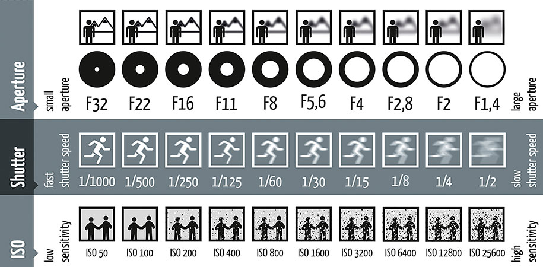
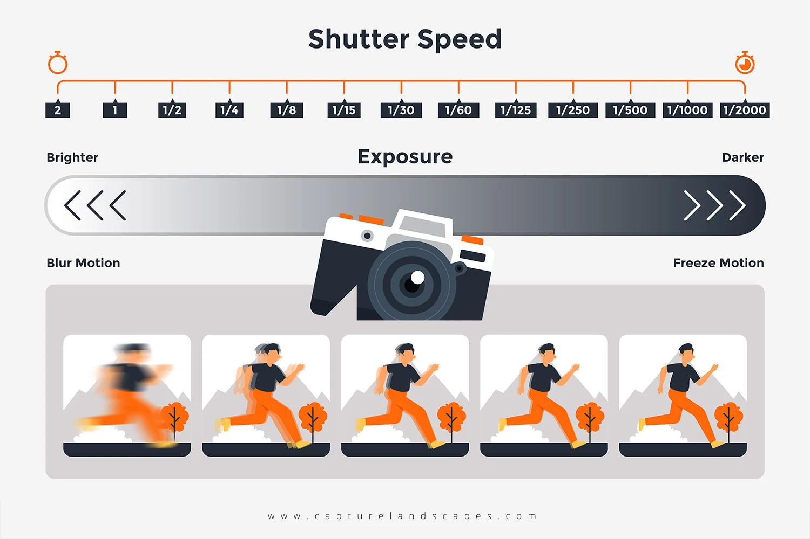
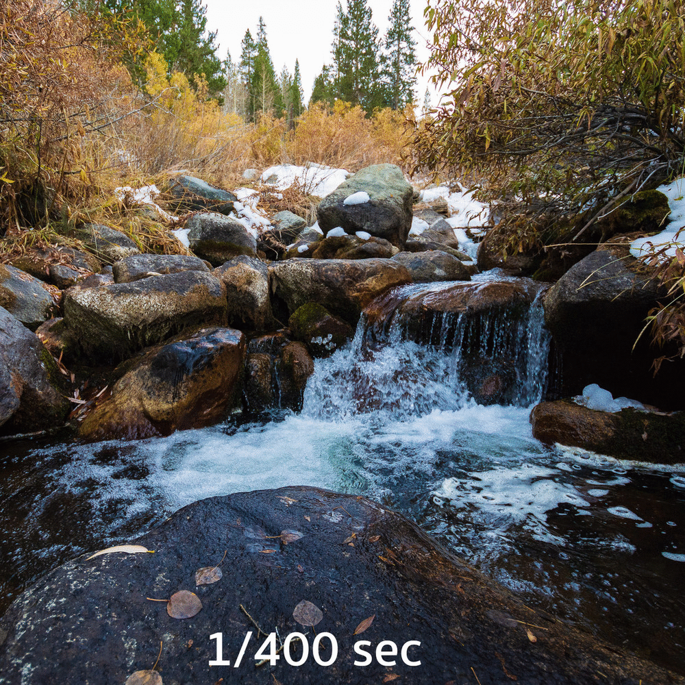

[Photography Tutorials](README.md)

---

# 📸 Manual Mode and ⚙️ Technical Card: Shutter Speed

**Time:** 1-1.5 hours  

**Goal:** Explore how shutter speed records movement, use Shutter Priority (`Tv`) mode, and create a GIF comparing frozen and blurred motion.

You will work with a partner for camera setup, tripod support, and feedback. Each participant must photograph and create their own three technical cards.

---

<!--
/////////////////
SECTION 1
/////////////////
-->

<details class="tutorial-section">
  <summary>
    <span class="section-title">1. Understand Manual Mode and Shutter Speed</span>
    <span class="section-description">
      Learn how Manual mode provides direct control over exposure and how shutter speed changes the appearance of movement.
    </span>
  </summary>

<div class="section-content" markdown="1">

## Why use Manual mode?



**Manual mode (`M`)** gives you direct control over the three main exposure settings:

- **Aperture:** Controls how much light enters the camera and affects depth of field.
- **Shutter speed:** Controls how long the camera sensor is exposed to light and how movement appears.
- **ISO:** Controls how strongly the camera amplifies the image signal. Higher ISO values produce a brighter image but may increase digital noise.

In Manual mode, the camera does not automatically adjust the aperture or shutter speed to correct the exposure. You must select and evaluate each setting.

## Shutter speed

<div class="media-grid media-grid--two">

  <figure class="media-card">
    
    <figcaption>
      <strong>Shutter-speed scale:</strong> Faster shutter speeds freeze movement, while slower shutter speeds create more motion blur.
    </figcaption>
  </figure>

  <figure class="media-card">
    
    <figcaption>
      <strong>Shutter-speed comparison:</strong> The same movement photographed using different exposure times.
    </figcaption>
  </figure>

</div>

**Shutter speed** controls how long the camera sensor is exposed to light.

- A **fast shutter speed** records a brief moment, freezes movement, and allows less light to reach the sensor.
- A **slow shutter speed** records movement over a longer period, creates motion blur, and allows more light to reach the sensor.

Shutter speed is written as a fraction of a second:

```text
1/1000
1/500
1/250
1/125
1/60
1/30
1/15
1/8
```

A larger denominator represents a faster shutter speed. For example:

- `1/1000` is faster than `1/30`.
- `1/1000` exposes the sensor for less time.
- `1/30` exposes the sensor for more time.

## Shutter speed in Manual mode

<div style="width: 70vw; max-width: 100%; aspect-ratio: 16 / 9; margin: 1rem auto;"> <iframe src="https://www.youtube.com/embed/siYpMmY0jgQ?si=KE3-WeV7Sw6_Gr7D" title="Beginner Photography - Tv Mode (Shutter Priority Mode)" style="width: 100%; height: 100%; border: 0;" allow="accelerometer; autoplay; clipboard-write; encrypted-media; gyroscope; picture-in-picture; web-share" referrerpolicy="strict-origin-when-cross-origin" allowfullscreen> </iframe> </div>

Because the camera is in Manual mode, it will not automatically compensate as the shutter speed changes.

As a result:

- Faster shutter speeds will generally produce darker photographs.
- Slower shutter speeds will generally produce brighter photographs.
- The appearance of movement will change from frozen action to visible motion blur.

> This activity demonstrates how shutter speed affects both movement and exposure.

## Use the histogram

In Manual mode, the camera does not automatically correct the exposure. The histogram provides a visual record of how the selected aperture, shutter speed, and ISO affect the distribution of tones in the photograph.

{: .tutorial-image }

Use the histogram to evaluate the image after each exposure:

- The **left side** represents shadows and darker tones.
- The **middle** represents midtones.
- The **right side** represents highlights and brighter tones.
- A graph pressed against the **left edge** may indicate blocked shadows with little or no visible detail.
- A graph pressed against the **right edge** may indicate clipped highlights with lost detail.

The histogram does not need to be centred. Its shape depends on the subject, background, lighting, and intended visual result. A dark scene may naturally contain more information on the left, while a bright scene may contain more information on the right.

## Subject movement and camera movement

Motion blur can come from:

- **Subject movement:** The subject moves while the camera remains stationary. This requires a tripod. 
- **Camera movement:** The camera moves while the shutter is open.
- **Both:** The subject and camera move during the exposure.

</div>
</details>

<!--
/////////////////
SECTION 2
/////////////////
-->

<details class="tutorial-section">
  <summary>
    <span class="section-title">2. Prepare the camera</span>
    <span class="section-description">
      Set the camera to Manual mode and establish a fixed aperture and ISO so that only the shutter speed changes during the comparison.
    </span>
  </summary>

<div class="section-content" markdown="1">

## Establish the fixed exposure settings

<fieldset class="equipment-checklist">
  <legend>Shutter speed comparison settings</legend>

  <label class="checklist-item">
    <input type="checkbox">
    <span>
      <strong>Shooting mode: Manual (`M`)</strong>
      Set the aperture, shutter speed, and ISO manually.
    </span>
  </label>

  <label class="checklist-item">
    <input type="checkbox">
    <span>
      <strong>Image quality: RAW + Large/Fine JPEG</strong>
      Use the JPEG files for the GIF and preserve the RAW files for future editing.
    </span>
  </label>

  <label class="checklist-item">
    <input type="checkbox">
    <span>
     <strong>Aspect ratio: <code>16:9</code></strong>
      Use the same widescreen aspect ratio for every photograph in the GIF.
    </span>
  </label>

  <label class="checklist-item">
    <input type="checkbox">
    <span>
      <strong>Grid: Grid 1</strong>
      Use the grid to maintain alignment and framing.
    </span>
  </label>

  <label class="checklist-item">
    <input type="checkbox">
    <span>
      <strong>Metering: Evaluative</strong>
      Use the exposure meter to observe how the exposure changes at each shutter speed.
    </span>
  </label>

  <label class="checklist-item">
    <input type="checkbox">
    <span>
      <strong>Aperture: One fixed setting</strong>
      Select the aperture before beginning the final sequence and keep it unchanged for every photograph.
    </span>
  </label>

  <label class="checklist-item">
    <input type="checkbox">
    <span>
      <strong>ISO: One fixed setting</strong>
      Select the ISO before beginning the final sequence and keep it unchanged for every photograph.
    </span>
  </label>

  <label class="checklist-item">
    <input type="checkbox">
    <span>
      <strong>White balance: One fixed setting</strong>
      Do not use Auto White Balance. Keep the same preset throughout the comparison.
    </span>
  </label>

  <label class="checklist-item">
    <input type="checkbox">
    <span>
      <strong>Focus: Autofocus, then Manual Focus</strong>
      Focus on the area where the movement will occur, confirm sharpness, and then switch the lens from <code>AF</code> to <code>MF</code>. Do not touch the focus ring again.
    </span>
  </label>

  <label class="checklist-item">
    <input type="checkbox">
    <span>
      <strong>Image Stabilization: Off</strong>
      Turn stabilization off because the camera is mounted on a tripod.
    </span>
  </label>

  <label class="checklist-item">
    <input type="checkbox">
    <span>
      <strong>Flash: Off</strong>
      Use the available light in the location.
    </span>
  </label>

  <label class="checklist-item">
    <input type="checkbox">
    <span>
      <strong>Tripod: Required</strong>
      Lock the tripod and do not move it during the comparison.
    </span>
  </label>
</fieldset>

> Keep the aperture, ISO, white balance, focus, focal length, framing, camera position, subject, background, and lighting unchanged. The only setting that should change during the final sequence is the shutter speed.

</div>
</details>

<!--
/////////////////
SECTION 3
/////////////////
-->

<details class="tutorial-section">
  <summary>
    <span class="section-title">3. Photograph the shutter-speed comparison</span>
    <span class="section-description">
      Plan one repeatable movement and photograph it at six shutter speeds while keeping ISO, white balance, framing, focal length, and focus unchanged.
    </span>
  </summary>

<div class="section-content" markdown="1">

## What the comparison should demonstrate

The Shutter Speed GIF should demonstrate how movement changes from **frozen action** to **motion blur** as the shutter speed becomes slower.  

<div class="media-grid media-grid--two">

  <figure class="media-card">
    
    <figcaption>
      <strong>Example 1:</strong> A repeated body movement photographed from a stationary camera.
    </figcaption>
  </figure>

  <figure class="media-card">
    
    <figcaption>
      <strong>Example 2:</strong> A moving object photographed against a contrasting background.
    </figcaption>
  </figure>

</div>

For this exercise, the **camera must remain stationary on a tripod**.  

Do not move the tripod, reframe the composition, change the focal length, or refocus during the sequence. Only the subject should move, repeating the same action at each shutter speed.

## Movement and location requirements

Choose one movement that can be repeated consistently.

Examples include:

- Walking or running across the frame
- Jumping
- Spinning
- Moving fabric
- Rolling or throwing an object
- A repeated hand or body gesture
- Moving water

Select a location with:

- Enough space to complete the movement safely
- A clear and contrasting background
- Stable lighting
- Minimal pedestrian traffic
- A safe and level place for the tripod
- A clearly defined starting and ending area

> A tripod is required. Do not complete the Shutter Speed comparison handheld.

## Plan the composition

Before photographing, decide:

- Where the movement will begin and end
- Where the subject should appear in the frame
- Whether the movement will travel horizontally, vertically, or diagonally
- Which compositional strategy will organize the image
- Which area should remain in focus
- How the background will help make the movement visible

Check 📐 [Photography Composition Reference Guide](00_Composition_Reference.md){:target="_blank" rel="noopener noreferrer"}.

## Photograph the six shutter speeds

Photograph the same repeated movement using:

1. `1/1000`
2. `1/500`
3. `1/250`
4. `1/125`
5. `1/60`
6. `1/30`

When the location and exposure allow, you may also experiment with:

- `1/15`
- `1/8`

## Photographing and backup procedure

At each shutter speed:

1. Set the required Shutter Speed.
2. **Take the first photograph.**
3. Review the photograph on the camera.
4. Magnify the main subject to check focus.
5. Check for camera movement, subject movement, or unexpected blur.
6. **Take a second photograph** using the same settings as a backup.
7. Take a third photograph only when one of the first two has a visible problem.

You will select the strongest photograph from each pair when creating the GIF.

## Record the settings

Record the information on the **Technical Cards Handout**.

| Frame | Shutter Speed | ISO | Aperture | Movement Result |
|---|---:|---:|---:|---|
| 1 | `1/1000` |  |  |  |
| 2 | `1/500` |  |  |  |
| 3 | `1/250` |  |  |  |
| 4 | `1/125` |  |  |  |
| 5 | `1/60` |  |  |  |
| 6 | `1/30` |  |  |  |

</div>
</details>

<!--
/////////////////
SECTION 5
/////////////////
-->

<details class="tutorial-section">
  <summary>
    <span class="section-title">5. Transfer, review, and organize the photographs</span>
    <span class="section-description">
      Import all camera files, review the JPEG photographs, select one image for each setting, and rename the selected files.
    </span>
  </summary>

<div class="section-content" markdown="1">

## Transfer all files

> The camera will save recorded photographs twice: once as a `.JPEG` file and once as a RAW file (`.CR2`).

1. Turn off the camera.
2. Remove the SD card.
3. Insert the SD card into a card reader.
4. Create the main project folder on the computer.
5. Copy **all RAW and JPEG files** from the SD card into the project folder.
6. Confirm that the files open correctly on the computer.
7. Do not work directly from the SD card.

Add a **Shutter-Speed** folder to your existing project folder:

```text
Name-Lastname-Technical-Cards/
├── Aperture/
├── ISO/
├── Shutter-Speed/
│   ├── RAW/
│   ├── JPEG/
│   └── Selected/
└── White-Balance/
```

## Review the JPEG photographs

Open the JPEG folder for each comparison and check every photograph.

For each camera setting:

1. Compare the photographs taken at that setting.
2. Confirm that the main subject is sharp.
3. Check for camera movement or subject movement.
4. Confirm that the framing remained consistent.
5. Check that no person or unexpected object entered the composition.
6. Select the strongest photograph.
7. Copy the selected JPEG into the corresponding Selected folder.

> Copy the selected files rather than moving them. Keep all original JPEG and RAW files in their existing folders.

> Do not delete the additional JPEG photographs or RAW files.

## Rename the selected Aperture JPEG files

Rename the six selected files in order:

```text
01-1000.jpg
02-500.jpg
03-250.jpg
04-125.jpg
05-60.jpg
06-30.jpg
```

I the location allowed: 

```text
07-15.jpg
08-8.jpg
```

</div>
</details>

<!--
/////////////////
SECTION 6
/////////////////
-->

<details class="tutorial-section">
  <summary>
    <span class="section-title">6. Create GIF in Photoshop</span>
    <span class="section-description">
      Label the photographs, load them as layers, and export looping GIF files.
    </span>
  </summary>

<div class="section-content" markdown="1">

> For this activity, use only the **JPEG files** in each **Selected** folder.

### 1. Add information to each selected photograph

1. Open the photograph in Photoshop:
   - Right-click the file.
   - Select **Open With → Adobe Photoshop**.
2. Select the **Type Tool (`T`)**.
3. Add the setting shown in the photograph:
   - Aperture: `1/1000`, `1/500`, `1/250`, etc.
4. Use a simple, readable sans-serif font.
5. Keep the font, size, alignment, and colour consistent across all six photographs.
6. Position the label in the same place on every photograph.
7. Use **View → Rulers** and drag guides from the rulers to align the labels consistently.
8. Make sure the text is clearly visible against the photograph. Add a simple solid background behind the text when necessary.
9. Save image: **File → Save**

> Check the Photoshop Text Tool and ruler tutorials below before adding the labels.
> Repeat the same process with each image. 

<div style="width: 70vw; max-width: 100%; aspect-ratio: 16 / 9; margin: 1rem auto;">
  <iframe
    src="https://www.youtube.com/embed/SBfpj2fTWYs?si=-dIMAAL5prkpQz_E"
    title="How to OPEN Files in Photoshop"
    style="width: 100%; height: 100%; border: 0;"
    allow="accelerometer; autoplay; clipboard-write; encrypted-media; gyroscope; picture-in-picture; web-share"
    referrerpolicy="strict-origin-when-cross-origin"
    allowfullscreen>
  </iframe>
</div>

<div style="width: 70vw; max-width: 100%; aspect-ratio: 16 / 9; margin: 1rem auto;">
  <iframe
    src="https://www.youtube.com/embed/Pi2VOfnes-Q?si=wPh_SZFp_YWp5nQX&amp;start=17"
    title="How To Use Text Tool In Photoshop"
    style="width: 100%; height: 100%; border: 0;"
    allow="accelerometer; autoplay; clipboard-write; encrypted-media; gyroscope; picture-in-picture; web-share"
    referrerpolicy="strict-origin-when-cross-origin"
    allowfullscreen>
  </iframe>
</div>

<div style="width: 70vw; max-width: 100%; aspect-ratio: 16 / 9; margin: 1rem auto;">
  <iframe
    src="https://www.youtube.com/embed/RCnDuPOE680?si=abHy-sg0q3_puaGx"
    title="How to Add Ruler Guides in Photoshop"
    style="width: 100%; height: 100%; border: 0;"
    allow="accelerometer; autoplay; clipboard-write; encrypted-media; gyroscope; picture-in-picture; web-share"
    referrerpolicy="strict-origin-when-cross-origin"
    allowfullscreen>
  </iframe>
</div>

### 2. Create a new Photoshop document

> Follow the video tutorial below, then use these document settings.

1. Open Photoshop.
2. Select **File → New**.
3. Enter the following settings:
   - **Width:** `1920 pixels`
   - **Height:** `1080 pixels`
   - **Orientation:** Landscape
   - **Resolution:** `150 pixels/inch`
   - **Colour Mode:** RGB Colour
4. Click **Create**.
5. Continue to the next step.

<div style="width: 70vw; max-width: 100%; aspect-ratio: 16 / 9; margin: 1rem auto;">
  <iframe
    src="https://www.youtube.com/embed/0KDEtrFnpx4?si=A6j---rMLKUOQipe"
    title="How To Create New File In Photoshop 2025"
    style="width: 100%; height: 100%; border: 0;"
    allow="accelerometer; autoplay; clipboard-write; encrypted-media; gyroscope; picture-in-picture; web-share"
    referrerpolicy="strict-origin-when-cross-origin"
    allowfullscreen>
  </iframe>
</div>

### 3. Create the GIF

> Follow the video tutorial below to create a frame animation in Photoshop.

1. In Photoshop, select **File → Scripts → Load Files into Stack**.
2. Click **Browse**.
3. Select the six labelled JPEG files from the corresponding **Selected** folder.
4. Click **Open**, then click **OK**.
5. In the **Layers** panel, confirm that each photograph appears on a separate layer.
6. Select **Window → Timeline**.
7. In the Timeline panel, select **Create Frame Animation**.
8. Open the Timeline panel menu.
9. Select **Make Frames From Layers**.
10. Confirm that the frames appear in the correct order:
    - Shutter Speed: faster to slower value
11. When the frames appear in reverse order:
    - Select all frames.
    - Open the Timeline panel menu.
    - Select **Reverse Frames**.
12. Select all six frames.
13. Set the duration to approximately **1.5 seconds** per frame.
14. Set the looping option to **Forever**.
15. Press **Play** and review the complete animation.
16. Continue to the next step.

<div style="width: 70vw; max-width: 100%; aspect-ratio: 16 / 9; margin: 1rem auto;">
  <iframe
    src="https://www.youtube.com/embed/8cn6zmYGYZM?si=-iv8Dt76iCjemgVL&amp;start=28"
    title="How To Create a GIF in Photoshop - Tutorial"
    style="width: 100%; height: 100%; border: 0;"
    allow="accelerometer; autoplay; clipboard-write; encrypted-media; gyroscope; picture-in-picture; web-share"
    referrerpolicy="strict-origin-when-cross-origin"
    allowfullscreen>
  </iframe>
</div>

## Export GIF

1. Select **File → Export → Save for Web (Legacy)**.
2. Select **GIF**.
3. Confirm that looping is set to **Forever**.
5. Save as `Shutter-Speed-Card.gif`

Open the exported GIF in a web browser and watch it from beginning to end.

</div>
</details>

---

Credits: Jessica A. Rodríguez
