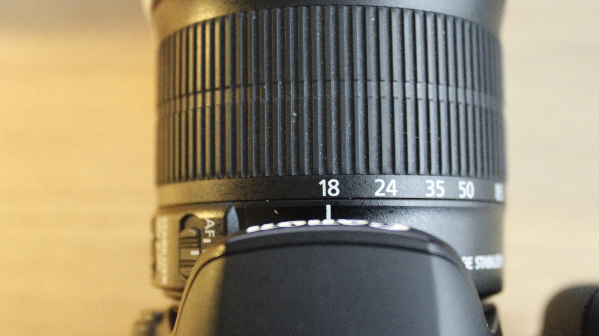
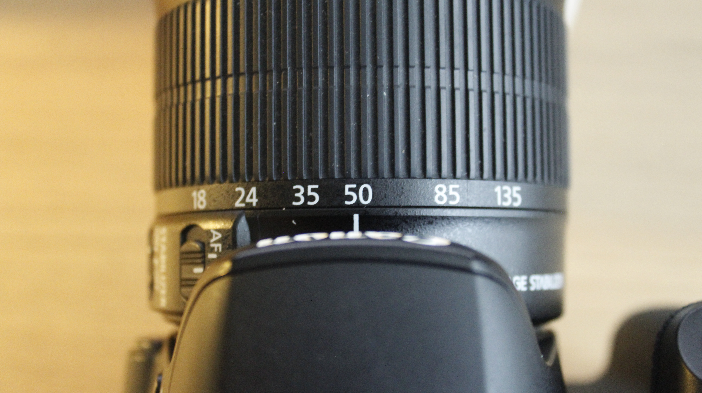
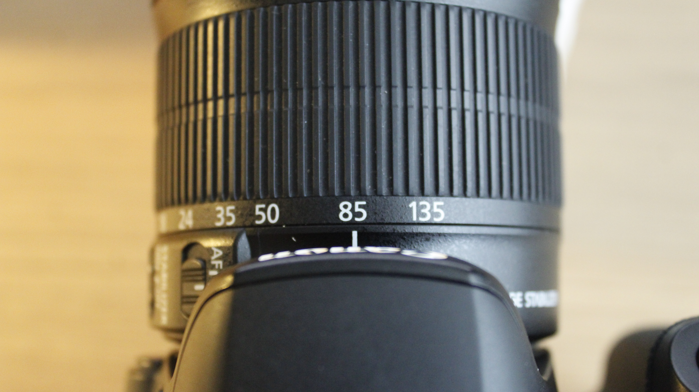
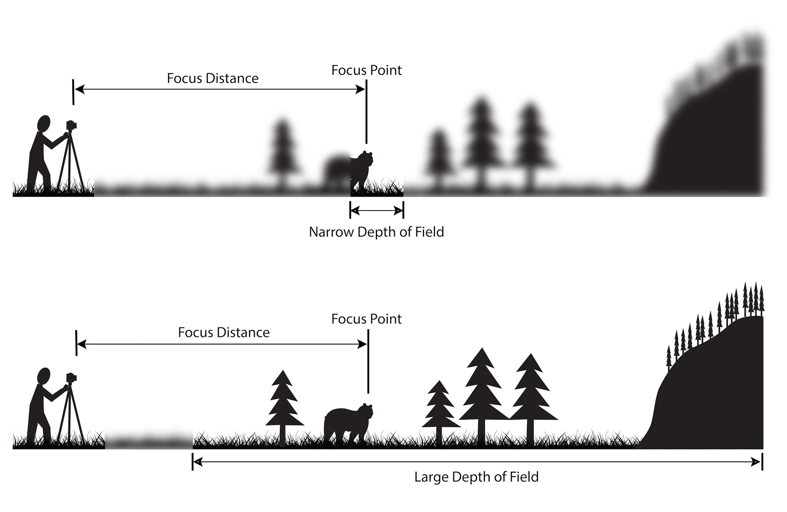
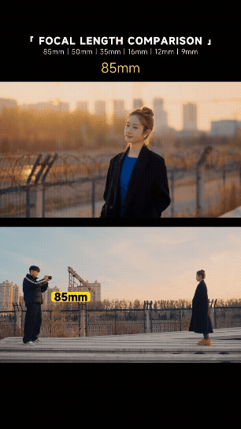

[Photography Tutorials](README.md)

---

# 🔭 Focal Length, Camera Distance, Perspective, and Depth of Field

**Time:** 30 minutes  

**Goal:** Learn how focal length changes field of view, how camera position changes perspective, and how focal length, distance, aperture, and background distance affect depth of field.

---

<!--
/////////////////
SECTION 1
/////////////////
-->

<details class="tutorial-section">
  <summary>
    <span class="section-title">1. Understand focal length, camera distance, perspective, and depth of field</span>
    <span class="section-description">
      Learn how focal length changes field of view, how camera position changes perspective, and how several controls work together to shape depth.
    </span>
  </summary>

<div class="section-content" markdown="1">

## Focal length and field of view

**Focal length** is measured in millimetres (`mm`). It affects how much of the scene appears inside the frame.

{: .tutorial-image }

With the Canon 18–135 mm lens:

- `18 mm` produces a wider field of view.
- `50 mm` produces a narrower field of view.
- `135 mm` produces a much narrower field of view.

A wider focal length includes more of the surrounding environment. A longer focal length includes a smaller section of the scene and makes distant details appear larger within the frame.

> Changing focal length changes the field of view. It does not change perspective when the camera remains in exactly the same position.

## Set the focal length

Use the **white line indicator** on the lens to align the zoom ring with the required focal length.

<div class="media-grid media-grid--three">

  <figure class="media-card">
    
    <figcaption>
      <strong>18 mm:</strong> Turn the zoom ring until the white line indicator aligns with <code>18</code>.
    </figcaption>
  </figure>

  <figure class="media-card">
    
    <figcaption>
      <strong>50 mm:</strong> Turn the zoom ring until the white line indicator aligns with <code>50</code>.
    </figcaption>
  </figure>

  <figure class="media-card">
    
    <figcaption>
      <strong>85 mm:</strong> Turn the zoom ring until the white line indicator aligns with <code>85</code>.
    </figcaption>
  </figure>

</div>

## Camera distance and perspective

**Perspective** describes the apparent spatial relationship between objects at different distances from the camera.

Camera position determines perspective:

- Moving the camera closer can exaggerate the apparent distance between foreground and background.
- Moving the camera farther away can make foreground and background appear closer together.
- A close camera position can make near objects appear much larger than distant objects.
- A distant camera position can make the background appear larger relative to the main subject.

When photographers use a longer focal length and move farther away to maintain similar subject framing, the background often appears larger and closer to the subject. This effect is commonly described as **compression**, but it results primarily from the increased camera distance.

> The lens changes the framing. Moving the camera changes the perspective.

## What is depth of field?

Explore the [Depth of Field Simulator](https://jherr.github.io/depth-of-field/){:target="_blank" rel="noopener noreferrer"} to compare how focal length, aperture, camera distance, and subject distance affect depth of field.

**Depth of field** is the area in front of and behind the focus point that appears acceptably sharp.

{: .tutorial-image }

- A **shallow depth of field** keeps a limited area in focus while other areas appear blurred.
- A **deep depth of field** keeps a larger area of the scene in focus.

Depth of field is affected by several connected factors:

### Aperture

- A wider aperture with a lower f-number generally creates a shallower depth of field.
- A narrower aperture with a higher f-number generally creates a deeper depth of field.

### Camera distance

- Moving closer to the focus point generally creates a shallower depth of field.
- Moving farther from the focus point generally creates a deeper depth of field.

### Focal length

- Shorter focal lengths generally make it easier to maintain a deeper area of focus.
- Longer focal lengths generally make it easier to isolate the subject with a shallower area of focus.

### Background distance

- A background close to the subject may appear more defined.
- A background farther behind the subject is more likely to appear blurred.

> Focal length, aperture, camera distance, and background distance work together. Do not evaluate any one factor in isolation.

## Compare the examples

### Same camera position

<div class="media-grid media-grid--three">

  <figure class="media-card">
    
    <figcaption>
      <strong>Comparison 1:</strong> A wider field of view from the fixed camera position.
    </figcaption>
  </figure>

  <figure class="media-card">
    
    <figcaption>
      <strong>Comparison 2:</strong> A narrower field of view from the same camera position.
    </figcaption>
  </figure>

  <figure class="media-card">
    
    <figcaption>
      <strong>Comparison 3:</strong> A much narrower field of view from the same camera position.
    </figcaption>
  </figure>

</div>

In this comparison, the subject and camera position remain unchanged while the focal length changes. Compare:

- How much of the environment is visible
- The size of the subject within the frame
- The apparent size of background details
- Which parts of the scene are excluded at longer focal lengths

### Similar subject framing from different camera distances

<div class="media-grid media-grid--three">

  <figure class="media-card">
    
    <figcaption>
      <strong>Distance comparison 1:</strong> A wider focal length from a closer camera position.
    </figcaption>
  </figure>

  <figure class="media-card">
    
    <figcaption>
      <strong>Distance comparison 2:</strong> A middle focal length from an intermediate camera position.
    </figcaption>
  </figure>

  <figure class="media-card">
    
    <figcaption>
      <strong>Distance comparison 3:</strong> A longer focal length from a more distant camera position.
    </figcaption>
  </figure>

</div>

In this comparison, the subject remains in the same location while the focal length and camera distance change. The subject should remain approximately the same size in every frame.

Compare:

- The apparent distance between the subject and background
- The amount of background visible
- The apparent size of background objects
- The shape and spatial relationship of foreground and background elements
- The depth of field

</div>
</details>

---

# ⚙️ Technical Card: Focal Length and Distance

**Time:** 60–75 minutes  

**Goal:** Photograph two controlled comparisons using different focal lengths and camera distances, then create a technical card showing changes in field of view, perspective, and depth.

You will work with a partner for camera setup, tripod support, distance checks, and feedback. Each participant must photograph and create their own Focal Length and Distance Technical Card.

---

<!--
/////////////////
SECTION 2
/////////////////
-->

<details class="tutorial-section">
  <summary>
    <span class="section-title">2. Prepare the camera and location</span>
    <span class="section-description">
      Select a subject and background, establish fixed manual exposure settings, and prepare the tripod for two controlled comparisons.
    </span>
  </summary>

<div class="section-content" markdown="1">

## Location and subject requirements

Choose a safe location with:

- One stationary main subject
- A clearly visible background several metres behind the subject
- Foreground, middle-ground, and background information
- Stable light
- Minimal pedestrian traffic
- Enough space to move the tripod closer to and farther from the subject
- A clear path between each camera position

Suitable subjects include:

- A person who can remain stationary
- A sculpture
- A sign
- A bench
- A plant or small tree
- An architectural detail
- Another object with a clearly identifiable shape

The subject and background must remain in the same positions throughout both comparisons.

> Do not use a moving subject. The activity examines focal length, camera position, perspective, and depth of field rather than movement.

## Establish the composition

Before photographing:

1. Decide which subject will remain the main focus point.
2. Identify a background with visible details that can be compared.
3. Confirm that there is enough room to use `18 mm`, `50 mm`, and `135 mm`.
4. Decide how large the subject should appear in the second comparison.
5. Check the edges of the frame for distractions.
6. Confirm that the tripod can be moved safely between positions.

Check 📐 [Photography Composition Reference Guide](00_Composition_Reference.md){:target="_blank" rel="noopener noreferrer"}.

## Base camera settings

<fieldset class="equipment-checklist">
  <legend>Focal length and distance comparison settings</legend>

  <label class="checklist-item">
    <input type="checkbox">
    <span>
      <strong>Shooting mode: <code>M</code></strong>
      Use Manual mode so the exposure remains controlled throughout the activity.
    </span>
  </label>

  <label class="checklist-item">
    <input type="checkbox">
    <span>
      <strong>Image quality: RAW + Large/Fine JPEG</strong>
      Use the JPEG files for the technical card and preserve the RAW files for future editing.
    </span>
  </label>

  <label class="checklist-item">
    <input type="checkbox">
    <span>
      <strong>Aspect ratio: <code>16:9</code></strong>
      Use the same widescreen format for every photograph.
    </span>
  </label>

  <label class="checklist-item">
    <input type="checkbox">
    <span>
      <strong>Grid: Grid 1</strong>
      Use the grid to maintain alignment and compare subject placement.
    </span>
  </label>

  <label class="checklist-item">
    <input type="checkbox">
    <span>
      <strong>Lens: Canon 18–135 mm</strong>
      Use the same lens for the complete activity.
    </span>
  </label>

  <label class="checklist-item">
    <input type="checkbox">
    <span>
      <strong>Focus: Manual Focus (`MF`)</strong>
      Focus manually on the same point of the subject at each focal length. Recheck and adjust the focus after changing to <code>18 mm</code>, <code>50 mm</code>, or <code>85 mm</code>, because the focus may shift when the lens is zoomed.
    </span>
  </label>

  <label class="checklist-item">
    <input type="checkbox">
    <span>
      <strong>White Balance: Daylight</strong>
      Keep the same white-balance preset throughout the activity.
    </span>
  </label>

  <label class="checklist-item">
    <input type="checkbox">
    <span>
      <strong>Metering: Evaluative</strong>
      Use the histogram to confirm that the fixed exposure preserves the required tonal information.
    </span>
  </label>

  <label class="checklist-item">
    <input type="checkbox">
    <span>
      <strong>Flash: Off</strong>
      Use the available light in the location.
    </span>
  </label>

  <label class="checklist-item">
    <input type="checkbox">
    <span>
      <strong>Exposure Bracketing (EB): Off</strong>
      Confirm that Exposure Bracketing is not active.
    </span>
  </label>

  <label class="checklist-item">
    <input type="checkbox">
    <span>
      <strong>Tripod: Required</strong>
      Use the tripod for both comparisons and lock it securely at every camera position.
    </span>
  </label>

  <label class="checklist-item">
    <input type="checkbox">
    <span>
      <strong>Image Stabilization (`IS`): Off</strong>
      Turn Image Stabilization off while the camera is mounted on the tripod. Turn it on again only after completing the activity and returning to handheld photography.
    </span>
  </label>
</fieldset>

## Confirm the exposure

Before the next step:

1. Set the focal length to `50 mm`.
2. Set the aperture to `f/8`.
3. Begin with `1/125` and `ISO 400`.
4. Take a test photograph.
5. Display the histogram.
6. Check that important highlights and shadows retain the required detail.
7. Adjust the shutter speed or ISO when necessary.
8. Once the final aperture, shutter speed, and ISO are selected, keep them unchanged for all six final photographs.

> When outdoor light changes significantly, stop the activity. Re-establish one fixed exposure and restart both comparisons so the six photographs remain technically consistent.

</div>
</details>

<!--
/////////////////
SECTION 3
/////////////////
-->

<details class="tutorial-section">
  <summary>
    <span class="section-title">3. Photograph the focal length and distance comparisons</span>
    <span class="section-description">
      Create one comparison from a fixed camera position and a second comparison using different camera distances with similar subject framing.
    </span>
  </summary>

<div class="section-content" markdown="1">

<div class="media-grid media-grid--two">

  <figure class="media-card">
    
    <figcaption>
      <strong>Comparison A:</strong> Same camera position with different focal lengths.
    </figcaption>
  </figure>

  <figure class="media-card">
    
    <figcaption>
      <strong>Comparison B:</strong> Framing from different distances with different focal lengths.
    </figcaption>
  </figure>

</div>

## Comparison A: Same camera position

This comparison demonstrates how focal length changes the **field of view** while the camera perspective remains unchanged.

### Prepare the fixed position

1. Confirm fix placement and exposure settings (Aperture, ISO, and shutter speed)
2. Frame the scene at `85 mm` and set the composition and the focus. 
3. Confirm that the main subject and background are visible.

### Photograph the three focal lengths

Photograph from the same camera position using:

1. `18 mm`
2. `50 mm`
3. `135 mm`

### Photographing and backup procedure

At each shutter speed:

1. Set the required focal length.
2. **Take the first photograph.**
3. Review the photograph on the camera.
4. Magnify the main subject to check focus.
5. Check for camera movement, subject movement, or unexpected blur.
6. **Take a second photograph** using the same settings as a backup.
7. Take a third photograph only when one of the first two has a visible problem.

You will select the strongest photograph from each pair when creating the GIF.

## Comparison B: Similar subject framing from different distances

This comparison demonstrates how moving the camera changes **perspective**.

The subject should appear approximately the same size in all three photographs. Change the focal length and move the camera to create similar framing.

### Photograph the three focal length and distance combinations

> Do not move the subject to create the framing. Move the camera and tripod.

#### Photograph 1: `18 mm` from a close position

1. Confirm exposure settings (Aperture, ISO, and shutter speed)
2. Set the focal length to `18 mm`.
2. Move the tripod closer to the subject.
3. Frame the subject at the planned size.
4. Lock the tripod.
5. Refocus on the same point on the subject.
6. Take two photographs.

#### Photograph 2: `50 mm` from an intermediate position

1. Set the focal length to `50 mm`.
2. Move the tripod farther from the subject.
3. Match the subject size and placement from the first photograph as closely as possible.
4. Lock the tripod.
5. Refocus on the same point.
6. Take two photographs.

#### Photograph 3: `135 mm` from a distant position

1. Set the focal length to `135 mm`.
2. Move the tripod farther from the subject again.
3. Match the subject size and placement from the first two photographs.
4. Lock the tripod.
5. Refocus on the same point.
6. Take two photographs.

## Record the settings

| Frame | Comparison | Focal Length | Approximate Camera Distance | Aperture | Shutter Speed | ISO | Observation |
|---|---|---:|---:|---:|---:|---:|---|
| A1 | Same position | `18 mm` |  |  |  |  |  |
| A2 | Same position | `50 mm` |  |  |  |  |  |
| A3 | Same position | `135 mm` |  |  |  |  |  |
| B1 | Similar framing | `18 mm` |  |  |  |  |  |
| B2 | Similar framing | `50 mm` |  |  |  |  |  |
| B3 | Similar framing | `135 mm` |  |  |  |  |  |

</div>
</details>

<!--
/////////////////
SECTION 4
/////////////////
-->

<details class="tutorial-section">
  <summary>
    <span class="section-title">4. Transfer, review, and organize the photographs</span>
    <span class="section-description">
      Import all camera files, select one photograph from each setup, and rename the six selected JPEG files.
    </span>
  </summary>

<div class="section-content" markdown="1">

## Transfer all files

> The camera records each photograph twice: as a JPEG file and as a Canon RAW file (`.CR2`).

1. Turn off the camera.
2. Remove the SD card.
3. Insert the SD card into a card reader.
4. Open the existing **Technical Cards** project folder.
5. Copy all RAW and JPEG files from the SD card.
6. Confirm that the files open correctly.
7. Do not work directly from the SD card.

Add a **Focal-Length-Distance** folder to the existing project structure:

```text
Name-Lastname-Technical-Cards/
├── Aperture/
├── ISO/
├── Shutter-Speed/
├── Focal-Length-Distance/
│   ├── RAW/
│   ├── JPEG/
│   ├── Selected/
│   └── Exported-JPEG/
└── White-Balance/
```

Sort the files:

- Copy all `.CR2` files into the **RAW** folder.
- Copy all `.JPG` or `.JPEG` files into the **JPEG** folder.

## Review the JPEG photographs

For each setup:

1. Compare the photographs made with the same focal length and camera position.
2. Confirm that the intended focus point is sharp.
3. Check the exposure and histogram.
4. Confirm that the subject and background remained stationary.
5. Check that the framing follows the comparison requirements.
6. Check that no unexpected person or object entered the composition.
7. Select the strongest photograph.
8. Copy the selected JPEG into the **Selected** folder.

> Copy the selected files rather than moving them. Keep all original JPEG and RAW files in their existing folders.

## Rename Comparison A files

Rename the three files made from the same camera position:

```text
A1-Same-Position-18mm.jpg
A2-Same-Position-50mm.jpg
A3-Same-Position-135mm.jpg
```

## Rename Comparison B files

Rename the three files made with similar subject framing:

```text
B1-Similar-Framing-18mm.jpg
B2-Similar-Framing-50mm.jpg
B3-Similar-Framing-135mm.jpg
```

## Confirm the file organization

<fieldset class="equipment-checklist">
  <legend>File transfer and selection check</legend>

  <label class="checklist-item">
    <input type="checkbox">
    <span>
      <strong>All camera files copied</strong>
      Confirm that every RAW and JPEG file was transferred from the SD card.
    </span>
  </label>

  <label class="checklist-item">
    <input type="checkbox">
    <span>
      <strong>RAW and JPEG files separated</strong>
      Confirm that the files are stored in the correct folders.
    </span>
  </label>

  <label class="checklist-item">
    <input type="checkbox">
    <span>
      <strong>Six JPEG photographs selected</strong>
      Confirm that the Selected folder contains three photographs from each comparison.
    </span>
  </label>

  <label class="checklist-item">
    <input type="checkbox">
    <span>
      <strong>Selected files renamed</strong>
      Confirm that every filename identifies the comparison and focal length.
    </span>
  </label>
</fieldset>

> Do not erase or format the SD card until the instructor confirms that the transfer and backup are complete.

</div>
</details>

<!--
/////////////////
SECTION 5
/////////////////
-->

<details class="tutorial-section">
  <summary>
    <span class="section-title">5. Create GIFs in Photoshop</span>
    <span class="section-description">
      Label the photographs, load them as layers, and export looping GIF files.
    </span>
  </summary>

<div class="section-content" markdown="1">

Complete these steps separately for each GIF: **Comparison A and Comparison B**.

> For this activity, use only the **JPEG files** in each **Selected** folder.

### 1. Add information to each selected photograph

1. Open the photograph in Photoshop:
   - Right-click the file.
   - Select **Open With → Adobe Photoshop**.
2. Select the **Type Tool (`T`)**.
3. Add the setting shown in the photograph:
   - Comparison A: `Same distance - 18mm`, `Same distance - 50mm`, `Same distance - 135mm`, etc.
   - Comparison B: `Different distance - 18mm`, `Different distance - 50mm`, `Different distance - 135mm`, etc.
4. Use a simple, readable sans-serif font.
5. Keep the font, size, alignment, and colour consistent across all six photographs.
6. Position the label in the same place on every photograph.
7. Use **View → Rulers** and drag guides from the rulers to align the labels consistently.
8. Make sure the text is clearly visible against the photograph. Add a simple solid background behind the text when necessary.
9. Save image: **File → Save**

> Check the Photoshop Text Tool and ruler tutorials below before adding the labels.
> Repeat the same process with each image. 

<div style="width: 70vw; max-width: 100%; aspect-ratio: 16 / 9; margin: 1rem auto;">
  <iframe
    src="https://www.youtube.com/embed/SBfpj2fTWYs?si=-dIMAAL5prkpQz_E"
    title="How to OPEN Files in Photoshop"
    style="width: 100%; height: 100%; border: 0;"
    allow="accelerometer; autoplay; clipboard-write; encrypted-media; gyroscope; picture-in-picture; web-share"
    referrerpolicy="strict-origin-when-cross-origin"
    allowfullscreen>
  </iframe>
</div>

<div style="width: 70vw; max-width: 100%; aspect-ratio: 16 / 9; margin: 1rem auto;">
  <iframe
    src="https://www.youtube.com/embed/Pi2VOfnes-Q?si=wPh_SZFp_YWp5nQX&amp;start=17"
    title="How To Use Text Tool In Photoshop"
    style="width: 100%; height: 100%; border: 0;"
    allow="accelerometer; autoplay; clipboard-write; encrypted-media; gyroscope; picture-in-picture; web-share"
    referrerpolicy="strict-origin-when-cross-origin"
    allowfullscreen>
  </iframe>
</div>

<div style="width: 70vw; max-width: 100%; aspect-ratio: 16 / 9; margin: 1rem auto;">
  <iframe
    src="https://www.youtube.com/embed/RCnDuPOE680?si=abHy-sg0q3_puaGx"
    title="How to Add Ruler Guides in Photoshop"
    style="width: 100%; height: 100%; border: 0;"
    allow="accelerometer; autoplay; clipboard-write; encrypted-media; gyroscope; picture-in-picture; web-share"
    referrerpolicy="strict-origin-when-cross-origin"
    allowfullscreen>
  </iframe>
</div>

### 2. Create a new Photoshop document

> Follow the video tutorial below, then use these document settings.

1. Open Photoshop.
2. Select **File → New**.
3. Enter the following settings:
   - **Width:** `1920 pixels`
   - **Height:** `1080 pixels`
   - **Orientation:** Landscape
   - **Resolution:** `150 pixels/inch`
   - **Colour Mode:** RGB Colour
4. Click **Create**.
5. Continue to the next step.

<div style="width: 70vw; max-width: 100%; aspect-ratio: 16 / 9; margin: 1rem auto;">
  <iframe
    src="https://www.youtube.com/embed/0KDEtrFnpx4?si=A6j---rMLKUOQipe"
    title="How To Create New File In Photoshop 2025"
    style="width: 100%; height: 100%; border: 0;"
    allow="accelerometer; autoplay; clipboard-write; encrypted-media; gyroscope; picture-in-picture; web-share"
    referrerpolicy="strict-origin-when-cross-origin"
    allowfullscreen>
  </iframe>
</div>

### 3. Create the GIF

> Follow the video tutorial below to create a frame animation in Photoshop.

1. In Photoshop, select **File → Scripts → Load Files into Stack**.
2. Click **Browse**.
3. Select the six labelled JPEG files from the corresponding **Selected** folder.
4. Click **Open**, then click **OK**.
5. In the **Layers** panel, confirm that each photograph appears on a separate layer.
6. Select **Window → Timeline**.
7. In the Timeline panel, select **Create Frame Animation**.
8. Open the Timeline panel menu.
9. Select **Make Frames From Layers**.
10. Confirm that the frames appear in the correct order:
    - Shutter Speed: faster to slower value
11. When the frames appear in reverse order:
    - Select all frames.
    - Open the Timeline panel menu.
    - Select **Reverse Frames**.
12. Select all six frames.
13. Set the duration to approximately **1.5 seconds** per frame.
14. Set the looping option to **Forever**.
15. Press **Play** and review the complete animation.
16. Continue to the next step.

<div style="width: 70vw; max-width: 100%; aspect-ratio: 16 / 9; margin: 1rem auto;">
  <iframe
    src="https://www.youtube.com/embed/8cn6zmYGYZM?si=-iv8Dt76iCjemgVL&amp;start=28"
    title="How To Create a GIF in Photoshop - Tutorial"
    style="width: 100%; height: 100%; border: 0;"
    allow="accelerometer; autoplay; clipboard-write; encrypted-media; gyroscope; picture-in-picture; web-share"
    referrerpolicy="strict-origin-when-cross-origin"
    allowfullscreen>
  </iframe>
</div>

## Export GIF

1. Select **File → Export → Save for Web (Legacy)**.
2. Select **GIF**.
3. Confirm that looping is set to **Forever**.
5. Save as: 
  - `Name_Shutter-Focal-Lengh-1.gif`
  - `Name_Shutter-Focal-Lengh-2.gif`

Open the exported GIF in a web browser and watch it from beginning to end.

</div>
</details>

<!--
/////////////////
SECTION 6
/////////////////
-->

<details class="tutorial-section">
  <summary>
    <span class="section-title">76. Return the camera to the base settings</span>
    <span class="section-description">
      Reset the camera after the focal-length comparison so it is ready for the next photography activity.
    </span>
  </summary>

<div class="section-content" markdown="1">

After transferring all files, return the camera to these base settings.

<fieldset class="equipment-checklist">
  <legend>Base settings for the next activity</legend>

  <label class="checklist-item">
    <input type="checkbox">
    <span>
      <strong>Shooting mode: <code>M</code></strong>
      Continue using Manual mode so aperture, shutter speed, and ISO can be controlled directly.
    </span>
  </label>

  <label class="checklist-item">
    <input type="checkbox">
    <span>
      <strong>Image quality: RAW + Large/Fine JPEG</strong>
    </span>
  </label>

  <label class="checklist-item">
    <input type="checkbox">
    <span>
      <strong>Aperture: <code>f/8</code></strong>
      Use this as a starting point and adjust it when a different depth of field is required.
    </span>
  </label>

  <label class="checklist-item">
    <input type="checkbox">
    <span>
      <strong>Shutter speed: <code>1/125</code></strong>
      On the camera display, select <code>125</code>.
    </span>
  </label>

  <label class="checklist-item">
    <input type="checkbox">
    <span>
      <strong>ISO: <code>400</code></strong>
      Use this as the starting ISO and adjust it when the lighting conditions require a different setting.
    </span>
  </label>

  <label class="checklist-item">
    <input type="checkbox">
    <span>
      <strong>White Balance: Daylight</strong>
    </span>
  </label>

  <label class="checklist-item">
    <input type="checkbox">
    <span>
      <strong>Focal length: <code>50 mm</code></strong>
      Return the zoom ring to approximately <code>50 mm</code>.
    </span>
  </label>

  <label class="checklist-item">
    <input type="checkbox">
    <span>
      <strong>Focus: Autofocus (`AF`)</strong>
      Return the lens switch to <code>AF</code>.
    </span>
  </label>

  <label class="checklist-item">
    <input type="checkbox">
    <span>
      <strong>Image Stabilization: On</strong>
      Use stabilization for handheld photography and turn it off when the camera is mounted on a tripod.
    </span>
  </label>

  <label class="checklist-item">
    <input type="checkbox">
    <span>
      <strong>Metering: Evaluative</strong>
      Use the histogram after each photograph to evaluate exposure.
    </span>
  </label>

  <label class="checklist-item">
    <input type="checkbox">
    <span>
      <strong>Aspect ratio: <code>16:9</code></strong>
    </span>
  </label>

  <label class="checklist-item">
    <input type="checkbox">
    <span>
      <strong>Grid: Grid 1</strong>
    </span>
  </label>

  <label class="checklist-item">
    <input type="checkbox">
    <span>
      <strong>Flash: Off</strong>
    </span>
  </label>

  <label class="checklist-item">
    <input type="checkbox">
    <span>
      <strong>Exposure Bracketing (EB): Off</strong>
      Confirm that Exposure Bracketing is not active.
    </span>
  </label>
</fieldset>

</div>
</details>

---

## What is next?

Continue with 🗣️ [Technical Cards Exhibition and Group Review](10_Shutter_Speed_and_Focal_Length_Group_Review.md)

---

Credits: Jessica A. Rodríguez
